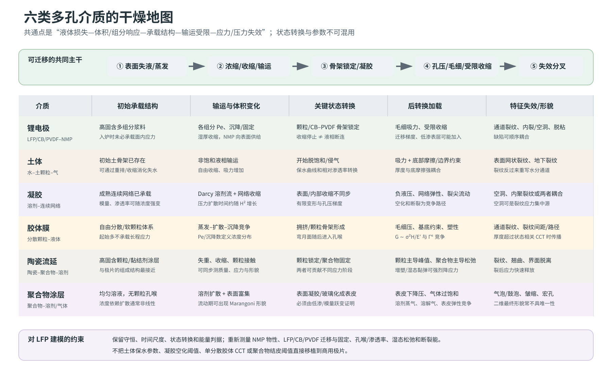

# 商用 LFP–PVDF/NMP 厚涂极片干燥开裂：第一阶段研究综合报告

> 本文全部公式的变量、SI 单位、符号方向、测量方法和适用前提，见[公式与物理量详解](13_formula_and_symbol_guide.md)。

> 版本：2026-07-30；研究类型：结构化范围综述 + 跨领域机制综合 + 可证伪模型设计。  
> 适用对象：约 20 cm 宽、铝箔单面涂布、LFP–炭黑–PVDF/NMP、连续多区热风干燥。  
> “开裂类缺陷”质量口径包含表面泥裂、层内裂纹、异常中层空洞、脱粘及与结皮相关的明显表面凹凸；模型中仍分别归因。

*图 0。六类介质的干燥状态地图。这是本项目的跨领域综合示意，不是任何单一文献原图；共同骨架及差异分别依据电极干燥、胶体膜、陶瓷流延、聚合物结皮/气泡、凝胶孔弹性和土体干缩证据重绘。代表来源：[Jaiser et al., 2017](https://doi.org/10.1016/j.jpowsour.2017.01.117)、[Tirumkudulu & Russel, 2005](https://doi.org/10.1021/la048298k)、[Lewis et al., 1996](https://doi.org/10.1111/j.1151-2916.1996.tb08099.x)、[Arai & Doi, 2012](https://doi.org/10.1140/epje/i2012-12057-2)、[Biot, 1941](https://doi.org/10.1063/1.1712886) 与 [Tang et al., 2021](https://doi.org/10.1016/j.earscirev.2021.103586)。*

## 1. 当前最重要的结论

### 1.1 这不是一个单阈值、单机制问题

现有证据最支持的共同主干是：湿膜先通过颗粒靠近和宏观收缩消化溶剂损失；颗粒骨架锁定后，孔隙中仍可能保持连续液体并通过毛细作用向表面供液；随后侵气、孔隙排空和液相断连使孔压、收缩约束和组分梯度转化为失效驱动力。[电极直接截面，C：Jaiser et al., 2017](https://doi.org/10.1016/j.jpowsour.2017.01.117) [厚电极干燥曲线，C：Kumberg et al., 2019](https://doi.org/10.1002/ente.201900722)

NMC622–PVDF/NMP 的原位 CT 在 300 和 800 µm 刮刀间隙样品中直接观察到主裂纹传播发生在固体层压实/厚度平台之后；500 µm 样品早期数据缺失，只能纳入作者总体归纳。预存气泡可先增长、排气并造成永久变形，固结后同一区域成为主裂纹优先传播位置；裂纹触底后又可诱发脱粘。[直接观察+作者解释，B：Dawson et al., 2026](https://doi.org/10.1039/D5EB00201J) 这支持“锁定后毛细/收缩加载”是表面泥裂的高优先级主线，但该模型体系并非商业 LFP，不能直接给出你们的临界涂布量。

### 1.2 厚度把三种不同风险同时放大

厚度增加会提高组分均化时间、按 $H^2$ 放大液压均化时间，并按薄膜断裂尺度提高可释放弹性能 $G\sim\sigma^2H/E'$。胶体/陶瓷研究直接建立了毛细应力、临界开裂厚度和断裂能之间的联系，[D2：Tirumkudulu & Russel, 2005](https://doi.org/10.1021/la048298k) [D1：Moorhead & Francis, 2024](https://doi.org/10.1111/jace.19644) 凝胶/岩土孔弹性则支持压力均化时间的厚度平方结构。[T：Biot, 1941](https://doi.org/10.1063/1.1712886) 因此超过某一涂布量后，单靠调温和调线速越来越难同时控制迁移、孔压和断裂，是合理的物理预期。

Schabel 工作群中，真正直接系统测量“厚度 × 蒸发通量 × 表面开裂”的核心来源仍是 Kumberg 2019；它还显示粘附恶化可早于可见裂纹。后续 2021 年厚膜动力学研究补充了内部传质限制随厚度增强，却没有测湿态应力或首裂。因此这条证据链支持风险坐标和状态模型，不提供 LFP 的临界涂布量。完整的直接/间接证据分层见[Schabel 工作群与厚涂开裂关联图](19_schabel_thick_coating_cracking_map.md)。

但临界涂布量不是纯材料常数。它是状态相关应力 $\sigma(t)$、模量 $E'(t)$、断裂能 $\Gamma_c(t)$、厚度和界面约束共同决定的输出：

$$
H_c(t)=\frac{E'(t)\Gamma_c(t)}{C\sigma(t)^2},
\qquad H_{c,process}=\min_t H_c(t).
$$

### 1.3 烘箱温度和线速应先转换成膜实际经历的轨迹

局部传热系数分布可使同一电极上同时出现干区和湿区；IR、称重与受控喷嘴实验已经直接观察到这种效应。[C：Kumberg et al., 2021](https://doi.org/10.1002/ente.202000889) 跨卷对卷设备研究也表明，放大应匹配膜温、干燥通量、气相条件和传热系数，而不是复制风机/温度设定。[C：von Horstig et al., 2026](https://doi.org/10.1002/batt.202500845)

所以模型输入应从 $(T_{oven},v_{web})$ 升级为 $(T_s(t,y),J(t,y),p_{NMP,g}(t,y))$。20 cm 宽度主要通过这些量的横幅不均匀、湿厚不均和箔材约束进入，而不是作为独立材料参数。

Schabel 团队的 NIR 与高–低–高程序进一步说明：在相近蒸发通量下，实际膜温仍会改变粘附结果；对特定石墨体系只在敏感中段削弱通量，可以缩短时间并保持界面质量。但这些研究主要测粘附、迁移和有限电化学终点，没有系统测裂纹，因而只能作为待验证的 LFP 防裂轨迹，不能当作已证实处方。[NIR：Altvater et al., 2022/23](https://doi.org/10.1002/ente.202200785) [多段程序：Altvater et al., 2024](https://doi.org/10.1002/ente.202301272)

Schabel 团队在燃料电池 Pt/C–Nafion 催化层中的直接开裂实验提供了一条更强、但只能跨体系使用的反例：对约 7–10 µm、水/1-propanol 薄层，按论文计算的近似平均干燥速率配对时，“较高膜温、较低传质系数”路线的裂纹面积比“强化气侧传质”路线低约 8.5–8.7 倍。[直接开裂实验，跨体系旁证：Zimmerer et al., 2026](https://doi.org/10.1002/ceat.70192) 因此 $J_{avg}$ 相近不代表开裂加载史等价，模型至少要分开 $T_s$、气侧传质/溶剂分压和材料松弛；Nafion、混合溶剂和微米薄层与 LFP/PVDF-NMP 厚电极差异很大，论文数值不能用于 LFP 参数或安全窗口。

### 1.4 表面完整但中层空洞，质量上可归为开裂，机制上必须拆开

至少保留四条竞争路径：入炉前夹气放大、溶解气体/溶剂蒸气气泡、负液压异质空化、弱层内聚断裂。聚合物溶液实验直接观察到结皮、液体压力下降和气泡增长；“泡内含溶剂蒸气与溶解空气、增长主要受空气扩散控制”是作者结合测压、Henry 定律和 $R\propto\sqrt{t-\tau}$ 拟合得到的解释，并非气体成分直接分析。[直接观察+作者解释，D2：Arai & Doi, 2012](https://doi.org/10.1140/epje/i2012-12057-2) 凝胶实验则观察到空化与裂纹可耦合。[D3：Wang & Cai, 2015](https://doi.org/10.1039/C4SM02652G)

目前没有足够的 LFP 直接证据证明“表面结皮导致中层空洞”。仅凭最终二维截面把四条路径合并，会使工艺优化方向互相冲突：例如强化脱气针对夹气有效，却不一定降低真正的层内断裂。

## 2. 变量效应的机制解释

| 生产变量 | 不是直接作用，而是通过 | 可能的相反效应 |
|---|---|---|
| 湿/干厚度、面密度 | $Pe_i$、液压均化、可释放能量、缺陷统计 | 更厚也可能形成更少但更大的裂纹 |
| 固含量 | NMP 库存、湿厚、收缩量、到达锁定的时间、流变和孔喉 | 少溶剂有利；提前锁定/脱气变差可能不利 |
| 粒径/团聚 | 扩散/沉降、孔喉毛细压、网络模量/屈服、断裂能 | 小粒径提高毛细压，也可能提高韧度；方向非普适 |
| 温度 | 膜温、NMP 活度/黏度、扩散、PVDF 迁移率、蒸发通量 | 相同通量下较高温度可能增强扩散；仅看设定温度会混淆 |
| 线速 | 各区停留时间和状态转换位置 | 提速可能降低总脱溶剂，也可能把敏感阶段移到后区 |
| 风速/喷嘴 | $h,\beta$ 及横幅/节距不均匀 | 提高平均通量同时制造局部热点 |

高干燥速率造成粘结剂表面富集已有石墨负极和 PVDF 正极证据，[C：Jaiser et al., 2016](https://doi.org/10.1016/j.jpowsour.2016.04.018) [B：Kumano et al., 2024](https://doi.org/10.1016/j.jpowsour.2023.233883) 但 NMC622 的另一项研究发现 F 富集分布对 60–120 °C 温度变化大体不敏感，细碳分布变化更明显。[反例，B：Zhang et al., 2022](https://doi.org/10.1039/D2TA00861K) 因此不能把“高温=PVDF 必然上浮”写成普适规律，必须记录实际通量、膜厚、材料与测量方法。

## 3. 建议采用的模型层级

### 层级 0：事件与数据基线

先用膜温、失重、厚度收缩和原位/中断形貌确定：表面/全层锁定、侵气、降速和首次失效的先后。没有这一步，后续模型参数不可辨识。

### 层级 1：随横幅位置参数化的一维厚向模型

每个 $y$ 位置求解：

1. 设备热质边界 → $(T_s,J,p_{NMP,g})$；
2. 锁定前移动边界与 LFP/CB/PVDF 独立输运；
3. 锁定后 Darcy/非饱和排液与孔压；
4. 状态相关 Maxwell/孔弹性应力；
5. 通道裂纹、层内裂纹、气泡/空化、界面脱粘的独立风险。

详细方程、参数顺序和升级条件见[模型与实验计划](09_modeling_framework_and_experimental_program.md)。

### 层级 2：只有被数据要求时才增加复杂度

- 若横向液流/热流不可忽略，升级为 $y-z$；
- 若需预测裂纹路径和相互作用，增加内聚区或相场；
- 若空洞显著响应脱气，增加气体溶解–扩散–气泡增长；
- 若直接观察到低渗表层，增加移动结皮前沿。

## 4. 第一轮研究的最优信息路径

第一轮不系统扫固含和粒径，而先固定配方，用阈值附近三档面密度与三条分区轨迹定位失效发生在哪个状态窗口：

- $(0.8m_A^*,1.0m_A^*,1.2m_A^*)$；
- 当前基准、前温和后增强、前增强后温和；
- 每个条件 3 个独立重复，共 27 个完整干燥样；
- 高/低风险角在锁定、侵气、降速、起裂附近做中断截面；
- 阈值条件增加标准/强化脱气对照。

第一轮的成功标准不是立即找到最优温度，而是回答五个因果问题：

1. 首次失效相对锁定、侵气和降速发生在何时；
2. 相同最终残余 NMP 下，分区历史是否改变缺陷；
3. 中层空洞是否预存、是否响应脱气、是否有裂尖；
4. 厚度主要放大孔压/应力、断裂能量还是缺陷概率；
5. 不同机器设定能否由 $(T_s(t),J(t))$ 统一描述。

之后再用“固定干面密度改变固含”与“固定湿厚改变固含”两组互补实验拆解固含效应；粒径实验必须同步记录团聚、孔喉、比表面积和湿态力学，不能只记录 D50。

## 5. 当前可执行的工艺优化假说

以下是待验证方向，不是已证实配方：

1. 优先削弱锁定至首次侵气附近的峰值蒸发通量，而非均匀降低全炉温度；
2. 比较前温和–中段增强与前段强干燥，在相同产能/残余 NMP 下选择较低的 $(Pe_i,\Pi_h,De_{dry})$ 轨迹；
3. 提高固含时同时检查提前锁定、脱气困难和孔喉变小，避免把“少 NMP”当作单向收益；
4. 优先消除横幅/喷嘴节距上的 $J(y)$ 热点与湿厚热点，再讨论材料极限；
5. 将强化脱气作为高信息增益诊断实验，而非默认所有中层空洞都是气泡。

上述方向的参数优先级、非单调副作用、D1–D5 分支选择以及固定厚度下的完整流程图，见[《固定目标厚度下降低开裂：参数地图与工艺决策路径》](22_fixed_thickness_cracking_reduction_parameter_map.md)。该文档是本项目综合，不是 Dawson 或 Kumberg 已验证的商用 LFP 数值处方。

## 6. 证据成熟度与缺口

### 接近第一阶段机制饱和

- 一般电极/颗粒膜的收缩—锁定—毛细供液—孔隙排空状态主干；
- 高通量下可移动添加剂形成梯度的条件性机制；
- 平均热质边界和多区烘箱的守恒建模；
- 受约束颗粒膜的 CCT/能量判据框架。

### 尚未饱和、必须由本体系实验推进

- 商业 LFP 的控制尺度是一次粒径、团聚体还是孔喉；
- LFP–炭黑–PVDF 湿骨架的模量、松弛、渗透率和断裂能如何随 NMP 含量变化；
- 表面低渗层与中层空洞是否存在因果关系；
- 20 cm 宽幅局部 $(J,T_s,p_{NMP})$ 与缺陷的共定位；
- 可接受裂纹/空洞阈值与后续辊压、电化学性能的产品定义。

## 7. 专题报告导航

- [基础知识体系：从设备边界到材料失效](00_basic_knowledge_framework.md)
- [物理过程学习与追问指南](10_physical_process_learning_guide.md)
- [锂电电极完整物理过程与直接证据](01_battery_electrode.md)
- [烘焙类比：面包外壳、饼干暗裂与淀粉浆](11_baking_analogy.md)
- [岩土干缩](02_geotechnical_desiccation.md)
- [凝胶孔弹性、空化与断裂](03_gel_poroelastic_fracture.md)
- [胶体膜与临界开裂厚度](04_colloidal_films.md)
- [陶瓷流延与同步干燥应力](05_ceramic_tape_casting.md)
- [聚合物结皮、气泡与表面形貌](06_polymer_coatings.md)
- [卷对卷与多区烘箱](07_roll_to_roll_drying.md)
- [跨领域迁移与竞争假设](08_cross_domain_synthesis.md)
- [模型层级与可执行实验](09_modeling_framework_and_experimental_program.md)
- [Schabel 工作群与厚涂开裂关联图](19_schabel_thick_coating_cracking_map.md)

## 8. 阅读边界

本报告给出了可证伪的机制框架和第一轮实验，而非已经校准的工艺窗口。公开 LFP 直接证据仍少；Zhao 等的 LFP 热质模型不含粘结剂迁移与断裂，[A：Zhao et al., 2023](https://doi.org/10.3390/pr11113236) 2026 年 LFP 厚度/停留时间研究在本轮仅取得摘要，不能用于方程或定量阈值。[仅摘要，A：Liu & Deng, 2026](https://doi.org/10.1016/j.jclepro.2026.148460) 所有临界参数必须由你们的配方和设备数据标定。

## 附录 A：核心原文与中文导读

以下导读用于快速定位论文价值，不是全文翻译。原文状态说明见 [`literature/README.md`](literature/README.md)。

1. **Dawson et al. (2026)，《利用原位 X 射线 CT 预测锂离子电池电极干燥泥裂的形成》** — [开放原文 PDF](https://pubs.rsc.org/en/content/articlepdf/2026/eb/d5eb00201j)｜[DOI](https://doi.org/10.1039/D5EB00201J)。在 NMC622–PVDF/NMP 模型电极中直接追踪压实、预存气泡增长/排气、泥裂和脱粘的先后顺序，是本报告“锁定后起裂—气泡缺陷定位—裂纹触底诱发脱粘”主线最强的电极直接证据。阅读时必须保留其 4 mm 钢针模型几何、含泡样品和非 LFP 边界。
2. **Tang et al. (2021)，《土体干缩开裂：研究方法、内在机制与影响因素综述》** — [出版社原文](https://doi.org/10.1016/j.earscirev.2021.103586)。系统梳理土体干缩实验、强度/能量/体积模型和边界因素，适合建立“输运—自由收缩—约束—断裂”的跨领域骨架；土体保水曲线和经验临界含水率不能移植到极片。
3. **Moorhead & Francis (2024)，《干燥陶瓷颗粒涂层的应力发展与开裂表征》** — [开放原文](https://doi.org/10.1111/jace.19644)。把质量损失、饱和度、悬臂梁应力和裂纹事件同步起来，并讨论临界开裂厚度。它最值得迁移的是实验设计和事件对齐方法，而不是 ZnO 涂层的数值阈值。
