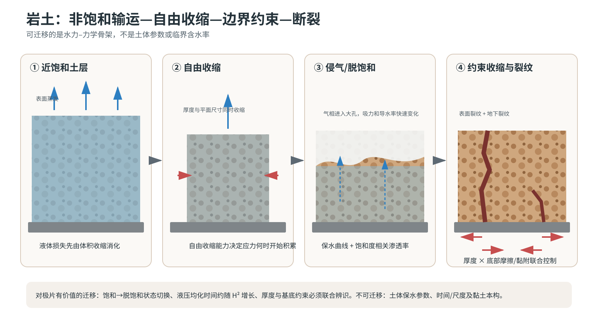

# 岩土干缩与脱水裂纹：专题研究报告

> 本文全部公式的变量、SI 单位、符号方向、测量方法和适用前提，见[公式与物理量详解](13_formula_and_symbol_guide.md)。

## 摘要

岩土干缩与电极湿膜干燥有一个真正共通的物理结构：液体损失先通过体积收缩被部分容纳；当气体开始侵入、自由收缩受限或内部水力场来不及均化时，干燥驱动才会转换为骨架拉应力和断裂。岩土领域对本项目最有价值的不是一组土体经验常数，而是“非饱和液相输运—自由收缩—边界约束—强度/能量判据—裂纹反过来改造传质”的闭环。

*图 2。土层从近饱和、自由收缩、开始脱饱和到受约束断裂的过程。图为本项目重绘；事件顺序与机理分类依据 [Péron et al., 2009](https://doi.org/10.1139/T09-054) 和 [Tang et al., 2021](https://doi.org/10.1016/j.earscirev.2021.103586)，厚度–底摩擦耦合依据 [Zeng et al., 2019](https://doi.org/10.1016/j.enggeo.2019.105220) 与 [Zeng et al., 2020](https://doi.org/10.1029/2019WR026948)。*

## 1. 领域问题如何演进

### 1.1 从现象分类到水力–力学耦合

早期研究主要记录裂纹深度、间距、网格尺寸与土层厚度。后续研究逐渐把过程拆为蒸发、吸力增加、体积收缩和裂纹演化，并将理论框架概括为强度控制、能量控制和体积/几何控制三类。这一历史和 400 余篇文献的模型谱系由 Tang 等系统整理；该综述将影响因素分成材料内秉性质、边界约束、环境条件和外加材料四类。[综述归纳，D4：Tang et al., 2021](https://doi.org/10.1016/j.earscirev.2021.103586)

Péron 等把自由收缩、受限收缩、含水率和吸力置于同一试验中，观察到所研究土体的裂纹通常在接近开始脱饱和时出现。这是特定土体与边界下的直接观察，不是可直接移植的普适临界点。[直接观察，D4：Péron et al., 2009](https://doi.org/10.1139/T09-054)

### 1.2 边界约束不是次要修正项

土样厚度与底部摩擦不是两个彼此独立的经验因子：实验表明，它们会联合改变裂纹尺寸与演化。[直接观察，D4：Zeng et al., 2019](https://doi.org/10.1016/j.enggeo.2019.105220) 较粗糙的底部与样品厚度还可改变地下裂纹的起始位置。[直接观察，D4：Zeng et al., 2020](https://doi.org/10.1029/2019WR026948)

这一证据对极片的启示是：“厚膜更易裂”不能仅解释为蒸发路径更长；铝箔黏附/滑移条件与膜厚必须联合进入力学问题。这是本项目推论，并非上述土工论文直接研究了电极。

### 1.3 从应力越限到裂纹路径模型

“最大主拉应力超过含水率相关抗拉强度”可用来判断起裂，但难以唯一预测裂纹的拓扑。土样尺寸和初始缺陷会显著影响最终裂纹网络。[直接观察，D4：Lakshmikantha et al., 2011](https://doi.org/10.1061/%28ASCE%29MT.1943-5533.0000242)

为了显式生成裂纹路径，后续模型将非饱和输运与内聚区断裂耦合。这类模型能描述含水率变化下的裂纹起始与传播，但结果依赖渗透率、抗拉强度、临界张开位移和断裂能的含水率本构。[理论/数值，D4：Vo et al., 2017](https://doi.org/10.1016/j.compgeo.2016.12.010) 相场断裂也可定性重现异质性诱导的路径，但实验与模型的局部应变仍可有显著偏差。[直接观察+理论，D4：Hün et al., 2021](https://doi.org/10.1016/j.engfracmech.2021.108065)

## 2. 可迁移的方程骨架

### 2.1 非饱和液相输运

一个常见的连续介质骨架是

$$
\frac{\partial (\rho_l nS_l)}{\partial t}
+\nabla\cdot(\rho_l\mathbf q_l)=-\dot m_{\rm evap},
\qquad
\mathbf q_l=-\frac{k\,k_r(S_l)}{\mu_l}
(\nabla p_l-\rho_l\mathbf g),
$$

并以保水曲线 $S_l(p_c)$ 与相对渗透率 $k_r(S_l)$ 闭合，$p_c=p_g-p_l$。van Genuchten–Mualem 方法是土壤科学中经典的保水–非饱和导水闭合。[理论推导，D4：van Genuchten, 1980](https://doi.org/10.2136/sssaj1980.03615995004400050002x)

对电极只应迁移守恒形式和“饱和度–毛细压力–相对渗透率”的闭合需求；土体的 van Genuchten 参数不可用于 LFP–PVDF/NMP。

### 2.2 收缩、有效应力与断裂

骨架平衡可写成

$$
\nabla\cdot\boldsymbol\sigma=0,
\qquad
\boldsymbol\sigma=
\boldsymbol\sigma'(\boldsymbol\varepsilon,S_l,w)
-\alpha p_l\mathbf I,
$$

总应变可分解为

$$
\boldsymbol\varepsilon=
\boldsymbol\varepsilon^e+
\boldsymbol\varepsilon^{sh}(w)+
\boldsymbol\varepsilon^{vp}.
$$

裂纹则可用含水率相关的强度或能量条件表示：

$$
\sigma_1\ge\sigma_t(w),
\qquad\text{or}\qquad
G(\sigma,E,h,a,\text{constraint})\ge G_c(w).
$$

内聚区模型的断裂能为 $G_c=\int T(\delta,w)\,d\delta$。岩土领域的重要经验是：$E$、$\sigma_t$、$G_c$ 和界面约束均应随干燥状态演化，把它们当成恒定干膜参数会错置起裂时刻。有关土体干缩断裂本构的历史总结可参见 Kodikara 与 Costa 的书章（页码 21–32）。[综述归纳，D4：Kodikara & Costa, 2013](https://doi.org/10.1007/978-3-642-32492-5_2)

## 3. 与极片体系的同异

### 可迁移

- “液体损失→自由收缩→受限收缩→拉应力→裂纹”的因果链。
- 饱和到脱饱和的阶段切换，以及液压扩散时间随厚度平方放大的尺度结构。
- 强度判据判断“何时启动”，能量/断裂模型判断“是否能维持传播”的分工。
- 厚度、基底约束和初始缺陷必须联合考虑；裂纹形成后会改写原有传质边界。

### 不可直接迁移

- 土体的水分保持曲线、非饱和导水参数、塑限/液限与黏土矿物本构。
- 土体的毫米至米级尺度、长时间自然蒸发和干湿循环。
- 土体没有溶解态 PVDF 的迁移/析出，也没有炭黑–PVDF 功能网络与高速 NMP 热风干燥。

## 4. 对本项目的限定性结论

1. 极片模型应保留“饱和收缩阶段—侵气/降饱和阶段”的切换，但必须用 LFP 堆积、NMP 润湿与孔喉分布重建 $S_l(p_c)$ 和 $k_r(S_l)$。
2. 20 cm 几何宽度只有通过横向边界不均匀与箔材约束才进入局部干燥问题；单纯把宽度作为裂纹经验自变量没有岩土机理支持。
3. 岩土模型最适合提供未来的液相输运–收缩–裂纹耦合架构，不适合直接给出电极的临界涂布量。

## 5. 未解决问题

- 极片的“开始脱饱和”应如何定义：表面首次侵气、连通液相断裂，还是收缩终止？
- 铝箔界面在湿态到干态之间是完全黏附、部分滑移还是可损伤界面？
- 裂纹打开新蒸发面后，局部 NMP 传质反馈对裂纹稳定化或二次传播有多大？

## 6. 完整时序物理电影

下面的“电影”不是把土体过程原样套到极片上，而是先逐帧陈述岩土来源支持到哪里，再单列向 LFP–PVDF/NMP 的项目推论。压力方向以样品厚度坐标 $z$ 表示，表面为 $z=H$、底部为 $z=0$；“向表面”表示液体通量总体沿 $+z$。受底面约束时，“面内拉应力”指平行于底面的拉应力，而毛细负压对局部骨架主要表现为压密驱动，两者不能混为同一个应力。

### 阶段 0：近饱和、尚可近似均匀收缩

- **源体系直接观察：** Péron 等在同一试验中跟踪自由收缩、受限收缩、含水率和吸力，所研究土体在起裂前存在可由整体收缩容纳失水的阶段。[直接观察，D4：Péron et al., 2009](https://doi.org/10.1139/T09-054)
- **谁在移动（作者解释/理论）：** 水从暴露面离开，内部液态水补给表面；颗粒随总体体积缩小而彼此靠近。气相尚未形成贯穿厚度的主要输运网络。[作者解释/理论框架：Péron et al., 2009](https://doi.org/10.1139/T09-054)
- **谁在承载（作者解释/理论）：** 颗粒骨架已传递有效应力，但仍可重排；外载由孔压与骨架有效应力共同分担。此处不等于“液体单独承载”。[理论框架：Tang et al., 2021](https://doi.org/10.1016/j.earscirev.2021.103586)
- **压力/应力方向（作者解释/理论）：** 表面蒸发使表层液压先降低，即 $p_l(H)<p_l(0)$，因此液体趋向表面；若样品可自由收缩，面内拉应力仍小，主要响应是体积收缩而非张裂。[作者解释/理论框架：Péron et al., 2009](https://doi.org/10.1139/T09-054)
- **可测签名（项目操作化）：** 质量持续下降；厚度和面内尺寸同步减小；表面位移场较平滑；尚无持续张开的裂口。含水率场若可测，应接近均匀或仅有弱梯度。
- **会推翻本帧解释的结果（项目反证）：** 尚未出现可测整体收缩时就已经出现内部空气连通、局部裂尖场或显著面内拉应变集中，说明过程并非从“可容纳失水的近均匀收缩”开始。
- **向 LFP 的项目推论：** 对刚涂布极片，本帧可作为“浆料仍能流动/重排”的候选阶段；必须用原位厚度、质量和表面位移共同验证，不能仅凭入炉时间指定阶段。

### 阶段 1：表面抽吸增强、收缩开始受到基底约束

- **源体系直接观察：** 土层厚度与底部摩擦会耦合改变裂纹尺度和演化，底面粗糙度还会改变地下裂纹的起始位置。[直接观察，D4：Zeng et al., 2019](https://doi.org/10.1016/j.enggeo.2019.105220)；[直接观察，D4：Zeng et al., 2020](https://doi.org/10.1029/2019WR026948)
- **谁在移动（作者解释/理论）：** 液体继续向表面补给蒸发；表层颗粒更快靠近，底部颗粒的面内位移受到摩擦或黏附限制。
- **谁在承载（作者解释/理论）：** 随颗粒接触增强，骨架承担更多由收缩不相容产生的载荷；底界面通过剪应力把自由收缩转化为受限收缩。[作者解释/理论框架：Tang et al., 2021](https://doi.org/10.1016/j.earscirev.2021.103586)
- **压力/应力方向（作者解释/理论）：** 液压通常由内部较高值指向表层更低值，液体通量向表面；毛细吸力促使骨架收缩，而底面约束使面内收缩受阻，从而积累面内拉应力。靠近底面的界面剪应力方向与局部自由收缩位移相反。
- **可测签名（项目操作化）：** 自由样与粗糙/黏附底面样在相同失水量下出现不同的面内位移；表面数字图像相关可见从均匀收缩转为应变局域化；底界面剪力或翘曲趋势增大。
- **会推翻本帧解释的结果（项目反证）：** 大幅改变底面摩擦后，应变局域化、起裂位置和临界失水量均不变，且厚度方向水分场也相同；这会削弱“底部约束主导应力转换”的解释。
- **向 LFP 的项目推论：** 铝箔–湿膜界面的黏附/滑移必须与湿膜厚度一同测量；若同一干燥程序下改变集流体表面处理显著移动裂纹阈值，便支持该迁移假设。

### 阶段 2：开始脱饱和，收缩能力衰减而拉应力加速积累

- **源体系直接观察：** Péron 等所研究的细粒土中，裂纹通常在接近开始脱饱和时出现；作者明确把这一时刻与自由收缩能力、吸力及边界约束联合解释，而非给出跨材料普适临界饱和度。[直接观察+作者解释，D4：Péron et al., 2009](https://doi.org/10.1139/T09-054)
- **谁在移动（作者解释/理论）：** 空气从暴露边界进入可进入的孔喉，液体退入较小孔隙并仍向蒸发表面输运；颗粒重排速度下降，局部收缩更依赖骨架变形。
- **谁在承载（作者解释/理论）：** 已形成的颗粒骨架成为主要承载路径；液–气弯月面通过毛细压力加载骨架，底部和侧向约束维持不相容应变。
- **压力/应力方向（作者解释/理论）：** 局部 $p_c=p_g-p_l$ 上升，亦即 $p_l$ 更负；毛细作用倾向压密骨架，但被限制的面内收缩表现为面内拉应力。水力梯度主要沿厚度，最大主拉应力的方向则由底面摩擦、几何和缺陷共同决定，二者不必同向。[综述归纳：Tang et al., 2021](https://doi.org/10.1016/j.earscirev.2021.103586)
- **可测签名（项目操作化）：** 气侵或饱和度下降开始出现；整体体积收缩相对失水量减缓；吸力继续上升；局部主拉应变开始集中但裂口可能尚未可见。
- **会推翻本帧解释的结果（项目反证）：** 裂纹稳定出现时样品仍保持完全饱和、自由收缩未衰减且无边界约束；这会推翻“脱饱和附近的受限收缩触发”对该试样的解释，但不否定其他裂纹机制。
- **向 LFP 的项目推论：** 极片中的对应状态可能是表面首次侵气、连通液相断裂或颗粒锁定中的某一个，三者不得先验视为同一时刻；需要用厚度/质量、阻抗或成像分别标定。

### 阶段 3：缺陷处起裂

- **源体系直接观察：** 土样尺寸和初始缺陷显著改变最终裂纹网络；相场模型与实验还显示异质性影响裂纹路径，局部应变预测与实验可有明显偏差。[直接观察，D4：Lakshmikantha et al., 2011](https://doi.org/10.1061/%28ASCE%29MT.1943-5533.0000242)；[直接观察+理论，D4：Hün et al., 2021](https://doi.org/10.1016/j.engfracmech.2021.108065)
- **谁在移动（作者解释/理论）：** 裂纹两侧骨架沿开口方向分离，裂尖向前推进；液体继续向外输运，气体可进入新生裂面。
- **谁在承载（作者解释/理论）：** 裂纹前方未破坏骨架与底界面承担并重新分配载荷；缺陷尖端或弱区出现应力集中。
- **压力/应力方向（作者解释/理论）：** 当局部最大主拉应力满足 $\sigma_1\ge\sigma_t(w)$，或能量释放率满足 $G\ge G_c(w)$，裂纹可以启动；裂面法向大致沿局部最大拉应力方向。该判据是模型结构，不保证唯一预测裂纹拓扑。[理论/数值：Vo et al., 2017](https://doi.org/10.1016/j.compgeo.2016.12.010)
- **可测签名（项目操作化）：** 数字图像相关先出现局域拉应变带，随后出现有限开口；声发射或力信号突变可与起裂同步；裂纹优先关联缺陷、厚度变化或界面约束差异。
- **会推翻本帧解释的结果（项目反证）：** 可见“裂纹”出现时没有裂面开口、没有位移不连续且三维成像显示仅为颜色/浓度条纹；这将推翻其为骨架张裂的判定。
- **向 LFP 的项目推论：** 对表面无裂但中层有空洞的极片，必须先验证是否存在位移不连续或尖锐裂尖；仅凭截面暗区不能把它归入本阶段。

### 阶段 4：裂纹传播、卸载与传质边界重写

- **源体系直接观察与理论：** 非饱和输运–内聚区模型可描述含水率变化下裂纹的起始和传播；裂纹网络的演化同时受材料状态、边界约束和几何影响。[理论/数值，D4：Vo et al., 2017](https://doi.org/10.1016/j.compgeo.2016.12.010)；[综述归纳，D4：Tang et al., 2021](https://doi.org/10.1016/j.earscirev.2021.103586)
- **谁在移动（作者解释/理论）：** 裂尖继续推进或停滞；裂面张开；液体可转而流向裂面，气体沿裂纹侵入。裂纹附近骨架卸载，远处受限区继续收缩。
- **谁在承载（作者解释/理论）：** 完整的骨架桥和底界面承担剩余载荷；裂纹后方不再传递法向拉应力，裂尖前方承载增强。
- **压力/应力方向（作者解释/理论）：** 裂纹使局部拉应力释放并在裂尖重新集中；新暴露裂面改变蒸发边界，使水力梯度可能从原先主要沿厚度转为同时指向裂面。后一句是由耦合模型结构得到的作者解释，不是上述试验逐点直接测得的通量场。
- **可测签名（项目操作化）：** 裂纹开口和长度随时间增长或间歇跳跃；裂纹邻域应变卸载；裂面附近失水加快；新裂纹间距受已有裂纹的应力屏蔽影响。
- **会推翻本帧解释的结果（项目反证）：** 裂纹形成后局部蒸发/含水率场完全不变，或裂纹后方仍跨裂面连续传递同等法向拉力；这会否定所采用的“开放裂面+卸载”边界条件。
- **向 LFP 的项目推论：** 一旦极片裂纹贯通至表面，局部 NMP 排出路径可能被重写，因此用无裂一维传质模型继续拟合裂后数据会混合机制；应在首次裂纹时刻切换边界或停止参数反演。

### 阶段 5：网络定型与残余变形

- **源体系直接观察：** 最终裂纹网络受样品尺寸、初始缺陷、厚度和底部摩擦共同影响，并非仅由最终平均含水率决定。[直接观察，D4：Lakshmikantha et al., 2011](https://doi.org/10.1061/%28ASCE%29MT.1943-5533.0000242)；[直接观察，D4：Zeng et al., 2019](https://doi.org/10.1016/j.enggeo.2019.105220)
- **谁在移动、谁在承载（作者解释/理论）：** 剩余液体继续排出；多数裂纹停止或缓慢扩展；分割后的骨架块体与底界面分别承担残余应力，局部可出现翘曲或滑移。
- **压力/应力方向（作者解释/理论）：** 水力梯度随接近平衡而减弱，但干燥历史造成的残余面内应力与界面剪应力可以保留；裂纹已将连续应力场分割为多个区域。
- **可测签名（项目操作化）：** 总质量趋于平台而裂纹几何趋于稳定；卸载或剥离后可能发生回弹；相同最终含水率的样品可因干燥路径不同而具有不同网络。
- **会推翻本帧解释的结果（项目反证）：** 完全复湿后裂纹和残余变形无滞后地全部消失，并且不同干燥路径在同一终态严格重合；这表明主要是可逆收缩而非已定型断裂网络。
- **向 LFP 的项目推论：** 最终极片外观只是整段历史的积分结果；工艺窗口应至少记录首次失稳时刻和裂后演化，不能只用出炉后的裂纹面积率反演单一“临界温度”。

## 7. 苏格拉底/费曼自检

以下问题用于检查是否真正理解上述因果链。每题的“合格回答”只给出最低必要逻辑；“反证动作”要求给出一项能让当前解释失败的观测，而不是再找一个支持性相关性。

1. **为什么毛细负压压密颗粒，却会得到宏观拉裂？**
   **合格回答：** 毛细压力促使骨架自由收缩；当底面摩擦、黏附或空间梯度阻止各处同步收缩时，收缩不相容转化为骨架面内拉应力。毛细压力的局部压密方向与约束诱发的宏观拉应力不是同一个量。
   **反证动作：** 在保持水分历程相近的前提下大幅降低底面约束；若拉应变和裂纹阈值完全不变，应改查材料异质性或其他载荷源。

2. **为什么“接近脱饱和起裂”不是可直接套用的临界饱和度？**
   **合格回答：** 这是 Péron 等特定土体和边界的直接观察；孔喉分布、界面约束和强度演化都会移动临界状态。[直接观察边界：Péron et al., 2009](https://doi.org/10.1139/T09-054)
   **反证动作：** 对 LFP 同步测气侵、收缩终止和起裂；若三者在多个配方与厚度下系统性错开，就不能用一个固定饱和度代替。

3. **为什么厚度不能作为唯一裂纹自变量？**
   **合格回答：** 厚度既改变水力均化时间，也改变底面摩擦约束能够影响的应力体积；土工试验已观察到厚度与底部摩擦的耦合作用。[直接观察：Zeng et al., 2019](https://doi.org/10.1016/j.enggeo.2019.105220)
   **反证动作：** 设计厚度×界面处理的析因试验；若不存在交互项且厚度方向溶剂梯度也不变，当前耦合解释不足。

4. **强度判据与能量判据各回答什么？**
   **合格回答：** $\sigma_1\ge\sigma_t$ 更适合判断局部何时可能起裂；$G\ge G_c$ 判断已有裂纹在给定几何和约束下是否能持续扩展。两者都需要随干燥状态更新材料参数。
   **反证动作：** 若模型用同一组常数同时预测不同含水状态的起裂与扩展均准确，可暂时不引入状态依赖；否则常参数假设被推翻。

5. **看到表面线状暗纹，如何证明它是裂纹而不是组分/颜色条纹？**
   **合格回答：** 必须找到裂面开口、位移不连续、三维连通或裂尖应变集中中的至少一项，并与成像伪影排查结合。
   **反证动作：** 若截面和三维成像均无几何间断，且暗纹随照明或溶剂挥发可逆变化，就应撤回“裂纹”命名。

6. **裂纹为什么会反过来改变干燥，而不是只做被动结果？**
   **合格回答：** 开放裂面既卸载法向拉应力，也新增气体进入和液体蒸发边界；因此裂后传质域与裂前不同。此处是耦合模型解释，不是对 LFP 的既成事实。
   **反证动作：** 原位比较裂前后局部溶剂/温度场；若在检测分辨率内没有变化，应降低该反馈在电极模型中的权重。

7. **怎样区分“干得更快导致裂纹”与“升温改变材料强度导致裂纹”？**
   **合格回答：** 需要把失水历程与温度历程解耦，例如在不同气温/风速组合下匹配质量损失曲线，再比较起裂；若失水匹配而起裂不同，纯水力解释不够。
   **反证动作：** 反过来匹配温度历程但改变蒸发通量；若裂纹随通量变化，则纯热软化解释不够。

8. **最小可辨识的 LFP 迁移模型需要哪些同时观测？**
   **合格回答：** 至少要有质量/溶剂损失、厚度或体积收缩、表面/内部首次失稳时刻，以及一个约束或界面状态指标；否则传质、收缩本构和断裂阈值会互相代偿。
   **反证动作：** 做参数可辨识性分析；若删去其中一类观测后多个参数组合仍给出同样预测，就证明该数据集不足以支撑唯一机制解释。

## 附录 A：核心原文与中文导读

1. **Tang et al. (2021)，《土体干缩开裂：研究方法、内在机制与影响因素综述》** — [出版社原文](https://doi.org/10.1016/j.earscirev.2021.103586)。它提供岩土干缩研究的全景地图：表征方法、强度/能量/体积模型、数值方法和四类影响因素。对极片最有价值的是模型谱系和变量分类，而非土体参数。
2. **Péron et al. (2009)，《细粒土干缩开裂基础：实验表征与机制识别》** — [机构仓储原文 PDF](https://infoscience.epfl.ch/record/141895/files/Peron-et-al_%20Fundamentals-of-desiccation.pdf)｜[DOI](https://doi.org/10.1139/T09-054)。把自由收缩、受限收缩、含水率、吸力和起裂时刻放在同一实验中，说明裂纹启动必须结合“还能否自由收缩”和“是否开始脱饱和”解释；该临界状态依赖土种和边界。
3. **Zeng et al. (2019)，《界面摩擦与土层厚度对干缩开裂的耦合作用》** — [出版社原文](https://doi.org/10.1016/j.enggeo.2019.105220)。用实验直接证明厚度效应会被底部摩擦/约束显著调制，因此极片的厚涂阈值也不应脱离铝箔界面状态讨论；其裂纹尺度和非饱和水力参数不可直接移植。
