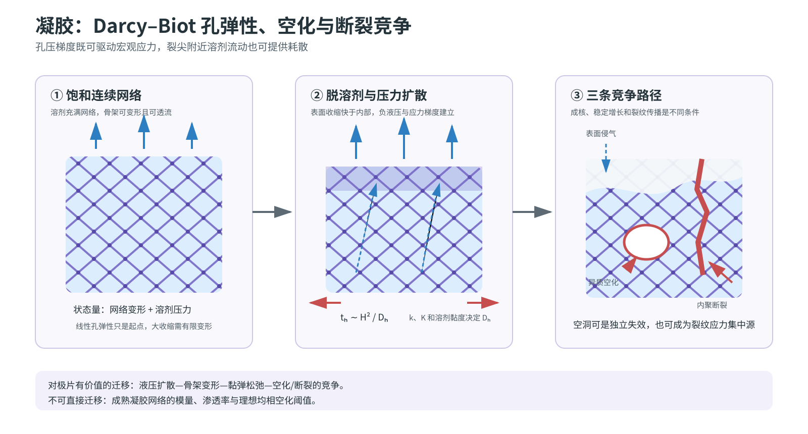

# 凝胶干燥、孔弹性断裂与空化：专题研究报告

> 本文全部公式的变量、SI 单位、符号方向、测量方法和适用前提，见[公式与物理量详解](13_formula_and_symbol_guide.md)。

## 摘要

凝胶领域为极片中层空洞/内裂问题提供了两个必须分开的模型族：一是 Darcy–Biot 式溶剂输运与网络变形，二是负液压下的空化/气泡成核与断裂竞争。该领域还提醒：孔压梯度既可以增大整体干燥应力，也可在裂尖附近通过溶剂流动耗散提高表观韧度。因此“内部压差大必然更易裂”不是普适命题。

*图 3。凝胶中溶剂排出、压力扩散与表面侵气/内部空化/断裂分叉。图为本项目重绘；孔弹性骨架源于 [Biot, 1941](https://doi.org/10.1063/1.1712886)，凝胶干燥应力及空化条件依据 [Scherer, 1990](https://doi.org/10.1016/0022-3093%2890%2990113-Z) 与 [Scherer & Smith, 1995](https://doi.org/10.1016/0022-3093%2895%2900222-7)，空化–断裂耦合依据 [Wang & Cai, 2015](https://doi.org/10.1039/C4SM02652G)。*

## 1. 模型演进与决定性证据

### 1.1 干燥应力来自网络收缩与溶剂排出不同步

Scherer 对凝胶干燥的系列工作将凝胶形成/老化、毛细负压、网络收缩、溶剂渗流与断裂放在同一物理图景中。早期工作指出凝胶老化和协同收缩会使模量、渗透率和后续可收缩量随时间变化。[综述/理论，D3：Scherer, 1988](https://doi.org/10.1016/0022-3093%2888%2990008-7) 随后的干燥模型将溶剂输运与宏观收缩耦合，说明表面和内部收缩不同步时会出现压力与应力梯度。[理论，D3：Scherer, 1989](https://doi.org/10.1016/0022-3093%2889%2990029-X)

在“凝胶为什么在某个干燥阶段容易开裂”上，Scherer 的宏观压力梯度模型可解释样品越大、干燥越快越容易裂，但单独的光滑连续介质场不会自动产生临界干燥点的奇异性；作者因此引入不规则干燥前沿作为缺陷源。[理论推导+作者解释，D3：Scherer, 1990](https://doi.org/10.1016/0022-3093%2890%2990113-Z)

### 1.2 线性孔弹性是起点，不是完整本构

小变形 Darcy–Biot 模型把骨架平衡与溶剂压力扩散耦合；但凝胶的大收缩、浓度依赖模量和渗透率常迫使模型进入有限变形和自由能形式。聚丙烯酰胺球形凝胶的吸胀–干燥实验与模型表明，内部的瞬态压力和体积分数场不能由“整个球均匀、准静态收缩”代替。[直接观察+理论，D3：Bertrand et al., 2016](https://doi.org/10.1103/PhysRevApplied.6.064010)

### 1.3 空化与表面侵气是竞争路径

对含大孔腔与小孔喉的凝胶/多孔介质，液体在小孔喉的进气压力保护下可以承受负压，并在大孔腔内发生异质空化。理论工作区分了“气泡成核”与“气泡能否继续长大”；后者还受孔喉进气阈值和骨架弹性限制。[理论推导，D3：Scherer & Smith, 1995](https://doi.org/10.1016/0022-3093%2895%2900222-7)

受限凝胶的干燥实验直接观察到空化与断裂可以先后或耦合出现：空洞周围的大变形可作为裂纹的应力集中源。[直接观察，D3：Wang & Cai, 2015](https://doi.org/10.1039/C4SM02652G)

### 1.4 裂尖溶剂流动可能韧化

孔弹性断裂理论将总能量释放分解为骨架弹性和裂尖附近的溶剂压力/流动贡献。该模型预测溶剂在裂尖区域的迁移耗散可提高表观断裂韧度。[理论推导，D3：Noselli et al., 2016](https://doi.org/10.1016/j.jmps.2016.04.017) 这一结论限于裂尖局部孔弹性耗散，不等于整层电极的孔压梯度有利于宏观完整性。

## 2. 可迁移的方程骨架

### 2.1 Biot–Darcy 压力扩散

$$
\nabla\cdot
\left[2G\boldsymbol\varepsilon+
\lambda\,{\rm tr}(\boldsymbol\varepsilon)\mathbf I-
\alpha p_l\mathbf I\right]=0,
$$

$$
\frac{\partial}{\partial t}
\left(\alpha\nabla\cdot\mathbf u+\frac{p_l}{M}\right)
-\nabla\cdot\left(\frac{k}{\mu}\nabla p_l\right)=s.
$$

经典小变形孔弹性理论的原始来源是 Biot。[理论推导，T：Biot, 1941](https://doi.org/10.1063/1.1712886) 压力扩散系数的数量级可写为

$$
D_h\sim\frac{kK_{\rm drained}}{\mu},
\qquad
t_h\sim\frac{H^2}{D_h}.
$$

对极片，$k$、$K$ 与 $M$ 必须是颗粒锁定程度、局部组成和饱和度的函数；线性、饱和、成熟骨架假设不适用于整个湿膜阶段。

### 2.2 断裂与空化的竞争判据

孔弹性断裂可概念化为

$$
G_{\rm elastic}+G_{\rm poro}
\ge\Gamma_0+\Gamma_{\rm diss}.
$$

空化和表面侵气则需同时比较

$$
-p_l\ge p_{\rm cav},
\qquad
p_{\rm entry}\simeq\frac{2\gamma\cos\theta}{r_{\rm throat}}.
$$

局部气泡/孔洞的概念自由能可表示为

$$
\Delta\mathcal G(R)=4\pi R^2\gamma
-\frac{4\pi}{3}R^3\Delta p
+U_{\rm elastic}(R).
$$

此式只是机制卡的能量结构；现实的异质成核阈值受初始夹气、湿润、孔腔/孔喉比与骨架非线性显著影响。[理论推导，D3：Scherer & Smith, 1995](https://doi.org/10.1016/0022-3093%2895%2900222-7)

## 3. 与 LFP–PVDF/NMP 的迁移审查

### 可迁移

- $t_h/t_{\rm dry}$ 用于衡量厚膜内部压力/溶剂场是否来得及均化。
- 压力扩散、骨架变形、黏弹松弛、空化和断裂的竞争。
- “负压足以成核”与“空洞能够稳定生长”是两个条件。
- 孔洞可以是独立失效，也可是后续裂纹的应力集中源。

### 不可直接迁移

- 成熟凝胶是连续聚合物/无机网络；电极前期是高固含颗粒浆料，承载骨架随干燥才形成。
- 凝胶模型通常不包含 LFP、炭黑和溶解态 PVDF 的独立迁移/固定。
- 凝胶常无铝箔强黏附、横向张力和强制对流烘箱边界。
- 空化的均相成核阈值往往远高于含实际缺陷体系的异质成核阈值，不得用理想值直接排除空化。

## 4. 对“中层空洞”的限定性结论

本领域不支持把所有中层空洞统一命名为“干燥裂纹”。至少应保留四条并列假设：

1. 入炉前夹气在升温/气体扩散下生长；
2. 结皮或低渗层下的 NMP 蒸气/溶解气体成核；
3. 孔隙液体负压诱导的异质空化；
4. 已锁定骨架在弱层上的真正内聚断裂。

这些路径的二维最终形貌可能相似；只有形成时序、三维连通性、裂尖形态与初始气泡信息才能区分。这是本项目基于凝胶文献的迁移推论。

## 5. 未解决问题

- LFP–炭黑–PVDF 湿骨架的 $k(\phi,S_l)$、$K(\phi,S_l)$ 与松弛时间在锁定附近如何跃变？
- NMP 在实际孔腔/孔喉结构中的进气压力和异质空化阈值是什么？
- 表面裂纹打开快速排气/排溶剂通道后，是否会抑制内部鼓泡或空化？

## 6. 完整时序物理电影

这段“电影”把连续凝胶的源体系事实、论文作者的理论解释和对颗粒电极的项目推论分开。厚度坐标仍取表面为 $z=H$、受限底面为 $z=0$。液压变得更负表示液体承受张力；网络承受的拉/压应力与液压符号不能直接画等号。凝胶文献中的连续网络从初始时刻已经存在，而 LFP–炭黑–PVDF 浆料的承载骨架是在干燥中逐渐形成，这是类比的首要边界。

### 阶段 0：均匀含溶剂、连续网络尚能协同变形

- **源体系直接观察与理论：** 凝胶形成和老化会使模量、渗透率及后续可收缩量随时间演化；球形凝胶的吸胀–干燥实验与有限变形模型显示网络变形与溶剂迁移必须耦合描述。[综述/理论，D3：Scherer, 1988](https://doi.org/10.1016/0022-3093%2888%2990008-7)；[直接观察+理论，D3：Bertrand et al., 2016](https://doi.org/10.1103/PhysRevApplied.6.064010)
- **谁在移动（作者解释/理论）：** 溶剂开始从外表面逸出，内部溶剂向表面迁移；聚合物或无机网络随溶剂损失发生协同收缩。
- **谁在承载（作者解释/理论）：** 连续凝胶网络承担偏应力；孔液压力通过网络–液体耦合贡献总应力。此阶段不是“溶剂自己承载全部载荷”。
- **压力/应力方向（作者解释/理论）：** 外表面液压先降低，因而 $p_l(H)<p_l(0)$，液体通量趋向表面；若样品自由且压力来得及均化，网络可主要以近均匀体积收缩响应，宏观拉应力较小。[作者解释/理论：Scherer, 1989](https://doi.org/10.1016/0022-3093%2889%2990029-X)
- **可测签名（项目操作化）：** 质量下降与尺寸平滑减小；径向或厚度方向浓度梯度较弱；无稳定空洞和位移不连续。
- **会推翻本帧解释的结果（项目反证）：** 初始阶段即出现强局部液压梯度、固定表层壳或内部空洞增长，而总体尺寸几乎不变，说明不能采用“先近均匀协同收缩”的起始帧。
- **向 LFP 的项目推论：** 刚涂布浆料只有在颗粒/CBD 已形成跨尺度接触网络时才可能对应本帧；若流变显示仍以黏性流动为主，连续凝胶本构不应提前启用。

### 阶段 1：蒸发表面形成压力与浓度边界层

- **源体系作者解释：** Scherer 的干燥模型把溶剂渗流、网络收缩与宏观压力梯度耦合，解释表面与内部收缩不同步。[理论，D3：Scherer, 1989](https://doi.org/10.1016/0022-3093%2889%2990029-X)
- **谁在移动（作者解释/理论）：** 溶剂在 Darcy 型压力梯度下向表面移动；表层网络比内部更早收缩，网络材料本身产生相对位移。
- **谁在承载（作者解释/理论）：** 连续网络承担收缩不相容造成的偏应力；孔液与网络共同决定总应力。若底面受限，界面还传递剪应力。
- **压力/应力方向（作者解释/理论）：** $\nabla p_l$ 主要沿厚度，液体从较高液压的内部流向更低液压的表面；表层想收缩而被湿润内部或基底牵制时，表层可出现面内拉应力，内部则可能处于不同符号的应力状态。后半句是孔弹性边界条件下的项目化解释，不是 Scherer 论文对 LFP 的直接观察。
- **可测签名（项目操作化）：** 表层与内部的溶剂含量、体积分数或折射/散射信号开始分离；表面位移先于中心；压力均化时间呈 $t_h\sim H^2/D_h$ 的尺度趋势。
- **会推翻本帧解释的结果（项目反证）：** 改变厚度后梯度形成时间不呈任何尺度依赖，且内部浓度始终均一；这会削弱压力扩散受限解释，需检查界面动力学或外部传热控制。
- **向 LFP 的项目推论：** 应把 $t_h/t_{\rm dry}$ 当候选机制指标而非已验证阈值；$k$、$K$、$M$ 必须随颗粒锁定、局部组成和饱和度演化。

### 阶段 2：网络变硬、压力来不及均化，失稳条件逐步成熟

- **源体系直接观察与作者解释：** 球形凝胶实验/模型表明内部瞬态压力和体积分数场不能用均匀准静态收缩代替；Scherer 的宏观模型解释了样品越大、干燥越快时压力梯度和开裂风险上升，但作者还需引入不规则干燥前沿作为缺陷源。[直接观察+理论，D3：Bertrand et al., 2016](https://doi.org/10.1103/PhysRevApplied.6.064010)；[理论推导+作者解释，D3：Scherer, 1990](https://doi.org/10.1016/0022-3093%2890%2990113-Z)
- **谁在移动（作者解释/理论）：** 溶剂仍向外排出，但渗透率下降可使其速度跟不上表面损失；网络继续收缩并在不同位置以不同速率变形。
- **谁在承载（作者解释/理论）：** 更硬且连续的网络承担主要偏应力；孔液保持负压并对网络施加体积性载荷，底面/内部湿区限制表层自由收缩。
- **压力/应力方向（作者解释/理论）：** 表层液压更负，内部较不负；网络中的最大拉应力方向由几何和约束决定，受限薄层常关注面内拉应力。负液压可促进网络压缩，同时差异收缩产生拉应力，因此不能仅用 $-p_l$ 大小替代断裂驱动力。
- **可测签名（项目操作化）：** 溶剂梯度、局部模量梯度和收缩速率差同时增强；外部质量损失仍快而内部溶剂下降滞后；表面可能完整但内部压力/应变已局域化。
- **会推翻本帧解释的结果（项目反证）：** 原位测得全厚度压力、溶剂含量和模量都近乎均匀，却仍在可重复的中层位置失稳；则需优先检查预存夹气、组分弱层或热膨胀失配。
- **向 LFP 的项目推论：** “表面无裂但中层空洞”可以在本帧埋下条件，却不能仅凭最终截面反推出负压或结皮；必须补形成时序。

### 阶段 3A：表面侵气路径

- **源体系理论：** 气体能否进入由孔喉进入压力控制，可概念化为 $p_{\rm entry}\simeq2\gamma\cos\theta/r_{\rm throat}$；小孔喉可能在一段时间内阻止气体进入。[理论推导，D3：Scherer & Smith, 1995](https://doi.org/10.1016/0022-3093%2895%2900222-7)
- **谁在移动（作者解释/理论）：** 气–液界面从外表面向可进入孔喉推进；液体退向更小孔隙并继续向外排出。
- **谁在承载（作者解释/理论）：** 侵气后的网络独立承担更多载荷；尚饱和区仍由孔液–网络耦合承载。
- **压力/应力方向（作者解释/理论）：** 当气液压差达到局部进入阈值，气体沿满足条件的孔路向内推进；弯月面后的液压和网络应力重新分布。
- **可测签名（项目操作化）：** 气相连通首先从外表面出现并向内延伸；空相与外界连通；不会先出现被完整湿层包围的孤立气泡。
- **会推翻本路径的结果（项目反证）：** 三维原位成像确认空洞首先在内部孤立成核，且成核时与外表面无气相连通，则表面侵气不能解释该首发事件。
- **向 LFP 的项目推论：** 若极片中层孔洞自始至终与边缘、针孔或表面裂纹连通，应优先考虑侵气/排气通道，而不是直接宣称空化。

### 阶段 3B：内部空化路径

- **源体系理论与直接观察：** 大孔腔中的异质成核、气泡继续长大和孔喉进入压力是不同条件；受限凝胶干燥实验直接观察到空化与断裂可先后或耦合发生。[理论推导，D3：Scherer & Smith, 1995](https://doi.org/10.1016/0022-3093%2895%2900222-7)；[直接观察，D3：Wang & Cai, 2015](https://doi.org/10.1039/C4SM02652G)
- **谁在移动（作者解释/理论）：** 溶解气体或预存微核增长为气泡，液体被排开并继续经网络渗流；空洞壁向外位移。
- **谁在承载（作者解释/理论）：** 空洞周围网络承担环向和径向载荷；孔洞内部气体承压，远场仍由孔液–网络共同承载。
- **压力/应力方向（作者解释/理论）：** 液压降低到异质成核条件后，气泡能否增长还取决于表面能、网络弹性能与压力功的竞争，可用 $\Delta\mathcal G(R)$ 的三项结构理解；空洞周围会产生大变形和应力集中。
- **可测签名（项目操作化）：** 内部先出现与外界不连通的近圆/椭圆空洞；空洞尺寸随时间增长；其周围位移呈向外扩张，随后可能从空洞边缘萌生裂纹。
- **会推翻本路径的结果（项目反证）：** 降低初始溶解气/夹气或提高背压后，空洞成核率与时刻完全不变；或三维成像显示所谓空洞其实是两片尖锐裂面，则需撤回气泡空化解释。
- **向 LFP 的项目推论：** 对 NMP 体系必须实测缺陷、润湿和孔腔/孔喉结构；理想均相空化阈值不能用来排除真实极片中的异质成核。

### 阶段 3C：内聚断裂路径

- **源体系理论：** 凝胶断裂可由弹性能释放与孔弹性耗散共同控制；裂尖附近溶剂迁移可能提高表观韧度，而非简单增加破坏驱动力。[理论推导，D3：Noselli et al., 2016](https://doi.org/10.1016/j.jmps.2016.04.017)
- **谁在移动（作者解释/理论）：** 网络裂面分离、裂尖推进；裂尖附近溶剂相对网络流动并耗散能量。
- **谁在承载（作者解释/理论）：** 裂尖前方完整网络承担集中载荷；裂纹后方不再传递法向拉力；孔液对裂尖区有效应力和耗散作贡献。
- **压力/应力方向（作者解释/理论）：** 裂纹通常沿使能量释放最大的路径扩展；局部溶剂压力梯度指向裂尖过程区时可产生流动耗散。该结论限于孔弹性裂尖模型，不代表整层压力梯度对完整性有利。
- **可测签名（项目操作化）：** 尖锐裂尖、裂面位移不连续、裂尖前方应变集中；传播速度随加载速率或溶剂迁移时间改变。
- **会推翻本路径的结果（项目反证）：** 空区始终圆钝、无裂尖和位移不连续，且主要响应初始气泡/背压而非机械约束，则内聚断裂不是首发机制。
- **向 LFP 的项目推论：** 中层暗区只有出现尖锐裂尖或骨架位移不连续时，才应进入断裂模型标定；否则先保留空化、夹气和蒸气成核假设。

### 阶段 4：空洞–裂纹耦合、传播或停滞

- **源体系直接观察：** 受限凝胶中，空洞周围的大变形可成为裂纹应力集中源，空化和断裂能够耦合出现。[直接观察，D3：Wang & Cai, 2015](https://doi.org/10.1039/C4SM02652G)
- **谁在移动（作者解释/理论）：** 空洞继续膨胀或停止；裂纹可能从空洞边缘发出；溶剂绕过空洞向外流，气体可能在裂纹贯通后快速排出。
- **谁在承载（作者解释/理论）：** 空洞间的网络韧带和裂尖前方网络承担载荷；一旦裂纹连通自由表面，原先封闭气体与周围网络的载荷分配突变。
- **压力/应力方向（作者解释/理论）：** 空洞壁附近的环向拉伸与远场收缩应力叠加；裂纹形成后局部应力卸载，同时新通道重写压力边界。
- **可测签名（项目操作化）：** “圆钝空洞先出现，尖锐裂纹后出现”的时间顺序；空洞附近应变集中；贯通瞬间空洞压力、形状或局部失重速率发生突变。
- **会推翻本帧解释的结果（项目反证）：** 裂纹总是远离空洞独立成核，空洞尺寸在裂前裂后均不受影响；则空洞不是裂纹触发源，两类失效应并列建模。
- **向 LFP 的项目推论：** 将“孔洞面积+裂纹面积”合并为单一缺陷指标会丢失因果顺序；数据库至少应记录首发形态、是否连通和后续转化。

### 阶段 5：排液减慢、缺陷冻结与残余应力

- **源体系作者解释：** 凝胶的模量、渗透率和可收缩量随老化/干燥演化，因而最终缺陷是整段压力扩散、网络变形和断裂历史的结果。[综述/理论，D3：Scherer, 1988](https://doi.org/10.1016/0022-3093%2888%2990008-7)
- **谁在移动、谁在承载（作者解释/理论）：** 剩余溶剂缓慢排出；空洞和裂纹趋于停滞；固化网络与约束界面承担残余应力。
- **压力/应力方向（作者解释/理论）：** 随液压接近平衡，瞬态压力梯度衰减；但由不可逆网络重排、断裂或界面约束留下的应力不必同时消失。
- **可测签名（项目操作化）：** 总质量趋于平台，缺陷几何趋稳；改变外界压力或复润湿时，气泡型空洞、可逆收缩和真正断裂表现出不同恢复性。
- **会推翻本帧解释的结果（项目反证）：** 所有内部空区在轻微复润湿或卸压后无滞后地完全消失，且无残余位移不连续；这更符合可逆气泡/收缩而非冻结断裂。
- **向 LFP 的项目推论：** 出炉截面只能提供终态约束，不能唯一反演阶段 3A、3B 或 3C；必须加入原位或中断干燥序列。

## 7. 苏格拉底/费曼自检

1. **液压更负时，为什么不能直接说“骨架拉应力更大”？**
   **合格回答：** 孔液负压主要通过有效应力耦合加载网络，而网络中的拉/压方向还取决于收缩约束、几何和边界；受限收缩可产生面内拉应力，自由凝胶则可能主要压缩收缩。
   **反证动作：** 同一液压历程下改变约束；若应变和开裂完全不变，说明约束不是关键转换环节。

2. **为什么 $t_h\sim H^2/D_h$ 只能作为尺度假设，不能直接给出极片阈值？**
   **合格回答：** 凝胶中的 $D_h$ 依赖渗透率和模量；极片的 $k$、$K$ 与骨架连通性在干燥中强烈演化，且前期未必是连续凝胶。
   **反证动作：** 用多厚度原位数据检验特征时间；若不随 $H^2$ 或状态依赖 $D_h$ 仍无法归一，就需加入外部传热、蒸发表面动力学或非局部结构变化。

3. **怎样用一张三维时序图区分表面侵气和内部空化？**
   **合格回答：** 表面侵气应先出现与外界连通并向内推进的气相；内部空化应先出现被液体/网络包围的孤立气核，之后才可能连通。
   **反证动作：** 若时间分辨率低于连通过程，单张终态图无法区分，必须承认不可辨识而不能强行命名。

4. **“达到空化压力”为什么仍不保证出现可见空洞？**
   **合格回答：** 成核和增长是两个门槛；增长还要克服界面能与网络弹性能，并受孔喉进入压力、缺陷和润湿影响。[理论边界：Scherer & Smith, 1995](https://doi.org/10.1016/0022-3093%2895%2900222-7)
   **反证动作：** 改变预存气核数量或背压；若空洞统计不响应，当前异质空化解释需要降权。

5. **为什么孔弹性流动既可能促成干燥应力，又可能提高裂尖表观韧度？**
   **合格回答：** 宏观上，压力均化落后会制造差异收缩和应力；裂尖局部，溶剂相对网络流动会耗散能量，提高传播所需的外部能量。两者发生在不同尺度和问题层级。[理论推导：Noselli et al., 2016](https://doi.org/10.1016/j.jmps.2016.04.017)
   **反证动作：** 通过改变加载速率或溶剂黏度检验裂纹传播韧度是否出现孔弹性速率依赖；若没有，则不应强加该韧化项。

6. **表面完整、中层有空区，最少要保留哪四种解释？**
   **合格回答：** 入炉前夹气增长、低渗表层下蒸气/溶解气体成核、负液压异质空化、锁定骨架内聚断裂。最终二维截面不能排除其中任何一项。
   **反证动作：** 分别用脱泡/背压、原位连通成像、裂尖形态和中断干燥样品去淘汰假设，而不是用一个终态面积指标确认机制。

7. **什么证据才允许把中层空洞叫作“内裂”？**
   **合格回答：** 尖锐裂尖、相对位移不连续、裂面形貌或从弱层传播的时序证据至少应有一项；圆钝孤立空洞更应先按气泡/空化处理。
   **反证动作：** 若提高背压或降低初始含气量能消除空区而机械约束不变，首发机制更可能是气体成核而非骨架断裂。

8. **为什么连续凝胶模型不能从湿膜入炉第一秒一直用到干膜？**
   **合格回答：** 凝胶从一开始就有连续承载网络；颗粒浆料可能先流动和重排，之后才颗粒接触、PVDF 析出并形成承载骨架。模型需要显式的锁定切换或状态依赖本构。
   **反证动作：** 若流变、原位结构和应力数据证明入炉前已经存在稳定连续承载网络且全程拓扑不变，才可考虑缩减切换模型。

9. **什么数据组合能让“空化”和“断裂”参数不互相代偿？**
   **合格回答：** 至少需要质量/溶剂历程、内部空相首次出现与连通时刻、局部位移或裂尖形态，以及压力/背压或初始含气量扰动；只有终态孔洞率无法同时识别成核阈值和断裂韧度。
   **反证动作：** 做参数可辨识性分析；若两套机制参数仍产生相同的时序与形貌预测，就应报告模型不可辨识并增加针对性实验。

## 附录 A：核心原文与中文导读

1. **Scherer (1990)，《凝胶干燥过程中的应力与断裂》** — [出版社原文](https://doi.org/10.1016/0022-3093%2890%2990113-Z)。论文用压力梯度和干燥前沿不规则性解释尺寸越大、干燥越快越易开裂，并指出光滑连续场不足以自动产生真实裂纹。对极片可迁移的是“压力扩散时间—缺陷—断裂”的结构。
2. **Scherer & Smith (1995)，《凝胶干燥过程中的空化》** — [Princeton 原文记录与摘要](https://collaborate.princeton.edu/en/publications/cavitation-during-drying-of-a-gel/)｜[DOI](https://doi.org/10.1016/0022-3093%2895%2900222-7)。建立孔喉进入压力、均相/异相成核和气泡宏观生长条件，适合构造中层空洞的空化竞争假设；它不是实际 LFP 异质孔网的阈值模型。
3. **Bertrand et al. (2016)，《球形凝胶的溶胀与干燥动力学》** — [开放预印本 PDF](https://arxiv.org/pdf/1605.00599)｜[DOI](https://doi.org/10.1103/PhysRevApplied.6.064010)。实验与有限变形孔弹模型共同展示溶剂迁移、瞬态压力和网络变形的耦合。球形自由凝胶与基底约束涂层不同，但很适合帮助理解液压均化时间为何随尺度平方增长。
