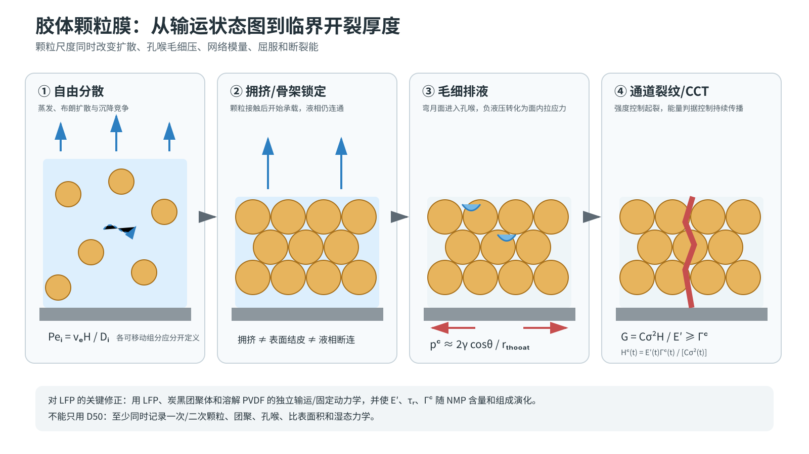

# 胶体颗粒膜的干燥、临界开裂厚度与裂纹力学：专题研究报告

> 本文全部公式的变量、SI 单位、符号方向、测量方法和适用前提，见[公式与物理量详解](13_formula_and_symbol_guide.md)。

## 摘要

胶体膜是与电极最接近的类比体系之一：两者都经历颗粒浓缩、拥挤/锁定、毛细排液、受基底约束的收缩和层内断裂。该领域最有价值的结论有三条。第一，颗粒迁移、沉降和均匀浓缩由不同时间尺度竞争，不能用单一“干燥速度”概括。第二，厚度阈值本质上是随干燥状态变化的应力轨迹与断裂阻力的交点，而不是材料的固定常数。第三，颗粒尺度同时改变孔喉毛细压力、网络模量、屈服和断裂能，因此“粒径越小越容易裂”虽然常见，却不是无需条件的普适定律。

*图 4。胶体膜从自由分散、拥挤/锁定到毛细排液和通道裂纹的状态顺序。图为本项目重绘；输运状态图依据 [Cardinal et al., 2010](https://doi.org/10.1002/aic.12190)，临界厚度/能量结构依据 [Tirumkudulu & Russel, 2005](https://doi.org/10.1021/la048298k) 和 [Singh & Tirumkudulu, 2007](https://doi.org/10.1103/PhysRevLett.98.218302)，塑性耗散依据 [Goehring et al., 2013](https://doi.org/10.1103/PhysRevLett.110.024301)。*

## 0. 完整时序物理电影：浓缩—拥挤—毛细排液—CCT

先想象一层透明的颗粒悬浮液贴在刚性基底上。最初颗粒还能绕开彼此；随后间距缩小、接触成网。此后膜虽然仍含液体，却已能储存应力。液面进入孔隙后，毛细加载与基底约束共同把它推向开裂。

下表采用固体拉应力为正。毛细吸力使自由颗粒层想收缩；只有收缩被基底阻止时，宏观面内拉应力才持续积累。它不是“负液压直接把颗粒拉开”。

| 镜头 | 移动相 / 承载相 | 主导传输 | 应力来源 | 直接观测或证据 | 证伪条件 | 到 LFP 的迁移边界 |
|---|---|---|---|---|---|---|
| 1. 可流动浓缩，约对应 E0–E1 | 溶剂和颗粒均可移动；液相与可松弛浆料网络承载 | 蒸发诱导对流、布朗扩散、沉降 | 主要是瞬态黏性应力，理想流体不能长期储存面内拉应力 | Cardinal 的 cryo-SEM 与一维状态图观察到不同颗粒分布区 | 若入炉时已有持久模量或屈服网络，完全流体起点失效 | LFP、炭黑团聚体和 PVDF 需各自的迁移/固定时间，不能共用一个 Pe |
| 2. 拥挤与骨架锁定，E1–E2 | 颗粒运动受阻，溶剂仍移动；颗粒接触网络开始承载 | 受阻对流–扩散、局部重排 | 自由收缩开始受限，局部拉应力可建立 | 胶体综述将拥挤、固化、侵气和结皮列为不同事件 | 若膜仍能完全流平并快速卸载应力，就尚未机械锁定 | 商用浆料的锁定受炭黑–PVDF 网络和触变影响，不由单一密堆体积分数决定 |
| 3. 饱和毛细供液，E2–E3 | 溶剂穿过孔网；承载相是贯通颗粒骨架 | Darcy 型供液、液桥重排 | 毛细吸力造成收缩倾向，基底约束把它转成面内拉应力 | Man–Russel 直接测得压实膜的起裂压力和缺陷敏感性 | 若解除基底约束后应力与裂纹不变，受限收缩不是主导解释 | LFP 孔喉由多峰颗粒和炭黑–PVDF 共同决定，不能用 D50 代替 |
| 4. 侵气与毛细排液，E3–E4 | 外界气体进入，连续液相逐步退缩；固体骨架承载 | 非饱和毛细流、蒸气扩散 | $p_c$、饱和度梯度和收缩失配共同加载 | 胶体干燥综述记录了液面进入孔隙、排液和裂纹的相邻时序 | 若没有外界连通气相，不能把降速拐点单独称为侵气 | 电极需加入 NMP 润湿、状态相关渗透率和组分梯度 |
| 5. CCT 分叉与通道裂纹，E5-D1 | 裂纹面增长；未裂骨架储能并承载 | 弹性能向裂尖释放，裂尖附近可塑性耗散 | $G$ 超过状态相关 $\Gamma_c$，且存在足够缺陷 | Tirumkudulu–Russel、Singh–Tirumkudulu给出 CCT；Goehring 观察到不可逆裂尖变形 | $H>H_c$ 而始终不起裂只会否定“充分条件”，不否定能量尺度；还需检查缺陷与耗散 | 可迁移 $G\sim\sigma^2H/E'$，不可迁移乳胶颗粒模量、阈值和指数 |
| 6. 裂后重分配 | 裂纹张开后，液体/蒸气可改走裂纹；剩余骨架承载 | 裂纹排气、局部排液、应力重分配 | 快速断裂释放叠加较慢松弛/排液 | 裂纹路径和塑性实验显示裂后场并非均匀弹性卸载 | 若裂纹出现前后传质与应力均无变化，裂纹反馈可忽略 | 第一代 LFP 模型可在 E5 截止；裂纹明显排气或诱发脱粘时必须升级耦合 |

三个最小方程分别回答三件不同的事：会不会形成梯度、会产生多大毛细加载、裂纹能不能持续扩展。

$$
Pe_i=\frac{v_eH}{D_i^{\rm eff}},
\qquad
p_c\simeq\frac{2\gamma\cos\theta}{r_t},
\qquad
G=C\frac{\sigma^2H}{E'}.
$$

它们不能合成一个“开裂公式”。$Pe_i$ 不含断裂阻力，$p_c$ 不含基底约束，$G$ 也不负责解释梯度如何形成。

## 1. 从液态分散体到承载颗粒骨架

### 1.1 迁移、扩散与沉降的竞争

Cardinal 等建立了一维颗粒输运模型，把蒸发诱导对流、布朗扩散和沉降共同写入移动边界问题，并用 Péclet 数与沉降数构造干燥状态图；单分散二氧化硅–水体系的瞬态颗粒分布由 cryo-SEM 验证。[直接观察+理论，D2：Cardinal et al., 2010](https://doi.org/10.1002/aic.12190) 该文把超过浓度阈值的表面颗粒富集区称为 “skin”，但明确没有计算它对蒸发、渗透率或流变的反馈；因此这里只能迁移“表面富集层”，不能把它当成本项目低渗/高模量 Skin+ 的直接证据。

对任一可移动组分 $i$，最小骨架可写成

$$
\frac{\partial \phi_i}{\partial t}
+\frac{\partial}{\partial z}(u_s\phi_i)
=\frac{\partial}{\partial z}
\left(D_i^{\rm eff}\frac{\partial\phi_i}{\partial z}\right)
-\frac{\partial}{\partial z}(v_{{\rm set},i}\phi_i)-R_{{\rm fix},i},
$$

其蒸发–扩散竞争数量级为

$$
Pe_i=\frac{v_eH}{D_i^{\rm eff}}.
$$

这里的关键不是计算一个“浆料 Pe”，而是 LFP 颗粒、炭黑团聚体、溶解态 PVDF 分别具有不同的 $D_i^{\rm eff}$、沉降速度和固定动力学。把同一个 Pe 同时用于三者，是超出胶体状态图原始假设的简化。

### 1.2 拥挤、聚集、成膜与侵气不是同一事件

胶体干燥综述将流体/固体转变、表面结皮、晶化、开裂和剥离列为相互联系但不同的过程。[综述归纳，D2：Russel, 2011](https://doi.org/10.1002/aic.12651) Routh 的综述进一步总结了颗粒前沿、横向流动、固化、裂纹和去润湿等多种时序；这些时序高度依赖几何与蒸发边界。[综述归纳，D2：Routh, 2013](https://doi.org/10.1088/0034-4885/76/4/046603)

因此，本项目需要分别定义：颗粒达到拥挤浓度、骨架能够承载面内应力、表面形成低渗层、液面降入孔隙以及连通液相断裂。文献不支持把它们统一称为“固化点”。

## 2. 毛细应力、临界应力与厚度阈值

### 2.1 毛细压力是驱动力，但不是完整断裂判据

孔喉尺度 $r_t$ 上的进气/毛细压数量级为

$$
p_c\simeq \frac{2\gamma\cos\theta}{r_t}.
$$

颗粒骨架受基底约束时，负液压会转化为面内拉应力。Man 与 Russel 通过高压超滤对均匀压实膜直接测量起裂压力，确认裂纹与弹性恢复相关，同时发现缺陷作为成核位置具有决定作用；简单能量判据只给出临界压力的下界。[直接应力测量，D2：Man & Russel, 2008](https://doi.org/10.1103/PhysRevLett.100.198302)

### 2.2 临界开裂厚度来自能量释放

Tirumkudulu 与 Russel 将干燥膜的应力–应变关系与 Griffith 能量平衡结合，预测临界应力和裂纹间距，并与乳胶膜实验进行比较。[理论+实验，D2：Tirumkudulu & Russel, 2005](https://doi.org/10.1021/la048298k) 对黏附于基底的通道裂纹，可保留如下通用结构：

$$
G=C(\nu,\text{interface})\frac{\sigma^2H}{E'};
\qquad G\ge \Gamma_c.
$$

由此得到瞬时临界厚度

$$
H_c(t)=\frac{E'(t)\Gamma_c(t)}{C\,\sigma(t)^2}.
$$

这比拟合一个固定临界涂布量更适合电极：$E'$、$\Gamma_c$ 和 $\sigma$ 都会在颗粒锁定、PVDF 浓缩/析出和孔隙排空过程中变化。极片在任一时刻满足 $H>H_c(t)$ 只表示裂纹在能量上可以扩展；是否起裂仍取决于缺陷尺度与局部强度。

Singh 与 Tirumkudulu 针对硬颗粒膜区分了不同变形能力下的无裂纹区，并把最大无裂纹厚度与颗粒尺度、刚度和堆积联系起来。[理论+实验，D2：Singh & Tirumkudulu, 2007](https://doi.org/10.1103/PhysRevLett.98.218302) 该工作支持使用“临界厚度”，但不支持将其公式不经校准地代入含 PVDF/炭黑多组分电极。

### 2.3 纯弹性模型会低估耗散

Goehring 等通过裂纹张开场分离可恢复与不可恢复变形，说明干燥胶体裂纹周围存在显著塑性；其尺度分析指出屈服应力常与最大毛细压力同量级。[直接观察+理论，D2：Goehring et al., 2013](https://doi.org/10.1103/PhysRevLett.110.024301) 因此，PVDF–炭黑网络的屈服/黏弹耗散可能显著抬高表观断裂能，不能只用最终干膜弹性模量。

## 3. 粒径、干燥速率与厚度为什么互相耦合

Birk-Braun 等通过定向干燥裂纹形貌反演断裂韧度，报告其所研究胶体中断裂韧度约随粒径的 $-0.8$ 次幂、临界能量释放率约随粒径的 $-1.3$ 次幂变化；降低蒸发速率会提高测得的韧度，而其试验范围内膜厚对韧度本身影响不显著。[直接观察+模型反演，D2：Birk-Braun et al., 2017](https://doi.org/10.1103/PhysRevE.95.022610)

另一方面，Yow 等在乳胶膜中测得起裂应力随膜厚增加而降低，而在其测试范围内对粒径不敏感。[直接应力测量，D2：Yow et al., 2010](https://doi.org/10.1016/j.jcis.2010.08.074) 两类结果并不矛盾：前者测量材料的断裂阻力，后者测量特定几何中达到断裂的应力；粒径还会通过孔喉、毛细压力、模量和缺陷群间接进入。

所以对 LFP 不能只记录 D50。最低限度应同时记录一次颗粒/二次团聚体分布、比表面积、浆料中团聚尺度、干膜孔喉分布与炭黑–PVDF 网络状态。

## 4. 裂纹路径、间距和“少而大”

定向干燥实验表明，裂纹路径会响应局部应力和干燥前沿，并可出现稳定振荡；这说明最终网格形貌并不能唯一反演起裂机理。[直接观察+路径模型，D2：Goehring et al., 2011](https://doi.org/10.1039/C1SM05979C)

对厚电极，“裂纹数量减少但单裂纹更宽/更深”可能只是固定总能量释放下的形貌分配变化，而不是风险降低。本项目因此应至少同时报告裂纹面积分数、最大宽度、深度、三维体积分数、到达铝箔的比例与裂纹间距，不能仅以裂纹条数作响应变量。

## 5. 与 LFP–PVDF/NMP 的迁移审查

### 可迁移

- 多组分蒸发–扩散–沉降的时间尺度竞争，以及各组分独立的 $Pe_i$。
- “液态→拥挤→承载骨架→侵气/排液”的事件式描述。
- 毛细压力产生干燥应力，强度控制起裂，能量控制可持续扩展。
- 临界厚度随状态相关的模量、韧度、应力和界面约束变化。
- 缺陷群、塑性和黏弹耗散对起裂分散性的重要性。

### 不可直接迁移

- 多数胶体研究使用单分散、单一硬/软颗粒和水；商用 LFP 浆料含多峰颗粒、纳米炭黑团聚体、溶解 PVDF 与 NMP。
- 胶体研究常采用毫米小样、边缘/定向自然干燥；20 cm 连续极片主要受强制对流、分区历史、气相 NMP 和基材张力影响。
- 胶体公式通常假定均匀饱和与均匀力学性质，而“表皮–中层空洞”正意味着这些假设可能失效。

## 6. 对本项目的限定性结论

1. 临界涂布量应作为模型输出：$H_{c,\min}=\min_t H_c(t)$，而不是先验常数。
2. 粒径进入模型至少有四条路径：$r_t\to p_c$、$D_i\to Pe_i$、网络模量/屈服和 $\Gamma_c$；只拟合 D50 会混淆机制。
3. 第一阶段模型可以用状态相关的通道裂纹判据预测“是否进入表面泥裂区”，但不应试图预测完整裂纹网格。
4. 若表面完整而中层出现空洞，均匀胶体膜的通道裂纹模型不足，必须转入结皮、气泡/空化或弱层断裂模型。

## 7. 苏格拉底/费曼自检

### 问 1：为什么不能给整锅浆料只算一个 $Pe$？

因为 $Pe$ 比较的是某一组分的蒸发输运与自身均化。LFP、炭黑团聚体和 PVDF 的 $D_i^{\rm eff}$、沉降和固定速度不同。一个总 Pe 只能描述溶剂移除，不能判断三种组分会怎样分层。

**会推翻什么？** 若三种组分在独立改变通量后始终同步迁移，才有理由采用共同有效输运时间；现有胶体证据并未保证这一点。

### 问 2：毛细压力很大，为什么仍不能直接宣布会开裂？

毛细压力只给加载尺度。自由膜可以收缩，受约束膜才储存面内拉伸能；材料还能通过重排、屈服和黏弹性耗散。只有加载、约束、缺陷和断裂阻力共同满足条件，裂纹才会启动并扩展。

### 问 3：膜越厚，是否一定因为应力更大而裂？

不一定。即使应力相同，$G\sim\sigma^2H/E'$ 也会随厚度增加；厚度还会改变输运和缺陷统计。近似正确但不完整的说法是“厚膜应力更大”，因为真正增加的可能首先是可释放能量。

### 问 4：满足 $H>H_c(t)$ 是否保证立即出现第一条裂纹？

不保证。该条件主要描述已有裂纹能否在能量上扩展。起裂还取决于初始缺陷、局部强度和塑性耗散。若没有足够缺陷，膜可暂时处于能量允许但未成核的状态。

### 问 5：粒径更小是否必然使 LFP 更容易裂？

不能这样外推。粒径同时改变扩散、沉降、孔喉毛细压、网络模量、屈服、韧度和团聚状态。只有这些中介量被控制或测量后，才可判断净效应；供应商 D50 不是充分状态变量。

### 问 6：最终只看到少数宽裂纹，能否说风险比密集细裂纹低？

不能。裂纹数减少可能只是能量集中到更宽、更深的裂纹。应同时看体积分数、最大宽度、深度、到达铝箔比例和脱粘，而不是只数裂纹条数。

## 附录 A：核心原文与中文导读

1. **Cardinal et al. (2010)，《颗粒涂层的干燥状态图》** — [出版社原文](https://doi.org/10.1002/aic.12190)。将蒸发、布朗扩散和沉降写入移动边界模型，并用 Peclet 数和沉降数组织表面富集、均匀浓缩和底部沉积区域；LFP、炭黑和 PVDF 必须分别定义迁移时间尺度，不能只用一个 Pe。
2. **Tirumkudulu & Russel (2005)，《干燥乳胶膜中的开裂》** — [出版社原文](https://doi.org/10.1021/la048298k)。把毛细加载、粘弹颗粒变形、Griffith 能量平衡、临界应力和裂纹间距联系起来，是临界开裂厚度模型的重要源头。可迁移的是能量结构，不是乳胶粒径或临界厚度数值。
3. **Goehring et al. (2013)，《干燥胶体膜中的塑性与断裂》** — [本地原文 PDF](literature/originals/COL07_Goehring_2013_plasticity_fracture_repository.pdf)｜[DOI](https://doi.org/10.1103/PhysRevLett.110.024301)。卸载实验和裂尖形貌表明大部分裂纹开口不可逆，单纯线弹性断裂会低估塑性耗散。它提示极片模型至少要允许湿态屈服/松弛与断裂能共同演化。
