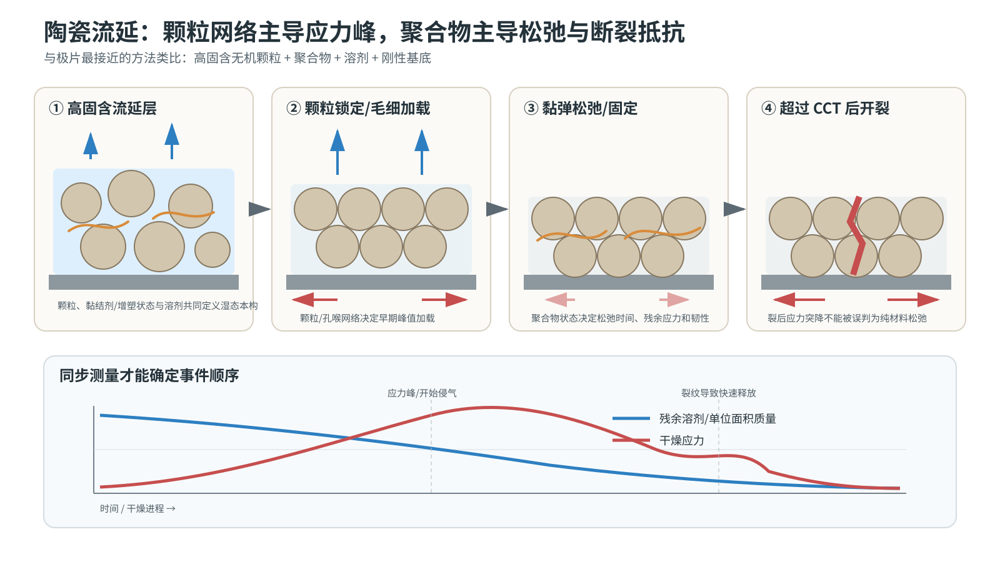

# 陶瓷流延与颗粒涂层干燥应力：专题研究报告

> 本文全部公式的变量、SI 单位、符号方向、测量方法和适用前提，见[公式与物理量详解](13_formula_and_symbol_guide.md)。

## 摘要

陶瓷流延是最接近“高固含无机颗粒+聚合物粘结剂+溶剂+刚性基底”的类比领域。它提供了电极文献中相对缺乏的同步质量损失–悬臂梁应力测量、湿态结构截面与临界开裂厚度方法。最重要的迁移结论是：颗粒网络主导毛细应力峰，聚合物粘结剂/增塑剂主导应力松弛、残余应力和断裂阻力；二者不能由一个最终干膜模量代替。

*图 5。陶瓷流延中颗粒毛细加载、聚合物松弛和裂后应力释放的分工。图为本项目重绘；增塑与应力轨迹依据 [Lewis et al., 1996](https://doi.org/10.1111/j.1151-2916.1996.tb08099.x)，颗粒/乳胶相对应力的不同贡献依据 [Martinez & Lewis, 2002](https://doi.org/10.1111/j.1151-2916.2002.tb00473.x)，同步应力–裂纹–CCT 方法依据 [Moorhead & Francis, 2024](https://doi.org/10.1111/jace.19644)。*

## 0. 完整时序物理电影：把质量、应力与裂纹放在同一块表上

陶瓷流延最有价值的不是某个 MPa 数值，而是它把同一试样的质量损失、悬臂挠曲、结构变化和裂纹时刻对齐。这样才能判断应力下降来自材料松弛、继续排液，还是膜已经裂开。

为避免符号混乱，以下把膜面内拉应力记为正。毛细液压让颗粒骨架产生收缩倾向；基底和周围未收缩材料阻止这一变形后，悬臂梁才读到持续的面内拉应力。

| 镜头 | 移动相 / 承载相 | 主导传输 | 应力来源 | 同步直接观测 | 证伪条件 | 到 LFP 的迁移边界 |
|---|---|---|---|---|---|---|
| 1. 可流动失重，约 E0–E1 | 溶剂、颗粒和聚合物仍可重排；浆料液相主承载 | 表面蒸发、内部对流–扩散、沉降 | 主要是黏性与表面张力作用，不能长期储存拉应力 | Lewis 同步记录质量损失和悬臂挠曲；早期质量先变化 | 若应力在失重前已稳定上升，应检查初始固体网络、热失配或装夹基线 | LFP 高固含与炭黑网络可能使机械锁定早于陶瓷模型体系 |
| 2. 颗粒拥挤与应力上升，E1–E2 | 溶剂继续移动；颗粒接触网络开始承载 | 受阻排液、颗粒重排 | 毛细加载、受限自由收缩 | Martinez–Lewis 观察到复合层早期应力主要受陶瓷颗粒相影响 | 若改变颗粒尺度/网络而上升段不变、只随聚合物变化，颗粒主导假说需降级 | LFP 一次颗粒、团聚体和炭黑网络会共同决定有效孔喉与承载路径 |
| 3. 锁定后排液与应力峰，E2–E3/E4 | 溶剂穿过已承载骨架；固体网络承载 | 毛细供液、孔隙排空 | 收缩被基底限制；松弛追不上加载时应力达到峰值 | Kiennemann 与 Moorhead–Francis 将干燥阶段、饱和度和应力峰对齐 | 若峰值只随温度基线漂移且与失重/饱和度无关，毛细解释不足 | 电极需实测膜温、NMP 活度和湿态松弛，不能使用水或 PVB 参数 |
| 4. 聚合物演化与应力松弛 | 残余溶剂和聚合物链仍可移动；颗粒–聚合物复合骨架承载 | 溶剂扩散、链段松弛、可能的成膜/析出 | 继续加载与黏弹/塑性松弛竞争 | Lewis 的塑化/未塑化配方出现数量级不同的峰值；Martinez–Lewis 观察到聚合物影响残余应力 | 若在无裂纹且状态相同条件下应力不随聚合物状态变化，聚合物松弛路径需重估 | PVB 增塑或乳胶融合不等于 PVDF 浓缩/吸附/析出，只迁移“状态影响松弛”的结构 |
| 5. 起裂与快速卸载，E5-D1 | 裂纹扩展，未裂膜仍承载；裂纹可成为新排液边界 | 弹性能释放叠加裂纹处排气/排液 | $G\ge\Gamma_c$ 且存在缺陷 | Moorhead–Francis 同步看到较厚膜在峰值附近起裂，随后快速应力下降 | 若应力先缓慢下降、之后才见裂纹，不能把前段下降归因于断裂 | LFP 裂纹触底还可能诱发铝箔界面脱粘，陶瓷小样界面不能代表铝箔 |
| 6. 裂后慢衰减与残余应力 | 残余液体继续排出；未裂区和聚合物桥承载 | 慢速排液、黏弹松弛、残余溶剂扩散 | 剩余收缩、聚合物固化与松弛共同作用 | Moorhead–Francis 区分快速裂后释放和较慢排液衰减 | 若裂后曲线仍按完整膜公式反演且与独立应力不符，该反演失效 | LFP 第一代模型应在贯穿裂纹出现时停止绝对应力反演，改记录事件和相对变化 |

建议把一次干燥压缩成四条同步曲线，而不是四组不同试样的终点数据：

$$
\frac{m(t)}{m_0},
\qquad
\frac{H(t)}{H_0},
\qquad
\sigma(t),
\qquad
A_{crack}(t).
$$

最有辨识力的是事件相对顺序：厚度何时停止、应力何时上升/达峰、第一条裂纹何时出现、裂后失重速率是否改变。任何一条曲线单独使用都会留下竞争解释。

## 1. 同步质量损失与干燥应力揭示了什么

Lewis 等对非水系氧化铝–PVB 流延层同步测量质量损失和悬臂梁挠曲。塑化配方在所研究 150–400 µm 刮刀间隙下的最大干燥应力约为 0.77–1.37 MPa；相近厚度的未塑化配方应力上升更缓、最大值约高一个数量级，随后应力随时间衰减。[直接应力测量，D1：Lewis et al., 1996](https://doi.org/10.1111/j.1151-2916.1996.tb08099.x)

该结果直接证明“粘结剂含量相同”不足以定义力学响应；增塑状态和湿态黏弹松弛可能比最终干膜拉伸模量更重要。对 PVDF/NMP 体系，这意味着 PVDF 分子量、溶解/析出状态、炭黑吸附和局部 NMP 含量均可能改变有效松弛时间。这一段是跨领域推论。

## 2. 颗粒与聚合物分别控制应力曲线的哪一段

Martinez 与 Lewis 对水系氧化铝–乳胶流延层进行了流变、冻干 SEM 和受控环境应力测量。应力历史具有上升、峰值和衰减三段；纯氧化铝层峰值约 1 MPa、残余应力很低，纯乳胶膜峰值约 0.1 MPa且衰减较小。复合层早期应力上升由陶瓷相主导，残余应力显著受乳胶相影响；较小氧化铝粒径提高峰值应力，较高乳胶玻璃化温度提高残余应力。[直接观察+应力测量，D1：Martinez & Lewis, 2002](https://doi.org/10.1111/j.1151-2916.2002.tb00473.x)

这给出一个对电极可检验的分工假说：LFP/孔喉网络更强地决定毛细加载峰，炭黑–PVDF 网络更强地决定加载能否松弛、裂纹能否钝化以及最终界面黏附。它不是上述陶瓷论文的直接结论。

## 3. 收缩终止、降速期与第二应力来源

Kiennemann 等同步考察水系氧化铝流延的干燥动力学与应力，报告了不同阶段的结构和应力演化，并讨论毛细作用与乳胶成膜对不同应力特征的贡献。[直接观察+作者解释，D1：Kiennemann et al., 2005](https://doi.org/10.1016/j.jeurceramsoc.2004.05.028)

陶瓷流延文献由此提示：

- 膜停止宏观收缩不等于溶剂已经排空；
- 第一个应力峰可与颗粒拥挤和毛细弯月面形成相关；
- 某些含乳胶体系可能在更晚阶段因聚合物成膜/玻璃化出现新的应力贡献。

这些阶段概念可以迁移，但 PVDF 从 NMP 中的浓缩、吸附与可能析出不同于预成型乳胶颗粒的融合，不能把“第二峰=PVDF 成膜”当作既定事实。

## 4. 临界开裂厚度的实验设计

Chiu、Garino 与 Cima 的系列工作把陶瓷颗粒涂层的临界开裂厚度与毛细应力、颗粒尺度、配方和约束联系起来，是后来胶体膜 CCT 理论的重要实验基础。[直接观察，D1：Chiu et al., 1993a](https://doi.org/10.1111/j.1151-2916.1993.tb04014.x) [直接观察，D1：Chiu et al., 1993b](https://doi.org/10.1111/j.1151-2916.1993.tb07762.x)

更近的工作使用有侧壁的悬臂梁抑制边缘先干，得到近似均匀自上而下干燥。对约 0.4 µm ZnO 颗粒膜，应力峰约 1 MPa；研究识别出约 53 µm 的临界开裂厚度区间，较厚膜在峰值附近出现裂纹，随后应力发生“快速释放+较慢排液衰减”的两段下降。[直接同步观察，D1：Moorhead & Francis, 2024](https://doi.org/10.1111/jace.19644)

这项工作对本项目的方法意义大于其数值：悬臂梁应力、表面图像、质量/饱和度和厚度必须同步，否则裂纹导致的应力释放会被误判成材料松弛或毛细压力下降。

## 5. 一个适合极片的应力分解

陶瓷流延证据支持用最小的并联结构表达湿态面内应力：

$$
\dot\sigma+\frac{\sigma}{\tau_r(c,\phi,T)}
=E'(c,\phi,T)
\left[-\dot\varepsilon_{sh}(c,\phi)
+\alpha_B\dot p_l/K_s\right],
$$

并在必要时加入聚合物固化/析出导致的第二本征应变项。式中的形式是本项目的模型选择，不是某一陶瓷论文的原式；其依据是陶瓷颗粒网络主导早期峰、聚合物相控制残余与松弛的实验分工。[证据基础：Lewis et al., 1996](https://doi.org/10.1111/j.1151-2916.1996.tb08099.x) [证据基础：Martinez & Lewis, 2002](https://doi.org/10.1111/j.1151-2916.2002.tb00473.x)

## 6. 与 LFP–PVDF/NMP 的迁移审查

### 高可迁移性

- 高固含无机颗粒、少量聚合物、溶剂和受约束薄层的总体结构。
- 同步质量损失–膜温–收缩–应力–表面成像的方法。
- 颗粒尺寸影响毛细应力，聚合物状态影响松弛/残余应力。
- 楔形/梯度厚度样条测 CCT，以及厚度与缺陷统计联合分析。

### 需要修正

- 氧化铝流延常使用 PVB/增塑剂或水系乳胶；PVDF 在 NMP 中是溶解态并与炭黑强耦合。
- 电极必须保持电子导通、离子孔路和集流体黏附；陶瓷生坯的质量函数不同。
- 商用极片是连续卷材，横幅换热、气相 NMP 负荷和张力会造成陶瓷小样中没有的边界变化。

## 7. 对实验方案的直接启示

1. 制备同一浆料的楔形厚度样或分级涂布量样，以单次干燥获得 CCT 区间并减少批间漂移。
2. 至少同步记录膜温、单位面积质量、厚度收缩与表面起裂时刻；若只能新增一个测量，优先选择非接触厚度/收缩，而不是只测出炉残余 NMP。
3. 对相同干燥通量改变 PVDF 分子量/含量或炭黑–PVDF状态，检验峰值应力与松弛是否可分离。
4. 裂后应力曲线不能继续按完整连续膜反演绝对应力，但其快速下降可作为起裂的辅助指纹。[方法边界，D1：Moorhead & Francis, 2024](https://doi.org/10.1111/jace.19644)

## 8. 苏格拉底/费曼自检

### 问 1：为什么只测质量损失，仍不知道膜什么时候开始危险？

质量只说明溶剂离开了多少，不说明颗粒是否已承载、收缩是否受限、材料能否松弛。相同失重率下，塑化与未塑化陶瓷层可有完全不同的应力历史，因此必须至少把质量与收缩或应力对齐。

### 问 2：应力曲线开始上升，是否表示膜已经完全干燥？

不是。它更可能表示承载网络已形成，而孔内仍有液体。后续毛细供液、孔隙排空和聚合物演化仍会继续，所以“开始承载”和“无溶剂”是两个事件。

### 问 3：应力达到峰值，第一条裂纹就一定在同一瞬间出现吗？

不一定。峰值由加载与松弛的净结果决定，起裂还受厚度、缺陷和断裂阻力控制。只有同步成像才能判断峰值前后是否已经出现微裂纹；事后把两者强行对齐会制造因果。

### 问 4：应力下降，能否直接解释为 PVDF 或聚合物松弛？

不能。下降还可能来自裂纹快速卸载、继续排液降低毛细加载，或悬臂测量在膜破坏后失去连续膜假设。先看裂纹时刻和失重，再讨论材料松弛。

### 问 5：为什么不能把 PVB 增塑后的 MPa 数值直接用到 PVDF/NMP？

因为聚合物化学、溶剂、吸附、颗粒孔喉、界面和加载时间都不同。可迁移的是“聚合物状态改变松弛与残余应力”这一因果结构，以及同步测量方法，不是数值参数。

### 问 6：最终干膜模量能否代替整个干燥过程的力学性质？

不能。危险窗口通常位于湿骨架已承载、但仍含大量溶剂时。此时的模量、松弛时间和断裂能可能与出炉干膜相差很大；用终态参数回算只会把过程耗散藏进经验系数。

## 附录 A：核心原文与中文导读

1. **Lewis et al. (1996)，《陶瓷流延层干燥中的流变性质与应力发展》** — [出版社原文](https://doi.org/10.1111/j.1151-2916.1996.tb08099.x)。同步测量质量损失与悬臂梁挠曲，比较塑化和未塑化氧化铝–PVB 流延层，直接展示聚合物状态如何改变峰值应力与后续松弛。其方法与非水系极片高度相似，但配方参数不能照搬。
2. **Martinez & Lewis (2002)，《水系氧化铝–乳胶流延层的流变、结构和应力演化》** — [作者原文 PDF](https://scholar.harvard.edu/files/lewis-lab/files/rheological_structural_and_stress_evolution_in_aqueous_al2o3_latex_tape-cast_layers.pdf)｜[DOI](https://doi.org/10.1111/j.1151-2916.2002.tb00473.x)。区分颗粒网络主导的早期毛细加载与聚合物相主导的后期松弛/残余应力，有助于为 LFP–炭黑–PVDF 分别建立承载与耗散变量。
3. **Moorhead & Francis (2024)，《干燥陶瓷颗粒涂层的应力发展与开裂表征》** — [开放原文](https://doi.org/10.1111/jace.19644)。把应力峰、饱和度、裂纹出现和 CCT 在同一实验中对齐，是本项目设计楔形厚度样和同步测量方案的直接方法依据。
