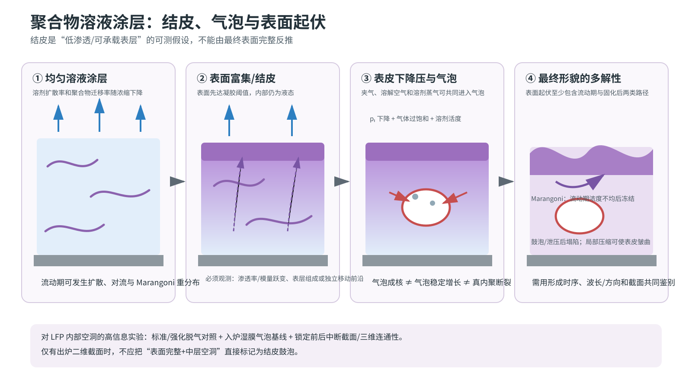

# 聚合物溶液涂层：结皮、气泡、宏孔与表面起伏专题报告

> 本文全部公式的变量、SI 单位、符号方向、测量方法和适用前提，见[公式与物理量详解](13_formula_and_symbol_guide.md)。

## 摘要

聚合物涂层领域与 LFP 极片的共同点是溶剂扩散率和聚合物迁移率会在浓缩时急剧下降，表面可能先进入凝胶/玻璃态，并在其下方形成压力和浓度梯度。它为“表面完整但粗糙，中层有空洞”提供了直接类比证据。不过纯聚合物溶液没有颗粒孔喉网络；因此它最适合生成和判别结皮–气泡/鼓泡假说，不足以证明电极中一定发生同一机制。

*图 6。聚合物溶液由表面富集/结皮分叉到气泡、鼓泡、皱缩和 Marangoni 形貌的示意。图为本项目重绘；结皮孔弹模型依据 [Punati & Tirumkudulu, 2022](https://doi.org/10.1039/D1SM01343B)，结皮后压力下降和气泡生长依据 [Arai & Doi, 2012](https://doi.org/10.1140/epje/i2012-12057-2)，溶解气体过饱和依据 [Pourdarvish et al., 2008/2009](https://doi.org/10.1002/app.28998)，Marangoni 形貌依据 [Yiantsios et al., 2015](https://doi.org/10.1016/j.ijheatmasstransfer.2015.06.015)。*

## 0. 完整时序物理电影：先分清五个不同事件

聚合物章最容易出现一条错误直线：“表面富集→结皮→气泡→皱曲”。真实情况是一个共同浓缩主干加多条竞争分支。表面富集不保证低渗 skin，skin 不保证气泡，Marangoni 与皱曲也发生在不同力学状态。

| 镜头/分支 | 移动相 / 承载相 | 主导传输 | 应力或失稳来源 | 直接观测或证据 | 证伪条件 | 到 LFP 的迁移边界 |
|---|---|---|---|---|---|---|
| 1. 均匀溶液开始干燥，约 E0–E1 | 溶剂和聚合物链均可移动；液体承载 | 浓度/温度依赖扩散、表面蒸发、移动边界 | 主要为黏性与界面应力，不形成持久薄壳应力 | Park–Kim 用厚度变化校准移动边界扩散模型 | 若初始膜已有持久模量或颗粒孔网，纯溶液起点失效 | LFP 膜一开始就含硬颗粒和炭黑网络，扩散需加孔道阻碍与吸附 |
| 2. 表面富集，但尚未证明 skin | 溶剂继续外逸，聚合物仍可扩散；整体仍主要由液体承载 | 蒸发向上输运与向内扩散竞争 | 浓度/表面张力梯度可驱动流动，但未必能储存弹性应力 | 浓度依赖扩散模型支持表面浓度先升高；此步不要求凝胶 | 若厚向组成始终均匀，表面富集分支不成立 | 电极表面 PVDF/炭黑富集、颗粒拥挤和外观变化必须分别记录 |
| 3. 低渗、可承载 skin，E1 分支 | 溶剂穿过皮层；皮层承载，内部仍可为液体 | 皮层内 Darcy/扩散输运 | 皮层与内部收缩失配、孔压梯度 | Punati–Tirumkudulu 理论定义凝胶阈值与孔弹性皮层；Arai–Doi 直接测了皮层厚度 | 若没有持续的渗透率或模量对比，只能称表面富集，不能称 skin | LFP 的“皮层”可能是异质颗粒–炭黑–PVDF 复合层，不是连续 PVDF 壳 |
| 4A. 气泡/鼓泡，skin 后可发生 | 气体、NMP 蒸气与溶解空气向气泡迁移；皮层/骨架承载 | 多组分扩散、局部蒸发、气泡界面传质 | $p_b-p_l$ 克服 Laplace 与皮层弹性阻力 | Arai–Doi 同步观察皮层、压力下降和气泡增长；Pourdarvish 关联过饱和与脱气 | 若空腔在入炉前已有且只按热膨胀增长，新生成泡解释不足；若有尖锐裂尖，应转查内裂 | 纯聚合物证据只建立可行路径；LFP 还需排除夹气、空化和层内断裂 |
| 4B. 流动期 Marangoni 起伏，可早于 E1 | 液体和溶质仍横向流动；无刚性皮层承载 | 表面张力梯度驱动面内循环 | 热/溶质 Marangoni 剪切使浓度与厚度重新分配 | Yiantsios 的模型显示浓度不均可在后续固化中冻结成形貌 | 若起伏只在表面已锁定后出现，或不响应梯度方向，Marangoni 解释应降级 | LFP 的高黏度、屈服应力、气流剪切和涂布条纹都可抑制或伪装该路径 |
| 4C. skin 皱曲/塌陷，发生在承载后 | 皮层弯曲，内部液体/软层提供支撑；皮层承载 | 继续排液、壳体弯曲与基底耦合 | 皮层面内压缩超过屈曲阈值，或鼓泡泄压后失稳 | 一般薄膜屈曲理论给出刚度–波长关系；本章没有 LFP 直接观测 | 若表层始终面内受拉、无皮层且形貌在流动期已形成，皱曲解释不成立 | 极片整体常受拉，必须证明局部压缩来源，不能见波纹就叫结皮皱曲 |
| 5. 最终结构冻结 | 溶剂迁移变慢；固态聚合物或颗粒复合骨架承载 | 残余溶剂扩散、解吸、局部空腔排气 | 残余收缩、玻璃化/析出和界面失配 | 上述模型与实验共同提示终态形貌可能依赖此前路径，而非只依赖终点溶剂量 | 若不同历史在相同终点给出相同全场组成和缺陷，路径依赖才可忽略 | LFP 还要满足导电、孔路和铝箔黏附，纯聚合物外观不是完整质量函数 |

五个事件应使用不同的最低判据：

| 术语 | 最低判据 |
|---|---|
| 表面富集 | $c_{p,\rm surface}>c_{p,\rm bulk}$，只说明组成梯度 |
| 低渗 skin | 表层存在持续的 $k_{\rm surface}<k_{\rm bulk}$ 或等价传质阻力跃变 |
| 气泡 | 有闭合气–液/气–固界面，体积随时间增长；不自动说明成核来源 |
| Marangoni 起伏 | 起伏在可流动期生成，并响应表面张力梯度的方向/尺度 |
| 皱曲 | 已承载皮层在压缩下出现具有弯曲–支撑波长标度的失稳 |

气泡增长可用统一的力学账本表达：

$$
p_b-p_l>
\frac{2\gamma}{R}+p_{\rm shell}(R),
\qquad
p_b=p_{\rm air}+p_{\rm NMP}.
$$

该式只描述既有泡是否能增长。它不判断泡是入炉前夹带、溶解气析出、NMP 蒸气加入，还是负液压空化后生成。

## 1. 移动边界与浓度依赖扩散

Park 与 Kim 对吸溶剂聚酰亚胺膜建立了浓度/温度依赖的修正 Fick 扩散与移动边界模型，并用干燥过程中的膜厚变化校准扩散和气侧传质参数。[直接观察+传质反演，D2：Park & Kim, 2000](https://doi.org/10.1295/polymj.32.415)

其可迁移结构为

$$
\frac{\partial c_s}{\partial t}
=\frac{\partial}{\partial z}
\left(D_s(c_s,T)\frac{\partial c_s}{\partial z}\right),
\qquad
-D_s\frac{\partial c_s}{\partial n}=J_s(T,c_{s,s},p_{s,\infty}),
$$

并由溶剂守恒决定移动表面。对 PVDF/NMP，$D_s$ 还会受 LFP/炭黑几何阻碍和吸附影响，不能沿用纯聚合物参数。

## 2. “结皮”必须有可操作定义

聚合物干燥模型常把表面聚合物体积分数达到凝胶阈值 $\phi_g$ 定义为结皮开始；之后表皮作为孔弹性固体，内部仍可为液态溶液，溶剂通过表皮的 Darcy 流动维持蒸发。[理论，D2：Punati & Tirumkudulu, 2022](https://doi.org/10.1039/D1SM01343B)

该模型把过程分为液态期、液体–表皮共存期和全层表皮/固体期，并预测表皮渗透率与蒸发通量共同决定孔压和干燥应力。[理论，D2：Punati & Tirumkudulu, 2022，正文式 8–19、附录 C](https://doi.org/10.1039/D1SM01343B)

对极片，“表面 PVDF/炭黑富集”“颗粒拥挤”“低渗透表层”和“可承载薄壳”是四个不同命题。只有观察到厚向结构/模量或渗透率跃变，才应使用结皮一词；单凭表面无裂纹或较光滑不能证明结皮。

## 3. 结皮后为什么会出现气泡

Arai 与 Doi 同步测量聚合物溶液干燥中的表皮厚度、气泡尺寸和溶液压力，观察到表皮形成后气泡出现。泡内含溶剂蒸气与溶解空气、表皮降压有助于成核以及增长主要受溶解空气扩散限制，是作者结合压力、Henry 定律和 $R\propto\sqrt{t-\tau}$ 数据一致性作出的机理解释；论文没有直接分析泡内气体成分，并将其列为未来工作。[直接观察+作者机理解释，D2：Arai & Doi, 2012](https://doi.org/10.1140/epje/i2012-12057-2)

Pourdarvish 等针对聚醋酸乙烯酯–甲苯–氮气体系建立多组分扩散模型。模型只有在保留交叉扩散项时才预测干燥过程中氮气过饱和，并与“脱气可降低气泡”的实验现象一致。[模型+实验相关，D2：Pourdarvish et al., 2009](https://doi.org/10.1002/app.28998)

因此，电极中层空洞至少有两个与“热到 NMP 沸点”不同的气泡来源：

- 初始夹带空气在升温/压力变化下增长；
- 溶解气体因局部组成变化而过饱和析出。

这两条路径均可能发生在远低于纯 NMP 常压沸点的条件下。是否适用于实际 LFP 浆料仍需通过脱气对照和原位时序验证，不能由纯聚合物结果直接断言。

## 4. 溶剂沸腾/鼓泡是第三条路径

聚合物涂层的详细热质传递模型表明，当膜内局部溶剂蒸气压达到局部总压时可发生沸腾并产生 blister；Price 与 Cairncross 将“不发生膜内沸腾”作为单区烘箱优化约束，在固定停留时间下权衡残余溶剂与缺陷。[理论优化，D2：Price & Cairncross, 1999](https://doi.org/10.1080/07373939908917616)

对极片应比较

$$
p_{\rm NMP}^{\rm eq}(T,c_{\rm NMP},\phi_{PVDF})
+p_{\rm air,bubble}
\quad\text{与}\quad
p_g+p_{\rm cap}+p_{\rm shell},
$$

而不是只比较烘箱温度与纯 NMP 沸点。上式是本项目的机制平衡表达，具体活度、曲率和壳体阻力需要实验闭合。

## 5. 相分离与宏孔：有类比，但迁移等级较低

对聚合物–溶剂–非溶剂三元体系，不同深度的组成轨迹可能穿过相图两相区并产生“发白”或多孔结构；气侧传质、相对扩散率、挥发度和环境溶剂饱和度都会改变轨迹。[理论+实验，D2：Dabral et al., 2002](https://doi.org/10.1002/aic.690480105)

这说明干燥宏孔也可能来自液–液相分离，而不必是机械裂纹。然而标准 LFP–PVDF/NMP 在没有水分/非溶剂污染时近似二元聚合物溶液加颗粒，是否会进入相分离区没有现成证据。除非检测到水分、配方共溶剂或 PVDF 析出相界，否则该路径暂列低优先级假说。

## 6. 表面凹凸不平至少有两种机制

### 6.1 流动期的 Marangoni 形貌冻结

数值研究表明，蒸发引起的溶质表面张力梯度可驱动 Marangoni 对流，形成溶质不均；在典型小毛细数下即时自由表面变形可能不大，但浓度不均可在后续固化中表现为膜面起伏。[理论+实验背景，D2：Yiantsios et al., 2015](https://doi.org/10.1016/j.ijheatmasstransfer.2015.06.015)

该路径要求表面起伏在浆料仍可流动时形成，且方向/波长应响应气流、温度和表面张力梯度。

### 6.2 结皮后的屈曲/皱缩

当薄而较硬的表皮受到面内压缩，并由更软的液体或软基底支撑时，会发生皱曲；一般薄膜屈曲理论给出波长由皮层弯曲刚度和基底刚度共同控制，而振幅随超临界压缩增长。[综述归纳，T/D2：Chen et al., 2014](https://doi.org/10.1002/polb.23590)

极片干燥通常整体受拉而非受压，但表层与下层收缩失配、气泡鼓胀后的卸压或局部塌陷可以在表皮内制造压缩。因此“表面凹凸=结皮皱曲”必须由时序、截面皮层和波长标度共同验证。

## 7. 与 LFP–PVDF/NMP 的迁移审查

### 可迁移

- 浓度/温度依赖扩散、移动边界和表面先凝胶化的判据结构。
- 结皮后 Darcy/孔弹性压力梯度。
- 夹气、溶解气体过饱和、溶剂蒸气和壳体阻力的气泡增长竞争。
- 流动期 Marangoni 形貌与固化后屈曲需要用时序区分。

### 不可直接迁移

- 纯聚合物层没有颗粒锁定、孔喉进气和毛细液桥；电极的“表皮”可能主要是颗粒/炭黑富集而非连续 PVDF 膜。
- 聚合物模型常假定清晰凝胶阈值和各向同性皮层；LFP–炭黑–PVDF 表层可能是异质、渗透率渐变的颗粒复合层。
- 纯聚合物气泡研究不能区分电极中的空化、入炉前夹气和骨架内聚断裂。

## 8. 对中层空洞的判别性实验

| 竞争机制 | 最强判别观测 | 工艺干预预测 |
|---|---|---|
| 入炉前夹气 | 湿膜原位已见同位置气泡；三维位置连续 | 真空脱气/降低混入气体显著减少 |
| 溶解气体析出 | 湿膜无可见泡；脱气仍有效；升温后成核 | 预脱气、降低早期升温或表面封闭速度有效 |
| 困 NMP/局部沸腾 | 缺陷与膜温/残余 NMP 峰和高温区共定位 | 降低后段膜温或先建立排液通道有效 |
| 负液压空化 | 与高毛细吸力、孔腔/孔喉比和弱缺陷相关 | 增大孔喉、降低通量或提高湿态韧性有效 |
| 层内断裂 | 尖锐裂尖、平面裂面、随面内约束变化 | 增强湿态韧性/松弛或降低应力有效 |

该表是基于上述文献的本项目推论；任何单一出炉截面都不足以完成归因。

## 9. 苏格拉底/费曼自检

### 问 1：表面聚合物浓度最高，为什么还不能叫结皮？

因为浓度梯度只说明物质分布。结皮还要求表层成为持续的传质阻力或承载层。若溶剂仍可轻易通过、表层也不能储存应力，它只是富集区，不是低渗 skin。

### 问 2：检测到 skin，是否就证明中层空洞由它造成？

不证明。还要看到空腔在 skin 之后形成、内部压力或溶剂/气体迁移与其增长一致，并排除入炉前夹气、正常孔隙、空化和层内断裂。skin 是可能条件，不是充分因果链。

### 问 3：炉温低于纯 NMP 常压沸点，能否排除蒸气参与鼓泡？

不能。泡内压力由局部 NMP 活度、温度、溶解空气、液压、曲率和皮层阻力共同决定。低于纯溶剂常压沸点只排除一种最简单情形，不排除局部蒸气加入已有气泡。

### 问 4：看到规则波纹，为什么不能立即判断是 Marangoni？

Marangoni 要求膜仍可流动，波纹应响应热/浓度表面张力梯度。若波纹在表层锁定后才出现，并符合皮层弯曲与支撑刚度的尺度，更可能是皱曲；气泡鼓胀和泄压也能留下相似凹凸。

### 问 5：脱气后空洞减少，是否已经证明“溶解气体析出”？

没有。脱气既会减少溶解气体，也可能减少初始夹带微泡。要区分二者，还需干燥前基线、成核时刻与气泡数量/体积轨迹。脱气是判别干预，不是单独的机制证明。

### 问 6：纯聚合物结皮模型可以怎样安全地迁移到 LFP？

可以迁移移动边界、浓度依赖扩散、低渗层、压力–壳体平衡和时序判据。不能迁移凝胶阈值、渗透率、气体溶解度或屈曲阈值；电极还必须加入颗粒锁定、孔喉侵气和炭黑–PVDF 网络。

## 附录 A：核心原文与中文导读

1. **Punati & Tirumkudulu (2022)，《聚合物涂层干燥建模》** — [出版社原文 PDF](https://pubs.rsc.org/en/content/articlepdf/2022/sm/d1sm01343b)｜[DOI](https://doi.org/10.1039/D1SM01343B)。把稀溶液区与聚合物富集的多孔皮层分开建模，并用 Biot 孔弹性计算应力，是“结皮”假设最明确的方程来源；在 LFP 中是否存在同类连续皮层仍需截面证据。
2. **Arai & Doi (2012)，《聚合物溶液干燥中的结皮形成与气泡生长》** — [公开原文 PDF](https://kinampark.com/PL/files/Arai%202012%2C%20Skin%20formation%20and%20bubble%20growth%20during%20drying%20processof%20polymer%20solution.pdf)｜[DOI](https://doi.org/10.1140/epje/i2012-12057-2)。同步测量皮层厚度、气泡尺寸与液内压力；气体组成和扩散控制属于模型解释，增长规律应按正文式写成 $R\propto\sqrt{t-\tau}$。它是生成极片竞争假设的直接类比，不是极片机制证明。
3. **Pourdarvish et al. (2009)，《聚合物膜干燥中的气泡形成机制》** — [出版社原文](https://doi.org/10.1002/app.28998)。用 PVAc–甲苯–氮气体系讨论溶剂减少导致气体过饱和，并解释为何预脱气可降低气泡。对极片的关键价值是把“脱气对照”变成可证伪实验，而非认定所有中层空洞都来自溶解气体。
