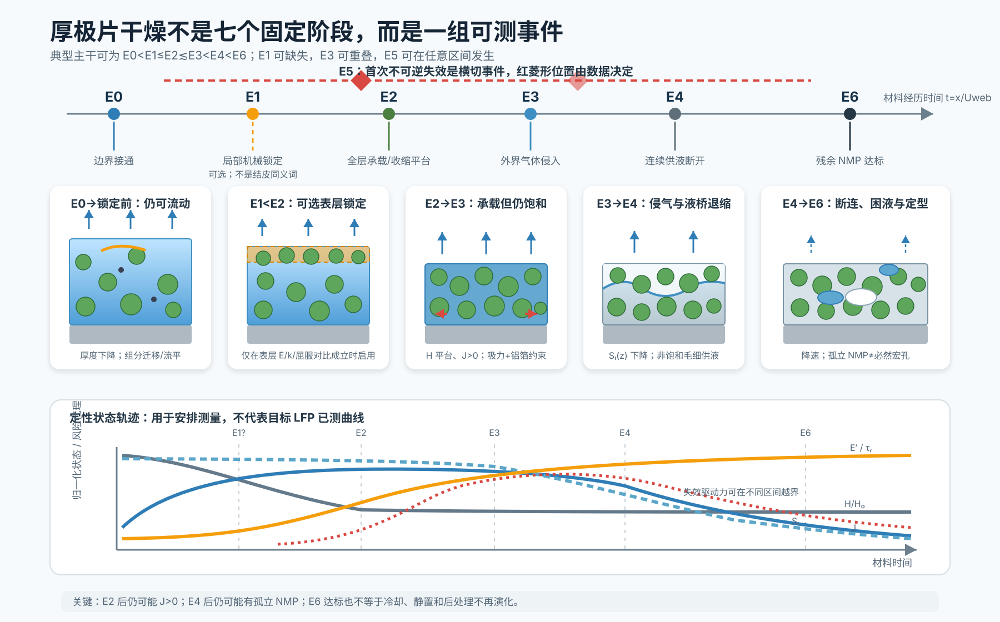
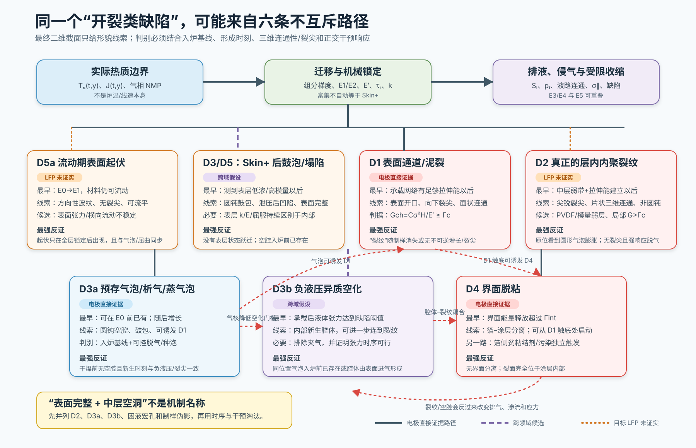

# 怎样真正理解一次厚极片干燥：物理过程学习与追问指南

> 本文全部公式的变量、SI 单位、符号方向、测量方法和适用前提，见[公式与物理量详解](13_formula_and_symbol_guide.md)。

> 版本：2026-07-23；对象：LFP–炭黑–PVDF/NMP 厚涂极片，约 20 cm 连续涂布。  
> 用途：把专题报告从“概念索引”变成可反复推演、可被实验推翻的工作语言。  
> 阅读原则：先讲清一块湿膜经历了什么，再引入方程；先区分观察和解释，再讨论优化。

## 0. 先闭上书，想象一小块湿膜

把一段刚涂好的极片截出来：上面是空气，下面是铝箔，中间是 LFP、炭黑、PVDF 和 NMP 组成的浓悬浮层。此刻它不是“已经成形、只差去掉溶剂的固体”，而是一种正在制造自身孔结构和力学性质的材料。

进入烘箱后，最先改变的是边界：表面被加热，NMP 开始离开。液体流向表面、颗粒靠近、组分重新分布、骨架承载、孔内压力差和气体侵入随后或重叠发生；失效也可能从入炉前缺陷继续演化，而不必等到所有状态转换结束。电极截面研究支持“收缩、孔隙排空和组分梯度是相互关联但不同的事件”；原位 CT 则直接观察到其模型正极在厚度收缩停止以后才启动泥裂。[直接观察，体系为石墨/CB/PVDF-NMP 负极：Jaiser et al., 2017](https://doi.org/10.1016/j.jpowsour.2017.01.117) [直接原位观察，体系为 NMC622–PVDF/NMP 模型正极：Dawson et al., 2026](https://doi.org/10.1039/D5EB00201J)

第一条需要真正掌握的句子是：

> **烘箱不是直接“制造裂纹”；烘箱先制造一条温度与蒸发通量历史，这条历史改变材料状态，材料状态再决定应力能否积累、缺陷能否长大。**

这是本项目的综合框架，不是某篇论文的原句。它把问题分成四层：

```text
机器怎样运行 → 湿膜实际受到什么边界 → 材料内部到了什么状态 → 哪条失效路径先越界
```

如果只能记住一个学习动作，就是每遇到一句“高温导致开裂”，立即追问：**中间省略了哪三层？**

## 1. 两条阅读轨道：先形成直觉，再做定量判断

本文和各专题都可以沿两条轨道阅读。

### 轨道 A：过程直觉

只追踪七个事件：

1. 入炉前湿膜继承了什么；
2. 膜温和蒸发通量怎样建立；
3. 可流动湿膜怎样收缩和重新分布；
4. 何时形成承载骨架；
5. 锁定后的 NMP 怎样继续流动和排空；
6. 气体、裂纹或界面损伤中哪条路径先启动；
7. 出炉及冷却后是否继续演化。

这条轨道的合格标准不是会背“Péclet 数”或“毛细压力”，而是能不用术语向同事讲明白：**为什么一块表面看起来已经干的极片，内部仍可能有液体、压力差和正在增长的损伤。**

### 轨道 B：可测量、可证伪

对每个事件再问四件事：

- 状态变量是什么；
- 最小控制方程是什么；
- 生产线上能观测什么代理量；
- 什么结果会推翻当前解释。

例如“形成了结皮”不是一个可直接接受的解释。必须先把它改写为操作性命题：表层是否比内部更早出现显著更高的模量、更低的渗透率或更低的有效扩散率？若没有这种厚向状态跃迁，表面完整只能算现象，不能算结皮证据。纯聚合物膜确有结皮—气泡的直接实验和理论，但电极截面研究并不支持所有配方都会形成锐利的自上而下颗粒硬壳。[聚合物溶液直接实验：Arai & Doi, 2012](https://doi.org/10.1140/epje/i2012-12057-2) [电极修正性证据：Jaiser et al., 2017](https://doi.org/10.1016/j.jpowsour.2017.01.117)

## 2. 用七个“画面”建立完整过程

下面的 P−1–P6 是为了讲故事而排列的教学画面，不是七个必然顺序发生的物理阶段。项目正式事件语法是：E0 边界接通、E1 首次局部机械锁定、E2 全层承载/宏观收缩平台、E3 外界气体侵入、E4 连续供液断开、E6 残余 NMP 达标；E5“首次不可逆失效”横切整条时间轴。E1 可以与 E2 重合，E3 可以和 E2 重叠，流动期表面起伏可以早于 E1，预存气泡甚至早于 E0。详细操作定义见[电极专题第 2 节](01_battery_electrode.md)。



*图 1。本项目教学示意图，不是文献原图。事件顺序的电极依据来自 [Jaiser et al., 2017](https://doi.org/10.1016/j.jpowsour.2017.01.117)、[Kumberg et al., 2019](https://doi.org/10.1002/ente.201900722) 与 [Dawson et al., 2026](https://doi.org/10.1039/D5EB00201J)；曲线只表达应测趋势和可能的相对时序，不代表目标 LFP 已测定的数值轨迹。*

### 画面 P−1：入炉以前，命运已经部分写下

初始湿厚、干面密度、固含、浆料密度、流变、团聚体、气泡、涂布条纹和铝箔表面共同构成初始条件。若干面密度为 $m_A$、浆料固体质量分数为 $w_s$、浆料密度为 $\rho_{slurry}$，忽略涂布后的瞬时流平损失，湿厚的第一近似是：

$$
H_0\approx\frac{m_A}{w_s\rho_{slurry}}.
$$

这条质量守恒关系来自定义；它说明“提高固含”与“减小湿厚”经常同时发生。若实验只改变固含却没有固定干面密度或湿厚，就无法知道缺陷变化究竟来自少了 NMP、薄了湿膜，还是流变和骨架发生了变化。

**苏格拉底追问**

- 两组样品干面密度相同、固含不同，它们的湿厚、NMP 库存和入炉流变分别怎样变化？
- 若强化真空脱气只降低了内部空洞，却没有改变表面泥裂，至少能排除或支持哪些路径？
- 一张最终截面能否证明气泡是在入炉前、锁定前还是锁定后形成？为什么不能？

### 画面 P0：烘箱设定先变成材料边界

设备给出各区空气温度、风速、喷嘴距离、排风和线速；湿膜真正经历的是膜温 $T_s(t,y)$、局部蒸发通量 $J(t,y)$ 与气相 NMP 分压 $p_{NMP,g}(t,y)$。局部换热分布可以让同一片电极同时出现相对干区与湿区；跨设备放大也更应匹配膜温和传递驱动力历史，而不是复制温度、风机或线速设定。[直接设备实验与模型：Kumberg et al., 2021](https://doi.org/10.1002/ente.202000889) [跨尺度实验与模型：von Horstig et al., 2026](https://doi.org/10.1002/batt.202500845)

最小能量账本可以写成：

$$
\rho c_p H\frac{dT_s}{dt}
=q_{conv}+q_{rad}+q_{foil}-J\Delta H_{vap}.
$$

它不是当前项目已经校准的热模型，只是在提醒：蒸发会消耗潜热，所以膜温不等于烘箱温度；铝箔导热、辐射和气侧传递也会改变局部轨迹。

**苏格拉底追问**

- 两台烘箱都设为 100 °C，为什么同一浆料可能得到不同裂纹结果？
- 同一烘箱中央和边缘的膜温相同，是否就能推出蒸发通量相同？还缺什么量？
- 如果总停留时间不变，只交换前后两区温度，终点残余 NMP 相同是否意味着材料经历相同？

### 画面 P1：湿膜仍能流动，先用重排消化体积损失

蒸发使液体体积减少。只要颗粒和聚合物网络仍能重排，膜就会通过厚度收缩、颗粒靠近和液体补给表面来消化这部分损失。不同组分的迁移能力并不相同；可用物种特异的 Péclet 数建立第一层判断：

$$
Pe_i=\frac{v_eH}{D_i^{eff}},
$$

其中 $v_e$ 是与蒸发相关的界面速度，$D_i^{eff}$ 是组分 $i$ 的有效均化能力。$Pe_i$ 大只意味着蒸发诱导输运相对均化更快，不能单独决定最终上浮方向，因为沉降、吸附、团聚和状态相关扩散也在竞争。[颗粒涂层直接实验与状态图：Cardinal et al., 2010](https://doi.org/10.1002/aic.12190) [电极粘结剂一维模型：Font et al., 2018](https://doi.org/10.1016/j.jpowsour.2018.04.097)

电池证据本身也构成一个有价值的冲突：有研究观察到高干燥强度下粘结剂或导电剂向表面富集并伴随黏附/电阻变化，另有 NMC622–PVDF/NMP 研究发现所测 PVDF 厚向分布对干燥温度大体不敏感，而细碳重排更明显。[石墨负极速率切换实验：Jaiser et al., 2016](https://doi.org/10.1016/j.jpowsour.2016.04.018) [PVDF 正极深度分析：Kumano et al., 2024](https://doi.org/10.1016/j.jpowsour.2023.233883) [反例与先进表征：Zhang et al., 2022](https://doi.org/10.1039/D2TA00861K)

真正应该学到的不是“binder 一定上浮”，而是：**迁移是多物种、路径依赖问题；烘箱温度不是足够的横坐标。**

### 画面 P2：骨架锁定，材料角色发生切换

当颗粒、炭黑–PVDF 网络开始连通并承载载荷，湿膜从“会流动的浓悬浮体”切换为“仍含大量液体的多孔骨架”。锁定不是一个肉眼可见的瞬间，更不是完全干燥；可把它操作性定义为宏观自由收缩明显受限、湿态模量开始快速上升、材料松弛时间接近或超过加载时间。

这一步改变了同一份 NMP 损失的后果：锁定前可以通过厚度收缩和颗粒重排释放；锁定后则更容易转化为孔压、受约束自由收缩和拉应力。NMC622 模型正极原位 CT 中，300、500、800 µm 刮刀间隙样品分别约在 39、45、74 min 出现裂纹；300 和 800 µm 样的主传播直接位于厚度平台后，500 µm 样前 35–36 min 数据因旋转中心错误丢失，不能同等强度地证明完整顺序。这些绝对时间属于 4 mm 钢柱、45 wt% 固含、环境慢干模型体系，不能移植到商用 LFP 线。[直接观察+数据缺口：Dawson et al., 2026](https://doi.org/10.1039/D5EB00201J)

**费曼自检**

试着不用“固化”“凝胶点”或“锁定”这些词，向新人解释：为什么此时继续蒸掉 1 g NMP，比入炉早期蒸掉同样 1 g NMP 更可能制造应力？如果只能回答“因为更干了”，说明还没有说清“可重排自由度消失”这一关键变化。

### 画面 P3：厚度不再缩，NMP 仍在孔网中接力

在所研究的电极中，宏观收缩停止后仍可保有大量液体，并继续通过孔网向表面供液；把这一窗口近似为“近饱和骨架”是第一代模型候选，不是所有配方的先验事实。[石墨/CB/PVDF-NMP 中断截面：Jaiser et al., 2017](https://doi.org/10.1016/j.jpowsour.2017.01.117) 表面蒸发通过孔网中的液体流动得到补给时，最小 Darcy 形式为：

$$
\mathbf{u}_l=-\frac{k(S_l,c,T)}{\mu(T,c)}\left(\nabla p_l-\rho_l\mathbf{g}\right).
$$

蒸发越快、路径越长、渗透率越低，为维持同一液体通量所需的压力梯度越大。气液弯月面给出的毛细压力尺度是：

$$
p_c=p_g-p_l\sim\frac{2\gamma\cos\theta}{r_{throat}}.
$$

这里真正控制侵气和压力的几何量更接近孔喉分布，而不是供应商给出的 LFP 单一 D50。炭黑–PVDF 网络、团聚体间隙、润湿性和压实路径都可能改变 $r_{throat}$ 与 $k$。

厚石墨负极实验显示，宏观收缩停止后仍能维持一段近恒速干燥；极厚样品随后出现被解释为毛细网络部分断连与孤立液体团簇的降速行为。[直接干燥曲线与作者解释，水系石墨体系：Kumberg et al., 2019](https://doi.org/10.1002/ente.201900722) 这证明“厚度不再变化”和“内部没有液体”不是同义词；但它并不直接证明 LFP 中层大空洞就是孤立 NMP 蒸发形成。

### 画面 P4：空气进入，连续液路开始破碎

当表面不能保持连续液膜、局部毛细进入条件被满足时，气体开始进入孔网。此后不同孔径按不同顺序排空，液相连通性下降，表面蒸发与内部传质之间的阻力重新分配；当连续供液路径断开，整体干燥往往转入降速阶段。[电极表面液体与孔隙排空实验，摘要级证据：Jaiser et al., 2017](https://doi.org/10.1016/j.jcis.2017.01.063) [厚电极干燥曲线：Kumberg et al., 2019](https://doi.org/10.1002/ente.201900722)

厚膜困难在此显现为一个平方尺度：若把锁定后的压力均化近似看成扩散型过程，

$$
t_h\sim\frac{H^2}{D_h},
$$

其中 $D_h$ 由渗透率、骨架刚度、储存性、黏度和饱和度共同决定。这个 $H^2$ 结构来自孔弹性/压力扩散的尺度分析；目标极片中的 $D_h$ 不能用土或凝胶参数代替。[方程结构来源：Biot, 1941](https://doi.org/10.1063/1.1712886)

### 横切画面 P5：不是“会不会裂”，而是哪条路径先越界



*图 2。本项目判别图。电极中的预存气泡—裂纹—脱粘时序依据 [Dawson et al., 2026](https://doi.org/10.1039/D5EB00201J)；结皮下气泡依据纯聚合物体系 [Arai & Doi, 2012](https://doi.org/10.1140/epje/i2012-12057-2)；空化—裂纹竞争依据凝胶体系 [Wang & Cai, 2015](https://doi.org/10.1039/C4SM02652G)。后三者对 LFP 均属于待验证迁移，不是已证实归因。*

至少要并列计算五类结果：表面通道裂纹 D1、层内裂纹 D2、异常空洞/气泡 D3、界面脱粘 D4 和表面起伏 D5。生产质量标准可以把它们合为“开裂类缺陷”，物理模型不能合并。这里把它放在 P4 后面只是为了先讲清共同主干；E5-D1–D5 的真实发生位置必须由数据决定。

通道裂纹的第一近似能量结构是：

$$
G_{ch}=C\frac{\sigma^2H}{E'},\qquad G_{ch}\geq\Gamma_c\ \Rightarrow\ \text{裂纹可传播}.
$$

该结构来自受约束颗粒/胶体薄膜断裂理论；$C$、$\sigma$、$E'$ 和 $\Gamma_c$ 都随目标湿态结构、界面和缺陷改变，不能直接搬用文献数值。[理论与实验比较：Tirumkudulu & Russel, 2005](https://doi.org/10.1021/la048298k) 湿膜裂纹附近还可能有明显不可逆变形，所以最终干膜弹性模量并不足以代表起裂时的抵抗。[直接裂纹场与模型：Goehring et al., 2013](https://doi.org/10.1103/PhysRevLett.110.024301)

对于“表面完整、中层空洞”，先不要给它命名为结皮裂纹。应依次问：

1. 入炉前是否已经有同位置气泡？
2. 腔体在何时出现，出现前表层是否已有可测的低渗/高模量层？
3. 腔体是圆钝、含残留物，还是具有尖锐裂尖和面状延伸？
4. 它是否与表面或边缘连通？
5. 强化脱气、降低早期通量、改变气相 NMP 分压分别怎样影响它？
6. 制样方法是否可能拉出颗粒或打开原有弱面？

只有时序、三维几何和干预响应三类证据一致，才有资格把它归入夹气、蒸气/溶解气体气泡、负压空化或真层内断裂中的某一支。

### 画面 P6：出炉不是物理过程的句号

**本项目待验证推论**：出炉后温度下降，厚向残余 NMP 与应力可能继续重排；冷却或静置期间的潜在损伤可能变得可见，而辊压与制样既可能显现也可能另行制造损伤。食品中的“饼干 checking”只提供一个跨领域提醒：其水分不均在冷却/储存期间与延迟裂纹和破损相关。[饼干水分成像与 15 天裂损跟踪：Bedas et al., 2019](https://doi.org/10.1016/j.foodchem.2019.125078) 这不能证明极片遵循相同水活度、玻璃化机制或时间尺度，只支持把“出口热态—规定冷却—后处理前后”分开观察。

## 3. 为什么厚到某个值后，调温和线速越来越难救

不要把临界面密度想成一堵固定的墙。它更像四只时钟与两道抵抗在竞争：

| 竞争项 | 尺度 | 厚度增加时首先发生什么 |
|---|---|---|
| 组分均化 | $t_{diff,i}\sim H^2/D_i^{eff}$ | PVDF、炭黑或细颗粒更难抹平梯度 |
| 液压均化 | $t_h\sim H^2/D_h$ | 孔压与饱和度更容易产生厚向差异 |
| 干燥加载 | $t_{load}$ 由 $J(t)$ 与状态转换决定 | 同一炉温下也会随气侧边界改变 |
| 材料松弛 | $\tau_r(c,T)$ | 若 $\tau_r/t_{load}$ 上升，应力来不及释放 |
| 内聚抵抗 | $\Gamma_c(c,T,\dot c)$ | 湿态弱层或缺陷会降低有效抵抗 |
| 界面抵抗 | $\Gamma_{int}(c,T)$ | 裂纹触底后可能转为脱粘 |

同时，通道裂纹可释放能量在简化条件下随 $H$ 增大。**本项目缺陷统计假说**还认为，更大材料体积可能增加遇到大气泡、团聚体或弱区的机会；这必须用生产面积/体积数据检验。厚石墨电极与 NMC 模型原位研究只直接支持“厚度与裂纹/脱粘结果相关”，不能证明上述统计路径，更不能把其数值阈值用于商用 LFP。[水系石墨厚度楔形实验：Kumberg et al., 2019](https://doi.org/10.1002/ente.201900722) [NMC 模型原位 CT：Dawson et al., 2026](https://doi.org/10.1039/D5EB00201J)

因此动态临界厚度应写成过程最危险时刻的输出：

$$
H_c(t)=\frac{E'(t)\Gamma_c(t)}{C\sigma(t)^2},
\qquad H_{c,process}=\min_t H_c(t).
$$

这是本项目采用的简化断裂尺度，不是已拟合公式。真正的工艺窗口还必须加入内部空洞、界面、残余 NMP 和产品允许缺陷严重度。

## 4. 三个最容易产生错误直觉的变量

### 固含：不能只说“溶剂少了，所以更安全”

同一干面密度下提高固含通常减少湿厚、NMP 库存和可发生的总收缩；这是一组有利因素。与此同时，黏度、屈服、脱气难度、锁定时刻、孔喉和迁移能力也会改变，可能形成不利因素。当前跨领域证据只支持这种竞争结构，不支持商用 LFP 的统一单调方向。[电极迁移模型：Font et al., 2018](https://doi.org/10.1016/j.jpowsour.2018.04.097) [陶瓷颗粒膜湿态应力实验：Lewis et al., 1996](https://doi.org/10.1111/j.1151-2916.1996.tb08099.x)

最小可解释实验必须包含两条扫描：固定干面密度改变固含，以及固定湿厚改变固含。前者更接近生产目标，后者用于拆掉几何混杂。

### 粒径：不能把 D50 当作孔喉、扩散和韧度的同义词

一次颗粒、二次团聚体、炭黑网络和最终孔喉是四个不同尺度。粒径变化可能同时提高毛细压力、改变渗透率、改变比表面积与 PVDF 吸附、改变湿态模量，也改变裂纹偏折和断裂耗散。胶体研究甚至给出彼此不同的粒径趋势，这正说明结果依赖材料和所测响应，而不是存在一个普适符号。[粒径/速率与韧度实验：Birk-Braun et al., 2017](https://doi.org/10.1103/PhysRevE.95.022610) [粒径反例：Yow et al., 2010](https://doi.org/10.1016/j.jcis.2010.08.074)

### 温度和线速：它们不是两颗旋钮，而是一条路径的编码

线速把各区长度换成停留时间；温度、风速、喷嘴和气相 NMP 共同把停留时间换成 $T_s(t,y)$ 与 $J(t,y)$。因此优化问题不是“温度取多少、速度取多少”，而是：**在骨架锁定前、锁定后但侵气前、侵气后这三个窗口，应该分配多少蒸发负荷。** 多区热质模型和电极迁移模型都表明时变路径可改变峰值通量或组分分布，但是否减少 LFP 开裂仍需目标实验验证。[多区热质模型：Susarla et al., 2018](https://doi.org/10.1016/j.jpowsour.2018.01.007) [迁移路径模型：Font et al., 2018](https://doi.org/10.1016/j.jpowsour.2018.04.097)

## 5. 把一个解释“烤”到经得起追问

对任何机制判断，按以下六问审查：

1. **我真正看见了什么？** 是表面照片、二维截面、三维 CT、失重曲线，还是直接应力？
2. **我给它起了什么名字？** “裂纹”“空洞”“结皮”“binder 上浮”分别有没有操作性判据？
3. **从观察到解释，中间跨了几步？** 每一步是否有同体系证据？
4. **至少还有哪两个竞争解释？** 它们会给出什么不同的时序或干预响应？
5. **哪项最小实验能让我的解释失败？** 如果没有失败条件，它只是故事，不是模型。
6. **这个结论能迁移多远？** 从纯聚合物到 LFP、从 4 mm 钢柱到 20 cm 铝箔、从环境慢干到强制对流，分别改变了什么？

### 示例：把“高温导致结皮并产生中层空洞”拆开

- 观察：高温条件的最终截面有中层空洞，表面没有开口裂纹。
- 尚未观察：表层低渗/高模量状态、空洞形成时间、气泡来源、局部压力。
- 竞争解释：入炉前夹气、溶解气体或 NMP 蒸气增长、负压空化、真内聚裂纹、制样伪影。
- 可区分预测：夹气应对脱气最敏感；结皮下鼓泡应先出现表层状态跃迁；真裂纹更可能有尖锐裂尖和面状连通；空化对液体张力、成核缺陷和孔喉敏感。
- 结论：当前只能说“高温轨迹与中层空洞相关”，不能说“结皮已被证明”。

## 6. 阅读论文时的证据标记法

本项目建议在笔记中固定使用以下标签：

| 标签 | 含义 | 可以支持什么 |
|---|---|---|
| 直接观察 | 原位/中断成像、同步质量–应力等直接看到事件 | 该体系、该边界下的事件或相关性 |
| 作者解释 | 作者用模型或间接证据解释观察 | 候选机制，需要检查替代解释 |
| 理论结构 | 守恒、尺度律、断裂或孔弹性方程 | 方程形式与变量关系，不等于目标参数 |
| 本项目推论 | 多来源综合后提出的 LFP 假设 | 用于设计实验，不能写成既成事实 |
| 反例/冲突 | 对普适命题的修正 | 限定适用条件，不能简单平均掉 |
| 迁移边界 | 材料、几何、溶剂、干燥方式不同 | 明确哪些数值和结论不能搬用 |

使用这个标记法，引用不再只是句末的装饰，而是告诉读者：这句话在哪个证据层级上成立。

## 7. 一次 90 分钟的建议学习路线

### 前 20 分钟：只看事件，不看方程

先看图 1，按 P−1 到 P6 复述过程；再看图 2，只回答“同一个最终空洞为何可能来自四种路径”。如果复述中把锁定、侵气、液相断连和完全干燥说成同一时刻，回到第 2 节。

### 中间 40 分钟：给每个事件找一个可测量量

- 边界：膜温、失重速率、气相 NMP；
- 收缩：在线/中断厚度；
- 锁定：收缩停止、湿态模量或应力起升；
- 侵气/断连代理：稳定气侧边界下的干燥曲线与膜温转折；直接/正交证据：cryo/CT 中的外部连通气相或液相连通性；
- 失效：原位表面、三维连通性、同步应力；
- 终点：残余 NMP、黏附、孔结构和缺陷严重度。

### 后 30 分钟：做一次反事实推演

选择一条当前工艺轨迹，分别假设：早段通量减半但总去溶剂不变、固含提高但干面密度不变、强化脱气但干燥轨迹不变。逐个写出每个事件预计提前、延后或不变；无法判断的地方，就是下一轮实验的参数缺口。

## 8. 一页学习卡：真正会了以后应该能回答什么

不查文档，尝试回答：

1. 为什么“宏观厚度停止下降”不等于“NMP 已排空”？
2. 为什么裂纹常在锁定后更容易启动？
3. 为什么厚度同时以 $H$ 和 $H^2$ 进入不同风险？
4. 为什么表面完整不能证明不存在开裂类缺陷，也不能证明存在结皮？
5. 为什么固含和粒径效应没有可靠的普适单调方向？
6. 为什么应比较 $T_s(t,y)$、$J(t,y)$，而不是只比较炉温和线速？
7. 哪三类证据能把夹气、鼓泡/空化和真层内裂纹区分开？
8. 如果两条轨迹终点残余 NMP 相同，为什么裂纹结果仍可能不同？

若其中任何一题只能用一个名词回答，继续追问“这个名词具体改变了哪个状态变量、发生在什么时刻、怎样测到”。

## 9. 下一步阅读

- [锂电电极完整物理过程与直接证据](01_battery_electrode.md)：沿 P−1–P6 深入目标体系。
- [烘焙中的外壳、内芯和延迟开裂类比](11_baking_analogy.md)：用生活画面建立直觉，同时审查类比边界。
- [模型与实验计划](09_modeling_framework_and_experimental_program.md)：把事件图变成方程、参数和首轮实验。
- [证据矩阵](evidence_matrix.csv)与[来源登记](source_registry.csv)：核对每条主张的体系、方法、强度和迁移限制。

## 10. 当前边界

这份指南能帮助组织因果问题，不能替代目标配方的事件测量。公开研究仍没有同时覆盖商用型 LFP–PVDF/NMP、约 20 cm 宽厚涂、分区强制对流与内部空洞/裂纹原位演化的完整数据集；因此任何数值工艺窗口都必须等待你们的膜温、失重、厚度、截面/CT、力学和缺陷统计联合标定。[本项目结构化检索缺口，参见检索记录](search_log.md)
