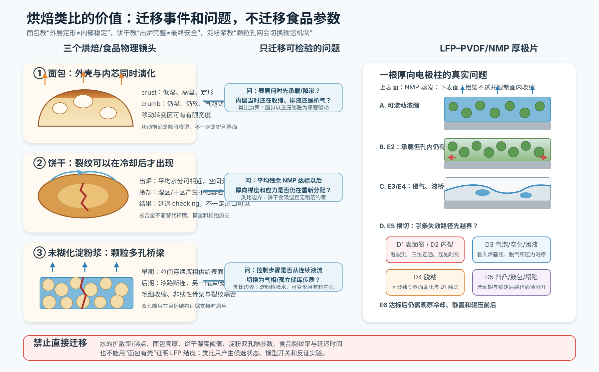

# 从面包外壳到饼干暗裂：烘焙怎样帮助理解厚极片干燥

> 本文全部公式的变量、SI 单位、符号方向、测量方法和适用前提，见[公式与物理量详解](13_formula_and_symbol_guide.md)。

> 版本：2026-07-23；定位：跨领域类比专题，而不是食品参数移植报告。  
> 核心问题：为什么“表面已经定形”与“内部已经稳定”是两回事，为什么缺陷可能在出炉以后才显现。  
> 证据规则：每个事实标明直接观察、模型、综述或本项目推论；食品中的数值一律不用于 LFP 参数赋值。

## 0. 一个由三只烤盘组成的教学故事

这是一个把多篇研究拼成同一上午的**教学故事**，不是某次真实实验。

第一只烤盘里是一条面包。可以把它想象为：烤箱门关上后，表面先升温，外层逐渐失水并定形；里面仍湿、仍软，原有气泡继续演化，外层和内芯逐渐承担不同角色。这是把面包温湿分区与气泡演化研究压缩成的教学画面，不是单次实验录像。[温湿分区：Zanoni et al., 1993](https://doi.org/10.1016/0260-8774%2893%2990027-H) [气泡演化综述：Sun et al., 2023](https://doi.org/10.1002/cche.10699)

第二只烤盘里是一块厚饼干。本章把 checking 研究简化成这样一幕：它出炉时外观完整，但中心与边缘的含水量不同；冷却/储存中材料状态和水分分布继续变化，裂纹可以延迟显现。具体何时起裂、是否“突然”，取决于配方、几何和环境，不能从这个故事本身推出。[全场应变与模型：Saleem et al., 2005](https://doi.org/10.1098/rspa.2005.1469) [水分成像与裂损跟踪：Bedas et al., 2019](https://doi.org/10.1016/j.foodchem.2019.125078)

第三只烤盘里不是面点，而是一层未糊化淀粉浆。本章把它简化为：浆料浓缩并形成含水颗粒骨架；早期由连续液体穿过粒间孔供给表面，后期转入与粒内水分有关的蒸气输运区间，裂纹前沿也可向内部推进。[双输运区：Goehring, 2009](https://doi.org/10.1103/PhysRevE.80.036116) [裂纹前沿成像：Crostack et al., 2012](https://doi.org/10.1007/s11340-011-9581-1)

三只烤盘分别照亮厚极片问题的三个盲点：

1. **面包**：外层定形与内部继续变化可以同时发生；
2. **饼干**：平均残余挥发物和出炉表面外观都不是充分判据；
3. **淀粉浆**：颗粒多孔体会经历液相输运、骨架加载、控制机制切换和裂纹传播。

烘焙类比真正有用的地方不在“也用了烘箱”，而在这些可检验的事件结构。

*图 1。本项目教学示意，不是论文原图。面包外壳/内芯及移动边界依据 [Zanoni et al., 1994](https://doi.org/10.1016/0260-8774%2894%2990057-4) 与 [Ureta et al., 2019](https://doi.org/10.1177/1082013218814144)；饼干延迟 checking 依据 [Saleem et al., 2005](https://doi.org/10.1098/rspa.2005.1469) 与 [Bedas et al., 2019](https://doi.org/10.1016/j.foodchem.2019.125078)；淀粉浆双输运区依据 [Goehring, 2009](https://doi.org/10.1103/PhysRevE.80.036116)。所有箭头表示可迁移的提问或模型结构，不表示食品与 LFP 参数相同。*

## 1. 面包：外壳已经“锁住”，内芯却还在运动

### 1.1 入炉时，它已经携带一套初始缺陷

发酵面团是含气泡、水、淀粉颗粒和蛋白网络的黏弹性多相体；混合与醒发过程已经建立气泡尺寸分布，后续还会发生增长、并合、破裂或消失。[气泡演化综述：Sun et al., 2023](https://doi.org/10.1002/cche.10699) **本项目推论**只迁移一个初始条件原则：极片进入烘箱时也可能已经带着夹气、团聚、湿厚起伏和涂布条纹；烘箱可以放大、迁移或冻结这些差异，并不负责创造全部缺陷。不能把面包气泡当作正常电极孔隙的机械等价物。

电极领域的直接证据支持更谨慎的说法——初态在入炉后仍可继续演化，并未立即冻结。硬 X 射线微透射研究在小尺度、特定 NMC622/炭黑/PVDF/NMP 配方和实验成像装置中看到涂布后轮廓或内部特征继续水平运动；它没有证明这些特征必然保留到最终极片，也不能代表商业连续涂布。[直接原位观察及实验边界：Higa et al., 2024](https://doi.org/10.1021/acsaem.4c00402)

### 1.2 表面先受热，但“外面先热”不是全部故事

面包表面直接接受对流和辐射，底部还可能接受接触导热；内部升温较慢，并伴随水的相变与蒸气迁移。早期实验直接测到局部温度、含水率和体积的空间/时间差异；作者据此提出外部低湿高温 crust、内部较湿 crumb 及向内推进蒸发转变区的现象学图景。前沿是作者的降阶解释，不是被直接拍到的零厚界面。[直接测量+现象学解释：Zanoni et al., 1993](https://doi.org/10.1016/0260-8774%2893%2990027-H)

这一点与极片最直接的相似是：烘箱设定温度不等于材料温度。蒸发潜热、气侧换热、铝箔导热和局部喷嘴场共同决定膜温 $T_s(t,y)$ 与蒸发通量 $J(t,y)$。相似到此为止：面包是厘米级三维块体，极片是有高导热铝箔底边界的微米级薄层，温度与传输尺度不能直接类比。

### 1.3 外壳和内芯：一个有效模型，不一定是一条锋利界面

Zanoni、Pierucci 与 Peri 将面包写成 crust、crumb 与向内移动的蒸发前沿，对圆柱面包的宏观温度、含水和质量数据取得一致描述；这验证的是模型的宏观预测能力，不是证明真实界面数学上零厚。[模型+实验比较：Zanoni et al., 1994](https://doi.org/10.1016/0260-8774%2894%2990057-4) Purlis 与 Salvadori 后来把移动边界、等效热物性及蒸发–冷凝纳入有限元，并对温度、含水、失重和壳厚进行比较。[模型与实验比较：Purlis & Salvadori, 2009a](https://doi.org/10.1016/j.jfoodeng.2008.09.037) [数值模拟与宏观验证：Purlis & Salvadori, 2009b](https://doi.org/10.1016/j.jfoodeng.2008.09.038)

如果只读到这里，很容易把“移动前沿”想成一张几何上零厚度的纸，把干层和湿层截然分开。后续局部实验给出了重要修正：Ureta 等测量 crust 与 crumb 不同位置的温度和含水率，发现面包中心含水率在早期可短时增加，之后才缓慢下降；作者用较热区域蒸发、蒸气向较冷内部移动并冷凝的机制解释。[直接局部测量+作者解释：Ureta et al., 2019](https://doi.org/10.1177/1082013218814144) 2024 年研究又在无酵母面团和指定受控温度梯度下用空间分辨 NMR 观察到向内水迁移；这是该简化条件中的空间证据，不能替代完整烘焙或极片验证。[直接 NMR 观察，摘要级细节：Lucas et al., 2024](https://doi.org/10.1016/j.jfoodeng.2024.111969)

所以最准确的理解是：

- 移动前沿可以是一个很好用的**降阶分区模型**；
- 真实孔内输运可以在有限厚度的转变区内分布发生；
- 宏观“前沿有效”不等于孔尺度“只有一张锐利界面”。

这正是 LFP 模型需要先验证的问题。电极中的空气侵入和降饱和可以先用移动转变区表达，但只有中断截面、CT 或饱和度数据支持时，才应把它收缩为锐利前沿。面包中的显著水蒸气再冷凝也不能自动推给 NMP；它取决于温度、气相连通性和局部 NMP 分压。

### 1.4 crust 不只是“表面水少”

面包 crust/近表层的演化涉及失水、淀粉糊化、蛋白变化、泡壁开孔、褐变和局部力学性质变化；这些过程的发生位置与时序并不完全相同。食品综述因此把 crust 视为耦合热–湿–结构转变区，而不只是一个含水率阈值。[综述：Vanin et al., 2009](https://doi.org/10.1016/j.tifs.2009.04.001)

对极片的正确迁移是定义方法，而不是材料机制：如果要说 LFP 表面形成了“结皮”，至少应证明表层相对内部出现了持久的低渗透率、低扩散率、高模量、高屈服或组分固定状态。仅凭表面光滑、颜色变浅或没有开口裂纹，不足以证明结皮。

### 1.5 外层先锁定，既可能保护，也可能把问题推到内部

面包研究用人工覆盖层模拟表面约束，直接观察到约束施加得越早，膨胀和 CO₂ 释放越受限，内部致密区的位置和深度也随之改变。[人工表层约束实验：Zhang et al., 2007](https://doi.org/10.1016/j.jfoodeng.2006.10.008)

这个实验给 LFP 的不是“结皮一定导致空洞”的证明，而是一个因果问题：**若外层先获得承载能力，内层仍在收缩、排液或析气，变形会被引向哪里？** 需要注意应力符号不同：面包早期以气泡正压和膨胀为重要驱动，极片通常以失溶剂收缩、负毛细压和铝箔面内约束为主。相同的“外层先定形”画面，可以对应完全不同的力学加载。

### 1.6 出炉后，内芯和外壳仍在交换水与应力

面包停止受热后的短时冷却可伴随气体与骨架体积变化；短烤和充分烤制样品的冷却收缩差别很大，说明出炉状态会控制之后的形变，具体百分比只属于论文配方和冷却程序。[直接体积测量：Ben Aissa et al., 2010](https://doi.org/10.1016/j.jcs.2009.10.006) 另一个更长时间尺度的密封储存对照显示，保留 crust 时存在 crumb 到 crust 的内部水分再分配；这不能自动证明即时冷却中 crust 已吸湿软化。[直接储存对照：Baik & Chinachoti, 2000](https://doi.org/10.1094/CCHEM.2000.77.4.484)

对极片的启示是把观测窗延长到出炉后、冷却和静置，而不是假定烘箱出口即为最终状态。这里仍只能迁移“过程没有结束”的结构；面包的气泡冷却、吸湿与淀粉回生并不存在于 LFP–PVDF/NMP 中。

## 2. 饼干 checking：出炉完整，为什么后来才裂

### 2.1 最像生产误判的一幕

一块饼干出炉时表面可以完整，但边缘、表面和中心的含水分布并不均匀。相关本构/有限元研究通常把热态阶段表示为松弛能力较强，冷却和水分重新分配后再积累不相容应变；这是测得的状态相关物性与模型解释的组合，不是每块饼干都遵循的固定时钟。[物性与松弛模型：Kim & Okos, 1999](https://doi.org/10.1016/S0260-8774%2899%2900055-2) [全场实验与模型：Saleem et al., 2005](https://doi.org/10.1098/rspa.2005.1469)

Kim 与 Okos 直接测量 cracker 与 checking 相关的热物性、扩散、力学和应力松弛性质，并用广义 Maxwell 形式描述热–湿流变响应。[直接测量+本构模型：Kim & Okos, 1999](https://doi.org/10.1016/S0260-8774%2899%2900055-2) Saleem 等进一步将含水依赖的扩散、吸湿应变和力学参数放入有限元，并用散斑干涉的全场应变进行验证；在该配方、初始场和低环境湿度条件下，边缘与中心出现相反应变并伴随更高 checking 风险。[全场实验+半耦合模型：Saleem et al., 2005](https://doi.org/10.1098/rspa.2005.1469)

这与“表面完整、中层已有空洞/弱层”的 LFP 现象不是同一机制，但它提供了一个非常具体的警告：**终点照片可能早于真正的损伤显现时刻。**

### 2.2 极小梯度也可能重要，平均含量会掩盖风险

Bedas 等把 Karl Fischer 与 NIR 成像结合，跟踪两种几何饼干的表面/中心及平面内水分，并在 15 天内统计 checking 和破损。较厚圆形样品的水分不均与裂损都更多；较薄、穿孔、矩形的组合样品更均匀并接近无 checking。厚度、平面几何和穿孔在该比较中没有完全解耦，因此它直接支持的是“几何组合—水分均匀性—checking 的关联”，不是单独厚度或穿孔的因果效应。[直接水分成像与裂损统计：Bedas et al., 2019](https://doi.org/10.1016/j.foodchem.2019.125078)

更有判别力的是干预实验：Ahmad、Morgan 与 Okos 比较常规烘焙和微波后处理，在总含水量及外观相近时，更均匀的内部水分对应 checking 从约 61% 降至约 5%；这些百分比只属于论文配方和设备，不能预测电极改善幅度。[直接干预实验：Ahmad et al., 2001](https://doi.org/10.1016/S0260-8774%2800%2900186-2)

**本项目据此提出的待验证质量原则**是：平均残余 NMP 达标，可能仍不足以证明厚向和横幅溶剂分布、自由收缩与应力均已安全。食品证据不能证明 NMP 梯度必然控制极片失效；它只使“库存+分布+历史”成为一个高优先级候选质量坐标，须由 LFP 分层测量验证。

### 2.3 饼干类比在哪里失效

饼干通常是自由薄片，没有铝箔的强面内约束；它可以从环境吸水，极片正常环境下不会从空气补充 NMP；饼干还经历糖–淀粉–蛋白体系的玻璃化和吸湿膨胀。在所引研究中，checking 可在数小时至首日集中出现，也可继续在更长储存窗内统计；极片关键演化则可能快得多。[Saleem et al., 2005](https://doi.org/10.1098/rspa.2005.1469) [Bedas et al., 2019](https://doi.org/10.1016/j.foodchem.2019.125078) 因此我们迁移的是“梯度—本征应变—松弛/脆化—延迟断裂”的方程结构，不迁移饼干的扩散率、模量、湿度阈值或延迟时间。

## 3. 淀粉浆：从厨房类比回到颗粒多孔介质

### 3.1 先分清两种“淀粉”

已糊化淀粉凝胶更接近聚合物/凝胶；未糊化的淀粉–水浆干燥后形成颗粒滤饼，更接近颗粒多孔涂层。本节只讨论后一种，避免把糊化、凝胶化和颗粒锁定混成一个词。

### 3.2 两个孔隙储库，两种控制机制

Goehring 对淀粉浆的孔隙、非线性弹性、干缩应变和干燥过程进行测量并建立多相模型。体系具有粒间孔隙与淀粉颗粒内部孔隙；早期由粒间连续液相输运控制，后期转为与粒内水分相关的蒸气输运，两种机制的明显分离与深部裂纹图样有关。[直接物性/结构观察+模型：Goehring, 2009](https://doi.org/10.1103/PhysRevE.80.036116) 把它写成两个均匀 NMP 库存，是本项目可能采用的降阶表示，不是该论文唯一的数学结构。

它比面包更接近电极，是因为这里确实存在“浆料—颗粒骨架—毛细输运—裂纹”的主干。但仍有关键差别：淀粉颗粒吸水、可变形且有明显粒内孔；本项目第一代模型会把 LFP 一次颗粒近似为相对更刚的固体，同时把二次颗粒、团聚体和 CBD 的破裂/重排保留为待验证自由度。电极还多出 PVDF 溶解/固定、炭黑网络和铝箔界面。

对 LFP 最有价值的是一个**带开关的模型假设**：如果 FIB-SEM、CT、孔结构或吸液动力学证明二次团聚体内部和团聚体之间存在明显不同的 NMP 储库，就可以试验双孔隙交换模型；如果没有证据，就不应因为淀粉有双孔隙而强行增加参数。

### 3.3 裂纹会追随传输区，但最终图样不能唯一反推过程

淀粉浆原位 X 射线照相和 CT 直接观察到三维柱状裂纹网络及裂纹间距随干燥前沿演化。[直接原位成像：Crostack et al., 2012](https://doi.org/10.1007/s11340-011-9581-1) 不同淀粉种类还显示不同裂纹演化和不同厚度趋势，作者将其与粒形、粒径等差异联系起来。[直接形貌统计+作者解释：Akiba et al., 2017](https://doi.org/10.1103/PhysRevE.96.023003)

**本项目跨论文综合判断**：厚度、颗粒形貌和输运前沿可能共同选择裂纹尺度；但两篇淀粉研究没有独立分离所有变量，从最终裂纹间距倒推唯一蒸发通量或唯一颗粒尺度仍不可靠。极片还叠加了基底约束、粘结剂迁移和缺陷群，反问题更不唯一。

## 4. 对照表：哪些能借，哪些必须留在厨房

| 烘焙现象 | 可以迁移到 LFP 的问题/结构 | 不能迁移的内容 |
|---|---|---|
| 面包 crust–crumb 分区 | 是否需要表层/内部不同状态与有限宽转变区 | 水的相变温度、壳厚、面包热物性 |
| 移动蒸发前沿 | 降阶移动边界模型及其验证方法 | 默认极片存在锐利 NMP 前沿 |
| 面包中心短时增湿 | 警惕内部传输非单调、需要空间测量 | 默认 NMP 会显著向内冷凝 |
| 人工表层约束 | 提出“早锁表层是否重定向内部变形/气体释放”的待验证问题 | 面包正压膨胀的应力符号与数值 |
| 饼干 checking | 终点完整不代表稳定；浓度梯度与脆化耦合 | 水活度、环境吸湿与小时/天尺度 |
| 相同总水分、不同 checking | 平均残余 NMP 不是充分质量坐标 | 微波工艺或 61%→5% 效果量 |
| 未糊化淀粉浆双输运区 | 液相连通→气相/内部储库控制的模型切换 | 淀粉粒内孔直接等同 LFP 颗粒内孔 |
| 淀粉裂纹前沿 | 同步传输前沿与裂纹事件的实验设计 | 柱状裂纹尺度和参数 |

## 5. 类比怎样改变 LFP 模型，而不是只增加故事

### 5.1 把“结皮”从形容词改成状态变量

建议只有在下列任一厚向对比被重复观察后才启用结皮分支：

- 表层有效渗透率显著下降；
- 表层模量或屈服显著上升；
- 表层 PVDF/炭黑固定或富集形成持续梯度；
- 表层气相/液相传递阻力出现可辨识跃迁。

模型中可用连续梯度，也可在数据支持时用移动边界。表面完整不是该开关的输入。

### 5.2 把平均残余 NMP 拆成“库存+分布+历史”

终点质量指标至少应扩展为：

$$
\left\{\bar c_{NMP},\;\partial c_{NMP}/\partial z,\;\partial c_{NMP}/\partial y,\;T_s(t,y),\;J(t,y)\right\}.
$$

其中第一项是库存，第二和第三项是目标状态量，实际实验可能只能得到分层平均或代理梯度；后两项是形成分布的历史。饼干证据支持“平均值可能不充分”这一结构，但 LFP 中需要用 GC 分层、热脱附及经过校准的光谱/超声代理或中断样自行建立测量，不能假定连续梯度已经可得。

### 5.3 把观测窗延长到冷却和后处理

建议把首次失效 $E5$ 的搜索窗从烘箱内延长至：出口热态、规定冷却时间和规定静置时间；再把辊压前后、截面制样前后作为独立的后续触发/伪影窗口。这样才能区分干燥中生成的潜在损伤、冷却中显现的缺陷与后处理新制造的损伤。

### 5.4 只在数据要求时引入双孔隙

双孔隙的最小形式可以写成团聚体外与团聚体内两个 NMP 库存 $c_{out}$、$c_{in}$，以交换系数 $K_{ex}$ 耦合。只有观察到两个稳定传质时间尺度且结构证据支持两个储库时，才增加这一层；否则一个状态相关有效扩散/渗透模型更可辨识。

## 6. 一个把类比变成实验的“小烤盘”方案

这不是用厨房替代电池实验，而是迁移其测量逻辑。

### 6.1 三条匹配终点、改变路径的轨迹

固定配方和干面密度，尽可能匹配平均残余 NMP 与终点温度，并如实报告尚未匹配的终点差异，比较：

1. 前段温和、后段增强；
2. 前段增强、后段温和；
3. 当前基准。

同步记录 $m(t)$、$H(t)$、$T_s(t)$、表面图像和可行的应力/超声信号。这样做是在电极中检验“近似匹配平均终点、不同路径是否仍产生不同分布/缺陷”的类似命题，而不是声称严格重建饼干实验或照搬微波。

### 6.2 在事件点切开，而不是只切终点

在收缩停止、干燥速率转折、膜温离开蒸发冷却平台、首次表面异常和出炉冷却后取匹配中断样，做三维/截面、分层 PVDF/碳和残余 NMP。面包前沿研究告诉我们宏观分区需要局部数据校验；淀粉浆研究告诉我们控制机制切换应与裂纹时序对齐。

### 6.3 两种专门判别“表面完整、中层空洞”的干预

- **气体路径干预**：标准脱气、强化脱气、可控种入气泡；同时测初始气泡谱、黏度、湿厚和面密度，并尽量保持流变一致。否则“种气泡”本身对涂布稳定性的改变会混淆归因。若缺陷对气泡初态强响应，预存气/析气路径才获得支持。
- **表层路径干预**：在尽可能匹配终点平均残余 NMP 的条件下削弱早期表面通量、保留后段去溶剂能力；只有表层低渗/高模量的时序先于空洞形成，且空洞显著下降，结皮约束路径才获得支持。整体应力、PVDF 迁移和温度史仍是竞争解释。

两种干预必须与时序/三维几何配合。单看“缺陷变少”仍可能有多个解释。

## 7. 苏格拉底式追问

### 问题 1：如果面包模型有移动前沿，为什么中心还能先变湿？

因为“前沿”是宏观降阶分区，局部还可能发生分布式蒸发、蒸气扩散和冷凝。对极片的正确动作是验证前沿宽度，而不是先选“锐利前沿”或“完全分布”之一。[Ureta et al., 2019](https://doi.org/10.1177/1082013218814144) [Lucas et al., 2024](https://doi.org/10.1016/j.jfoodeng.2024.111969)

### 问题 2：外层先变硬，为什么有时保护内部、有时反而制造内部缺陷？

面包人工覆盖实验直接支持的是：表面约束会改变膨胀、放气和内部致密区。[Zhang et al., 2007](https://doi.org/10.1016/j.jfoodeng.2006.10.008) **本项目依据连续介质力学提出**：对极片，早锁表层还可能把尚未完成的收缩、排液或析气转化为不同压力/应力路径，但三条分支必须分别验证。结果取决于加载方向、表层渗透率/模量、内层松弛和缺陷；“有壳”本身没有固定好坏符号。

### 问题 3：为什么饼干总含水量相近，checking 仍能相差很大？

因为空间分布决定局部本征应变和材料状态，平均值会把湿中心与干边缘相互抵消。微波干预实验直接支持这一点，但其百分比不能迁移到电池。[Ahmad et al., 2001](https://doi.org/10.1016/S0260-8774%2800%2900186-2)

### 问题 4：若极片出炉时无裂，24 小时后出现裂纹，能否断定是“冷却开裂”？

不能。干燥中可能已经形成亚临界裂纹、内部空洞或弱层，冷却只负责让它张开；也可能是残余 NMP 重新分布或后续机械操作触发。需要出口热态、冷却过程和静置后的连续观测来区分起始与显现。

### 问题 5：淀粉浆有双孔隙，是否说明 LFP 一定也要双孔隙模型？

不说明。只有团聚体内外孔结构和双时间尺度同时被目标数据支持时，这个分支才值得启用。否则增加 $c_{in}$、$c_{out}$ 与交换系数只会降低参数可辨识性。[Goehring, 2009](https://doi.org/10.1103/PhysRevE.80.036116)

### 问题 6：烘焙类比能不能给出温区和线速优化值？

不能。食品与极片在溶剂、相变、化学转变、几何、基底和本构上都不同。类比能给出应测状态、候选方程、反证实验和观测窗，不能给出 $D$、$k$、$\Gamma_c$、临界温度或临界厚度。

## 8. 一个可在家观察、但不能用于参数拟合的演示

用相同淀粉/水比例制备薄层、厚层和强对流厚层，每隔固定时间称重、俯拍；当表面看似干燥时切开一个小角观察内部。这个演示可帮助团队直观看见“平均失重、表面状态和内部状态并不等价”。不同厨房淀粉可能沉降、翘曲、不开裂或出现不同图样，这恰好说明材料本构和粒形重要。

它不能用来推断 LFP 临界厚度、NMP 蒸发速度、烘箱温区，也不能证明极片中层空洞由结皮引起。正式的颗粒浆证据仍应回到 [Goehring, 2009](https://doi.org/10.1103/PhysRevE.80.036116) 等可审计研究。

## 9. 最终留下的四句话

1. 表面定形不是内部稳定的同义词。
2. 平均残余溶剂不是空间分布和历史的同义词。
3. 出炉时完整不是最终不会失效的同义词。
4. 类比是用来提出更尖锐的实验问题，不是用来借参数。

下一步回到[锂电电极专题](01_battery_electrode.md)，把这些直觉分别对应到锁定、侵气、液相断连、内部空洞和冷却阶段；具体学习方式见[物理过程学习指南](10_physical_process_learning_guide.md)。
