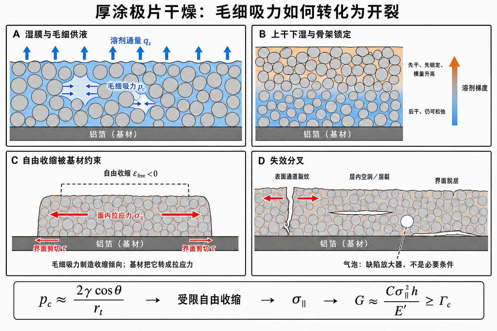

# 从溶剂厚向梯度到受限收缩：B–C 衔接与界面剪切的严格解释

> **目的：** 解释示意图 B“上干下湿与骨架锁定”怎样过渡到 C“自由收缩被基材约束”，并澄清厚度方向的溶剂梯度何时只产生面内应力/弯曲倾向，何时才会产生明显的涂层–铝箔界面剪切。  
> **坐标约定：** $z$ 为厚度方向，铝箔处 $z=0$，自由表面处 $z=h$；$x$ 为涂布/走带方向，$y$ 为幅宽方向。固体面内拉应力取正。  
> **证据口径：** “直接观察”只用于来源论文实际测得或成像的结果；连续介质方程标记为“模型结构”；对商用 LFP/PVDF–NMP 的判断标记为“本项目推论”。

*图 1。本项目机制示意图，不是任何论文原图。A 区分向上的溶剂通量与把相邻颗粒拉近的毛细吸力；B 表示厚向溶剂、锁定和模量梯度；C 表示自由收缩被铝箔约束后形成的面内拉应力；D 表示表面通道裂纹、层内空洞/层裂和界面脱层的竞争路径。C 中“界面剪切”箭头必须限定为边缘、裂纹、厚度过渡或局部干燥差异附近的载荷传递剪切，不能理解为仅因存在厚向梯度，整片中央界面便处处承受同样大的剪切。*

## 1. 先给最重要的结论

B 到 C 的严格衔接不是：

$$
\text{厚向溶剂梯度}
\Rightarrow
\text{界面剪切}.
$$

而是：

$$
\boxed{
\text{溶剂/锁定梯度}
\rightarrow
\text{自由收缩、模量和松弛梯度}
\rightarrow
\text{层间变形协调}
\rightarrow
\text{面内应力随高度变化与弯曲倾向}
}
$$

在此基础上，还要出现边缘、裂纹、面内干燥差异、涂层厚度变化或约束变化，使膜内总拉力沿 $x$ 或 $y$ 改变，才会形成显著的界面剪切。

因此需要分清两件事：

1. **表面通道裂纹主要由面内拉应力张开。**
2. **界面剪切主要负责在有限边缘和非均匀区域传递载荷，更直接关联脱层、边缘破坏和混合模式层裂。**

## 2. A→B：溶剂输运怎样留下厚向状态梯度

表面蒸发需要内部液体补给。饱和或部分饱和孔网中的最小液相关系为：

$$
q_z
=
-\frac{k\,k_r(S_l)}{\mu_l}
\frac{\partial p_l}{\partial z},
$$

其中：

- $q_z$：厚度方向的液体体积通量，正方向可定义为指向自由表面；
- $k$：涂层本征渗透率；
- $k_r(S_l)$：液相相对渗透率，表示降饱和后液路连通能力；
- $S_l$：液相饱和度；
- $\mu_l$：溶剂或浓缩液相黏度；
- $p_l$：孔液压力。

弯月面产生的毛细压力尺度为：

$$
p_c
=p_g-p_l
\simeq
\frac{2\gamma\cos\theta}{r_t},
$$

其中 $p_g$ 为气体压力，$\gamma$ 为气–液界面张力，$\theta$ 为润湿接触角，$r_t$ 为有效孔喉半径。$r_t$ 不是供应商 D50，而由一次颗粒、团聚体、炭黑–PVDF 细孔网和润湿状态共同决定。

当膜厚增加、渗透率下降或蒸发通量提高时，为维持表面供液所需的压力梯度增大；若内部输运追不上表面移除，便会形成：

$$
c_{\rm NMP}=c_{\rm NMP}(z,t).
$$

Jaiser 等的 Cryo-BIB-SEM/EDS 中断截面直接显示，大孔、小孔和局部液体库存并不同步排空，且 PVDF 液相浓度梯度可以在明显孔排空和收缩终止之前出现。[直接观察：Jaiser et al., 2017，PDF pp.7–9](../papers_Yang/jaiser2017.pdf#page=7)；[DOI 10.1016/j.jpowsour.2017.01.117](https://doi.org/10.1016/j.jpowsour.2017.01.117)

Kumberg 等的厚水系石墨电极失重曲线显示，宏观膜厚停止收缩后仍会继续失去溶剂，极厚样在末期才逐渐偏离单纯气相控制模型。[直接观察 + 作者解释：Kumberg et al., 2019，PDF pp.3–4](<../papers_Yang/Energy Tech - 2019 - Kumberg - Drying of Lithium‐Ion Battery Anodes for Use in High‐Energy Cells  Influence of Electrode.pdf#page=3>)；[DOI 10.1002/ente.201900722](https://doi.org/10.1002/ente.201900722)

这些来源支持“收缩终止、侵气、液路断连和完全干燥是不同事件”，但不能把其水系石墨数值直接移植给 LFP/PVDF–NMP。

## 3. B 图真正提供的是三个厚向梯度

溶剂分布不是直接的力学边界。它首先改变材料的自由收缩、模量和松弛能力：

$$
c_{\rm NMP}(z,t),\,S_l(z,t),\,\lambda(z,t),\,T(z,t)
\longrightarrow
\begin{cases}
\varepsilon_{\rm free}(z,t),\\
E'(z,t),\\
\tau_r(z,t).
\end{cases}
$$

其中：

- $\lambda(z,t)$：颗粒–炭黑–PVDF 网络从可流动到可持续承载的锁定状态；
- $\varepsilon_{\rm free}(z,t)$：取出一小层并解除约束后，它在当前状态下本来想达到的面内收缩应变；干燥收缩取负；
- $E'(z,t)$：与所选平面应力/平面应变假设一致的有效面内模量；
- $\tau_r(z,t)$：通过颗粒重排、黏弹或塑性变形释放应力的特征时间。

典型的“上干下湿”时刻可能表现为：

| 区域 | NMP/饱和度 | 锁定与模量 | 自由收缩 | 松弛能力 |
|---|---|---|---|---|
| 顶层 | 较低 | 较早锁定、模量较高 | 更负，即更想缩短 | 较难快速松弛 |
| 底层 | 较高 | 较软或尚未完全锁定 | 当时较小 | 仍可流动/蠕变 |

随着底层后续失去 NMP，它的自由收缩也会继续增加。但“底层最后失去溶剂”不等于“底层真的完成了同样大的几何收缩”：一旦被铝箔和已硬化上层夹住，它可能想缩而缩不了，结果主要表现为应力重新分布。

## 4. B→C 的力学桥梁：变形协调

只要层间没有滑移、空洞或层裂，同一 $x$ 位置的位移必须连续。在线性薄层/层合近似下，实际面内应变可写为：

$$
\varepsilon_{\rm actual}(z,t)
=
\varepsilon_0(t)+z\kappa(t),
$$

其中：

- $\varepsilon_0$：涂层–箔复合体的平均面内应变；
- $\kappa$：复合体曲率；
- $z\kappa$：因弯曲产生的线性应变分量。

若先忽略黏弹松弛，每一高度的面内应力为：

$$
\sigma_\parallel(z,t)
=
E'(z,t)
\left[
\varepsilon_0(t)+z\kappa(t)
-
\varepsilon_{\rm free}(z,t)
\right].
$$

这就是 B 到 C 的核心方程：B 给出不同高度“想缩多少”和“有多硬”，C 由共同的实际应变减去各层自己的自由收缩得到面内应力。

### 4.1 如果涂层完全自由

自由膜可以选择更负的 $\varepsilon_0$ 来整体缩短，并选择非零 $\kappa$ 来卷曲。若顶层比底层想缩得更多，顶层会趋向成为弯曲内侧。部分干燥失配通过实际收缩和弯曲释放，储存的面内拉伸能较少。

### 4.2 如果涂层粘在铝箔上

铝箔、卷材张力和边界条件限制 $\varepsilon_0$ 与 $\kappa$。在近似刚性、面内尺寸基本不变的极限下：

$$
\varepsilon_0\approx0,
\qquad
\kappa\approx0,
$$

于是：

$$
\sigma_\parallel(z,t)
\approx
-E'(z,t)\varepsilon_{\rm free}(z,t).
$$

因为干燥自由收缩 $\varepsilon_{\rm free}<0$，所以得到正的面内拉应力。更真实的黏弹模型还需要加入：

$$
\dot\sigma_\parallel
+
\frac{\sigma_\parallel}{\tau_r}
=
E'
\left(
\dot\varepsilon_{\rm actual}
-
\dot\varepsilon_{\rm free}
\right),
$$

表示干燥加载与应力松弛同时竞争。该式是模型结构，不是 Kumberg 或 Jaiser 已为商用 LFP 标定的参数关系。

## 5. 厚向梯度为什么不自动等于界面剪切

力学上容易混淆的“厚度梯度”有两种：

| 梯度 | 数学形式 | 首要力学后果 |
|---|---|---|
| 厚度方向的溶剂/状态梯度 | $\partial c/\partial z$、$\partial\lambda/\partial z$ | $\varepsilon_{\rm free}(z)$、$E'(z)$ 和 $\sigma_\parallel(z)$ 不同，并产生弯曲倾向 |
| 涂层厚度或干燥状态沿面内变化 | $dh/dx$、$\partial c/\partial x$ 或 $\partial c/\partial y$ | 膜内总拉力沿面内变化，产生界面载荷传递剪切 |

对单位幅宽涂层，定义沿 $x$ 方向的膜内合力：

$$
N_x(x,t)
=
\int_0^{h(x)}
\sigma_{xx}(x,z,t)\,dz.
$$

其中 $N_x$ 的单位为 $\mathrm{N\,m^{-1}}$。由面内力平衡，界面剪切的数量级满足：

$$
\left|\tau_i(x,t)\right|
\simeq
\left|
\frac{\partial N_x}{\partial x}
\right|.
$$

其中 $\tau_i$ 是涂层–铝箔界面对涂层施加的切向牵引，单位为 Pa；具体正负号取决于界面法向和牵引方向约定。

因此：

- 若膜在 $x$ 和 $y$ 方向无限或足够宽、厚度均匀、各处干燥历史相同，虽然 $\sigma_\parallel(z)$ 可以很大且随 $z$ 变化，但中央区域 $N_x$ 不随 $x$ 改变，界面剪切可以很小；
- 到达涂层自由边缘时，$N_x$ 必须从膜内有限值降到零，所以边缘附近出现剪切集中；
- 裂纹把局部膜内力降到接近零，裂纹两侧出现载荷重新传递和界面剪切集中；
- 喷嘴条带、温区切换、横向风速差和局部热斑使 $N_x(x)$ 或 $N_y(y)$ 改变；
- 楔形厚度、边缘厚边、局部缺料或涂布波动通过 $h(x,y)$ 改变膜内合力；
- 脱层前缘使“受约束区”和“已释放区”相邻，通常同时出现剪切和剥离应力。

所以图 1C 的界面剪切箭头应读成“边缘/非均匀区的载荷传递”，而不是“厚向梯度直接在整片界面产生均匀剪切”。

## 6. B–C 过程对应哪些失效模式

| 力学状态 | 更直接关联的失效 | 说明 |
|---|---|---|
| 较大的面内拉应力 $\sigma_\parallel$ | 表面通道裂纹、贯穿裂纹 | 裂纹面通常近似垂直于最大面内拉应力 |
| 厚向 $\sigma_\parallel(z)$ 与模量/自由收缩梯度 | 弯曲、应力峰迁移、弱层储能 | 不要求中央界面处处存在大剪切 |
| 边缘或面内不均匀造成的 $\tau_i$ | 边缘脱层、裂纹附近脱层、混合模式层裂 | 需要 $x/y$ 方向的载荷变化 |
| 局部法向拉力、负液压和弱层 | 层内空洞、空化候选、水平层裂 | 仅凭最终二维空洞不能唯一判机制 |
| 预存气泡或团聚体缺陷 | 降低局部起裂门槛 | 气泡是缺陷放大器，不是干燥开裂必要条件 |

受约束颗粒膜中，通道裂纹扩展的最小能量结构为：

$$
G
=
C\frac{\sigma_\parallel^2h}{E'},
\qquad
G\geq\Gamma_c,
$$

其中：

- $G$：裂纹每增长单位面积可释放的能量；
- $C$：包含泊松比、基底失配、滑移和裂纹几何的无量纲系数；
- $h$：涂层厚度；
- $E'$：有效面内模量；
- $\Gamma_c$：当前干燥状态下的有效断裂能。

该结构解释了为什么没有气泡的多孔颗粒膜也会出现临界开裂厚度：即使应力相近，$G$ 仍随 $h$ 增加。它来自受约束胶体/颗粒膜的断裂力学结构，不是商用 LFP 已校准的绝对阈值。[理论 + 实验比较：Tirumkudulu & Russel, 2005](https://doi.org/10.1021/la048298k)

陶瓷颗粒涂层的同步质量损失–应力–裂纹研究进一步表明，应力上升、峰值、松弛和裂后卸载必须与干燥状态共同记录，最终干膜模量不能替代整个湿态过程。[直接应力与裂纹实验：Moorhead & Francis, 2024](https://doi.org/10.1111/jace.19644)

## 7. 对模型层级的直接结论

### 7.1 一维厚向模型能够回答

只保留 $z$ 与 $t$ 的模型可以计算或表示：

- $c_{\rm NMP}(z,t)$、$S_l(z,t)$；
- 锁定状态 $\lambda(z,t)$；
- 自由收缩 $\varepsilon_{\rm free}(z,t)$；
- 模量与松弛时间 $E'(z,t)$、$\tau_r(z,t)$；
- 面内拉应力 $\sigma_\parallel(z,t)$；
- 通道裂纹的结构性 $G/\Gamma_c$ 风险代理。

### 7.2 一维模型不能真正回答

一维 $z$ 模型没有 $\partial/\partial x$ 或 $\partial/\partial y$，因此不能求出：

- 涂层边缘的界面剪切峰；
- 喷嘴条带之间的载荷传递；
- 局部厚薄变化导致的剪切；
- 裂纹两侧的剪切回传；
- 脱层前缘的混合模式 $G_I/G_{II}$。

这些问题至少需要：

- $x-z$ 模型：走带方向温区、涂布起停和裂纹附近；
- $y-z$ 模型：20 cm 幅宽横向风速、厚度和边缘差异；
- 或包含铝箔弯曲、张力和界面本构的二维/三维模型。

**本项目建模建议：** 第一层仍用一维模型回答“厚向状态和面内拉应力怎样演化”；只有实验确认边缘脱层、横向条带或明显局部破坏定位后，再升级二维界面剪切模型。这样可以避免用当前不可辨识的界面参数过早扩展模型。

## 8. 三个反事实自检

### 问 1：只有 $\partial c/\partial z\neq0$，但涂层在面内完全均匀，会发生什么？

会形成自由收缩梯度、面内应力梯度和弯曲倾向；膜中央不必因此处处存在很大的界面剪切。

### 问 2：为什么边缘最容易出现剪切和脱层？

因为膜内合力必须在有限距离内从 $N_x$ 下降到零，即 $|\partial N_x/\partial x|$ 变大，界面需要在该区域完成载荷传递。

### 问 3：表面通道裂纹主要由界面剪切张开吗？

不是。主要张开驱动力是面内拉应力及其可释放弹性能；界面剪切更直接影响载荷传递、边缘脱层及裂纹到达基材后的混合模式失效。

## 9. 与项目其他文档的衔接

- 完整的 LFP/PVDF–NMP 干燥状态链见[电池电极专题报告](01_battery_electrode.md)。
- 所有公式变量、单位和测量方法见[公式与物理量详解](13_formula_and_symbol_guide.md)。
- 一维 NMP–锁定–应力演示见[厚向应力机制模型](15_1d_thickness_stress_demonstrator.md)。
- 毛细压力与临界开裂厚度的跨领域来源见[胶体膜专题报告](04_colloidal_films.md)。
- 同步干燥应力和裂纹证据见[陶瓷流延专题报告](05_ceramic_tape_casting.md)。
