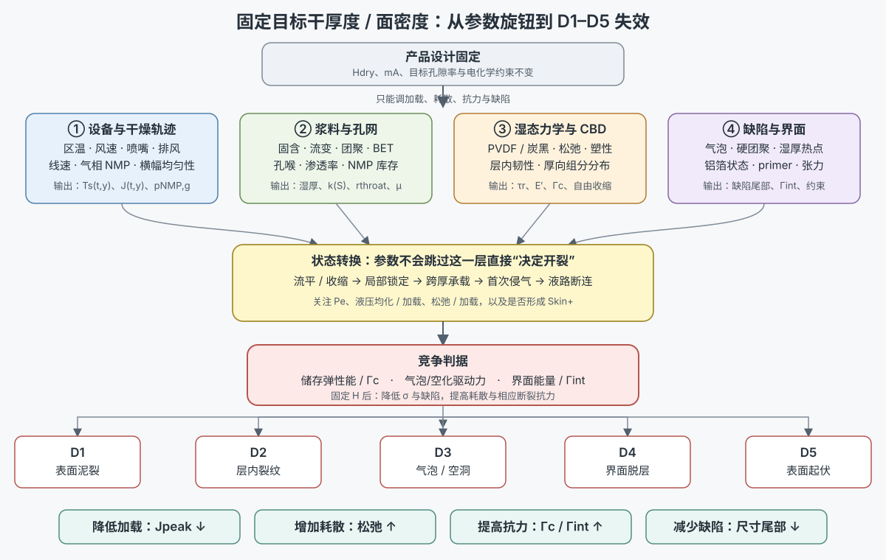

# 固定目标厚度下降低 LFP–PVDF/NMP 开裂：参数地图与工艺决策路径

> **文档性质：** 当前项目的机制综合与工艺优化地图，不是 Dawson 论文第 5 章的原文结论。  
> **版本：** 2026-07-30。  
> **适用对象：** 约 20 cm 宽、铝箔单面涂布、LFP–导电剂–PVDF/NMP、连续多区热风干燥。  
> **固定条件：** 以下默认产品的目标干厚度 $H_{dry}$、干面密度 $m_A$ 和基本电化学设计不变；如果固定的是湿膜间隙而不是干厚度，固含量的几何效应将不同。  
> **配方口径：** 如果产品真正固定的是 LFP 活性物面密度而非总固体面密度，改变 PVDF/导电剂比例时必须重新闭合活性物面密度和干膜体积，不能把“配方变化”误当成纯力学变量。  
> **缺陷口径：** D1 表面通道/泥裂、D2 层内内聚裂纹、D3 气泡/空洞/空化、D4 界面脱层、D5 表面起伏/鼓包/塌陷仍分别判定，不用一个“裂/不裂”标签替代。

## 1. 一页结论

固定干厚度以后，不能再通过减小 $H$ 降低裂纹能量；可调路径只剩四类：

1. **降低加载：** 削弱锁定—首次侵气敏感窗口内的局部蒸发通量、液压梯度和厚向不均；
2. **增加耗散：** 让湿骨架在加载过程中有足够的颗粒重排、黏弹松弛和塑性耗散；
3. **提高抗力：** 提高湿态层内断裂能 $\Gamma_c$ 和所需位置的界面断裂能 $\Gamma_{int}$；
4. **减少缺陷：** 压低气泡、硬团聚、湿厚热点、弱层和界面污染的尺寸尾部。

对当前量产问题，参数调整的首选顺序是：

$$
\text{敏感窗口的 }J(t,y)
\;\rightarrow\;
\text{横幅通量/湿厚均匀性}
\;\rightarrow\;
\text{气泡与大团聚缺陷}
\;\rightarrow\;
\text{固含–流变–孔网}
\;\rightarrow\;
\text{PVDF/CBD 湿态力学与界面}.
$$

这不是说前一项一定比后一项拥有更大的真实效应，而是表示：前几项最接近设备直接可调量、对产品配方扰动较小，而且能同时降低多条失效路径。

*图 22-1。固定产品厚度后的工艺决策主线。上游参数不直接“决定开裂”，而是先改变真实蒸发边界、锁定/侵气时序、孔压与松弛，再通过储存弹性能、断裂抗力、缺陷和界面状态分流到 D1–D5。图为本项目机制综合，不是任何单一论文原图；颜色只用于区分参数层、状态层和失效层，不表示定量风险。*

## 2. 固定厚度以后，真正需要降低的量是什么

### 2.1 表面通道裂纹的最小风险结构

对近似均匀、受基底约束的颗粒层，可把通道裂纹的结构风险写成：

$$
R_{ch}(t)=\frac{G_{ch}(t)}{\Gamma_c(t)},
\qquad
G_{ch}(t)\sim
C_{int}\frac{\sigma_{\parallel}(t)^2H}{E'(t)}.
$$

因此过程临界厚度可写成：

$$
H_{c,process}
=
\min_t
\frac{E'(t)\Gamma_c(t)}
{C_{int}\sigma_{\parallel}(t)^2}.
$$

- $G_{ch}$：通道裂纹扩展可释放的能量，单位 $\mathrm{J\,m^{-2}}$；
- $\Gamma_c$：当时含溶剂、当时温度下的层内断裂能，不是最终全干电极的单一强度；
- $\sigma_{\parallel}$：受限自由收缩形成的面内拉应力；
- $E'$：与平面应力/平面应变口径一致的有效模量；
- $C_{int}$：包含基底失配、界面滑移和几何影响的系数。

这一结构来自受约束胶体/颗粒膜的断裂力学。[`Model/D2`：Tirumkudulu & Russel, 2005](https://doi.org/10.1021/la048298k) 陶瓷颗粒涂层实验进一步显示，更厚样品可以在相近峰值应力下更容易开裂，因为厚度增加了可释放能量，而不要求“峰值应力一定随厚度增加”。[`Obs/D1`：Moorhead & Francis, 2024](https://doi.org/10.1111/jace.19644)

不能从分母中的 $E'$ 单独推出“模量越高或越低越好”。在受限收缩中，$E'$ 同时参与应力生成；实际目标是降低厚向储存弹性能

$$
U_A(t)=\int_0^H\frac{\sigma_{\parallel}(z,t)^2}{2E'(z,t)}\,dz,
$$

并提高裂尖附近的真实耗散，而不是只优化一个最终干态模量。

### 2.2 热质输运控制的是应力历史

锁定后仍需通过连通孔网向表面供液时，维持蒸发所需的压力梯度具有尺度：

$$
\Delta p_{tr}
\sim
\frac{\mu JH}{k},
\qquad
p_c\sim\frac{2\gamma\cos\theta}{r_{throat}}.
$$

其中 $\mu$ 是液相黏度，$J$ 是局部蒸发质量/体积通量的相应口径，$k$ 是湿骨架渗透率，$r_{throat}$ 是有效连通孔喉。由此得到四个明确方向：降低敏感窗口的 $J$、降低液相输运黏度、提高有效渗透率、避免过小孔喉控制整个孔网。但每个方向都会同时改变迁移、润湿、锁定或最终结构，不能脱离整条轨迹单独优化。

## 3. 按优先级排列的可调参数

| 优先级 | 参数族与量产旋钮 | 希望改变的中间量 | 候选方向 | 主要反作用与证据边界 |
|---:|---|---|---|---|
| 1 | **实际蒸发轨迹**：各区温度、风速、喷嘴间距、循环/排风、新风、气相 NMP、线速 | $J(t,y)$、$T_s(t,y)$、$p_{NMP,g}(t,y)$、加载时间 | 削弱锁定至首次侵气附近的 $J_{peak}$，把必要的脱溶剂量分配到风险更低的状态窗口 | 不能直接复制其他体系的“第几区降温”；后段过强也可能作用于困液/气泡支路。Kumberg 的水系石墨实验直接支持厚度×通量交互，但数值不可移植。[`Obs/C`](https://doi.org/10.1002/ente.201900722) |
| 2 | **横幅与节距均匀性**：风量平衡、喷嘴布置、边缘遮蔽/补偿、排气分布、狭缝模头和泵送稳定性 | $\max_y J$、$\max_y H_0$、局部 NMP 负荷与温差 | 优先消除局部通量热点和湿厚热点；用最坏位置而非幅宽平均值管理窗口 | 更均匀不等于平均通量更低。设备实验直接观察到局部换热边界造成同片干区/湿区。[`Meth/Obs/C`：Kumberg et al., 2021](https://doi.org/10.1002/ente.202000889) |
| 3 | **气泡与大缺陷**：真空脱气、混合末段、静置/回流、泵入口压力、过滤和模头侵气 | 初始气泡/硬团聚/弱区的数量与最大尺寸 | 降低缺陷尺寸分布的上尾；避免泵空化、回流起泡和高黏浆料把气体带入湿膜 | 只降低缺陷概率，不消除无气泡颗粒膜的有限 CCT。Dawson 模型电极直接观察到预存气泡与后续起裂位置重合，但样品非商用 LFP。[`Obs/B`：Dawson et al., 2026](https://doi.org/10.1039/D5EB00201J) |
| 4 | **固含–湿厚–流变组合**：质量/体积固含、浆料温度、分散状态、屈服、剪切黏度、触变恢复 | 单位面积 NMP 库存、湿厚、自由收缩、到达锁定的时刻、可脱气性 | 固定干面密度时，在仍可稳定涂布和脱气的范围内适度提高固含；优先靠分散/级配获得，而不是靠过度增稠 | 可能更早锁定、孔喉变小、气泡更难排出，效应可能非单调；公开证据尚不能给商用 LFP 的统一最优固含。[`Proj`，机制依据见 Font et al., 2018](https://doi.org/10.1016/j.jpowsour.2018.04.097) |
| 5 | **颗粒–团聚–孔网**：一次/二次颗粒、软/硬团聚、BET、炭黑细孔网、孔喉和渗透率 | $r_{throat}$、$k(S)$、毛细压力、残余 NMP 路径、弱界面尺度 | 减少控制孔网的超细团聚，同时消除大硬团聚；追求均匀、可连通的孔网，而不是单纯增大供应商 $D_{50}$ | 团簇内小孔与团簇间大孔的作用方向可能相反；粒径还同时改变韧性与塑性耗散。[`Obs/跨域`：Moorhead & Francis, 2024](https://doi.org/10.1111/jace.19644) [`Limit/反例`：Goehring et al., 2013](https://doi.org/10.1103/PhysRevLett.110.024301) |
| 6 | **PVDF/CBD 湿态网络**：PVDF 比例和分子量、炭黑类型/比例、混合顺序、吸附与迁移 | $\tau_r(c,T)$、$\Gamma_c(c,T)$、$k$、厚向 PVDF/CBD 分布 | 提高湿态断裂耗散和加载期松弛，减少大 CBD 团聚和上下层弱区；在满足导电性的前提下避免不必要的高比表面积细孔网络 | 不能简单增加 PVDF/炭黑。Dawson 的促裂配方同时提高了 CBD、改变固含和流变，不能归因为单变量；PVDF 富集也不等于机械结皮。[`Limit/B`](https://doi.org/10.1039/D5EB00201J) [`Obs/C`：Jaiser et al., 2017](https://doi.org/10.1016/j.jpowsour.2017.01.117) |
| 7 | **铝箔界面与外部约束**：表面清洁/粗糙度、primer、底部 PVDF、箔温和走带张力 | $\Gamma_{int}$、界面滑移/约束系数、热机械附加应变 | D4 主导时提高界面韧性；D1 主导时优先使用韧性/顺应性界面，避免只追求最高干态剥离力 | 更强粘附可抑制脱层，却也可能保留更多面内约束并把失效转成层内裂纹。Dawson 观察到裂纹触底后诱发脱层，证明 D1→D4 可行，不证明所有 D4 都由该路径产生。[`Obs/B`](https://doi.org/10.1039/D5EB00201J) |
| 8 | **结构逃逸路线**：两次薄涂–分别干燥、顺应性底层或功能梯度 | 单次承载层的有效厚度、裂纹偏折/终止和界面耗散 | 若单次厚涂在可接受产能下仍超过过程 CCT，把总厚度拆成每次低于其 CCT 的干燥层 | 两层湿碰湿若仍共同锁定，不会自动把有效厚度减半；分次干燥增加工序、界面和电阻风险。属于本项目力学推论，尚非目标 LFP 已验证处方。[`Proj`] |

## 4. 为什么只降低走带速度可能失效

第 $j$ 区停留时间是：

$$
t_j=\frac{L_j}{v_{web}}.
$$

但局部蒸发通量更接近：

$$
J_j(y,t)=\beta_j(y)
\left[c^*_{NMP}(T_s,c_l)-c_{NMP,g,j}(y,t)\right].
$$

所以线速是“在每个边界里停留多久”，不是局部 drying rate 本身。若区温、风速、喷嘴和气相 NMP 基本不变，单独降线速可能只会：

1. 让湿膜在同样强的气侧传质下停留更久；
2. 把锁定与侵气位置推到更靠前的烘箱区；
3. 改善最终平均残余 NMP，却不降低敏感窗口的 $J_{peak}$；
4. 让本来处于后区的锁定后加载暴露于另一组高通量边界。
5. 降低单位时间进入烘箱的 NMP 负荷，使局部气相 NMP 浓度下降，从而部分抵消“停留更久”对瞬时传质推动力的削弱。

因此，降速真正有利的条件是：利用新增停留时间同步降低敏感区的热质传递强度，并在相同残余 NMP 规格下得到更低的 $J(t)$ 峰值与更大的松弛时间。若目标 $H$ 已高于非常温和轨迹下的材料/结构 CCT，继续降速仍不能消除基底约束下的最终毛细收缩；此时必须提高 $\Gamma_c$、降低缺陷或改变有效层结构。

## 5. 固含量为什么大概率有利、却可能出现反转

固定干面密度时，单位面积初始 NMP 库存近似为：

$$
\frac{m_{NMP}}{A}
=
\frac{m_{dry}}{A}
\frac{1-w_s}{w_s}.
$$

提高固含可同时减少湿厚、NMP 库存和总自由收缩，这通常是厚涂的有利路径。但如果提高固含主要依赖更高 PVDF 分子量、更多炭黑或更强三维网络，则可能同时使：

- 低剪切黏度/屈服过高，气泡排出困难；
- 入炉前已经部分承载，更多去溶剂发生在锁定后；
- 有效孔喉减小、$k$ 降低，$\Delta p_{tr}$ 反而增加；
- 狭缝模头压降和泵入口负压提高，产生新的侵气/空化风险；
- 横幅湿厚与边缘形貌恶化。

因此真正的控制量是“在可涂、可脱气、可保持孔网连通的前提下减少单位面积 NMP”，而不是追求最高名义质量固含。

## 6. 按 D1–D5 选择参数，而不是所有缺陷使用同一处方

| 失效分支 | 最直接的优先参数 | 次级参数 | 不应默认的解释 |
|---|---|---|---|
| D1 表面泥裂/通道裂纹 | 锁定–侵气窗口的 $J_{peak}$、横幅热点、湿态 $\Gamma_c$、孔网 $k$ | PVDF/CBD 耗散、界面顺应性、缺陷尾部 | “底部 NMP 最后蒸发，所以裂纹一定从底部产生” |
| D2 层内内聚裂纹 | 厚向 $J$/饱和度/锁定差异、弱层 $\Gamma_c(z)$、PVDF/CBD 分布 | 团聚边界、热机械梯度 | “表面没有裂纹就说明没有层内损伤” |
| D3 气泡/空洞/空化 | 入炉气泡、溶解/夹带气体、困液上方压力、泵/模头侵气 | Skin+ 低渗表层、局部孔压和温升 | “所有椭圆空洞都等于经典裂纹”或“强化脱气可解决全部空洞” |
| D4 界面脱层 | $\Gamma_{int}$、底部 PVDF、铝箔状态、裂纹是否触底 | 走带张力、热膨胀失配、primer 顺应性 | “剥离强度最大就必然最抗层内裂纹” |
| D5 表面起伏/鼓包/塌陷 | 入炉前流平、屈服恢复、横幅气流、表层/内部收缩差 | 气泡排气、Skin+、箔张力 | “最终表面发哑或 PVDF 富集就证明存在硬壳” |

## 7. 当前建议的工艺决策顺序

### 第一级：不改产品配方，先处理设备与初始缺陷

1. 把温度、风速和线速转换成实际 $T_s(t,y)$、$J(t,y)$ 和气相 NMP 历史；
2. 压低锁定—侵气敏感窗口的局部通量峰值，而不是全炉等比例降温；
3. 消除横幅/喷嘴节距的通量热点和狭缝模头湿厚热点；
4. 降低入炉气泡、大团聚与界面污染的尺寸尾部。

### 第二级：在固定产品设计下减少 NMP 并改善孔网

1. 适度提高固含，但保持可脱气、可涂布和稳定流平；
2. 通过分散、颗粒级配和导电网络效率提高固含，而非只靠增稠；
3. 同时优化团簇内/间孔喉和渗透率，避免“少了 NMP，却更早锁定且更难排液”。

### 第三级：提升湿态抗裂和界面韧性

1. 以湿态 $\Gamma_c$、松弛和耗散为目标调整 PVDF/CBD，而非只看最终剥离；
2. D4 主导时提高 $\Gamma_{int}$，D1 主导时避免过度刚性约束；
3. 若单次涂布仍超过过程 CCT，再考虑分次涂布干燥或顺应性功能层。

## 8. 证据等级和可迁移边界

| 结论 | 当前等级 | 边界 |
|---|---|---|
| 厚度与蒸发通量共同改变表面开裂；粘附恶化可早于可见裂纹 | 电极直接证据，`Obs/C` | Kumberg 2019 为水系石墨/CMC-SBR/Cu，不提供 LFP 数值窗口 |
| NMC/PVDF-NMP 模型电极中，固结后可发生泥裂，预存气泡可定位后续主裂纹，裂纹触底可诱发脱层 | 近邻电极直接证据，`Obs/B` | Dawson 为 4 mm 钢柱、环境慢干、高 CBD 促裂配方，不是 20 cm LFP 热风产线 |
| $G\sim\sigma^2H/E'$、更厚层可在相似应力下更易裂 | 跨域模型+颗粒涂层直接证据，`Model/D2 + Obs/D1` | 系数、湿态本构和阈值必须由目标体系标定 |
| 敏感窗口削峰、提高固含、优化孔网/PVDF 网络和界面可提高目标 LFP 工艺 CCT | 本项目推论，`Proj` | 方向可能非单调；不能从现有公开文献给出通用温度、线速、固含或配方数值 |

核心来源：

- [Dawson 博士论文第 5 章完整中文翻译](21_dawson_thesis_chapter5_full_translation_zh.md)；[UCL 官方论文记录](https://discovery.ucl.ac.uk/id/eprint/10213921/)；[后续原位 CT 论文](https://doi.org/10.1039/D5EB00201J)。
- [Kumberg 2019 完整中文翻译](16_kumberg_2019_full_translation_zh.md)与[证据审计](18_kumberg_2019_deep_read.md)；[原论文 DOI](https://doi.org/10.1002/ente.201900722)。
- [电池电极完整物理过程](01_battery_electrode.md)、[模型与参数辨识](09_modeling_framework_and_experimental_program.md)、[毛细约束与面内拉应力](20_capillary_gradient_constraint_and_interfacial_shear.md)。

## 9. 最后一句话

固定目标厚度后，最有效的优化不应表述为“再慢一点”或“再多一点 binder”，而应表述为：**让锁定后的加载更缓、更均匀，让湿骨架有更多耗散，让裂纹扩展更困难，并把最大的气泡、团聚和弱界面从初始条件中移除；如果这些手段仍不足，就改变单次承载层的有效厚度。**
