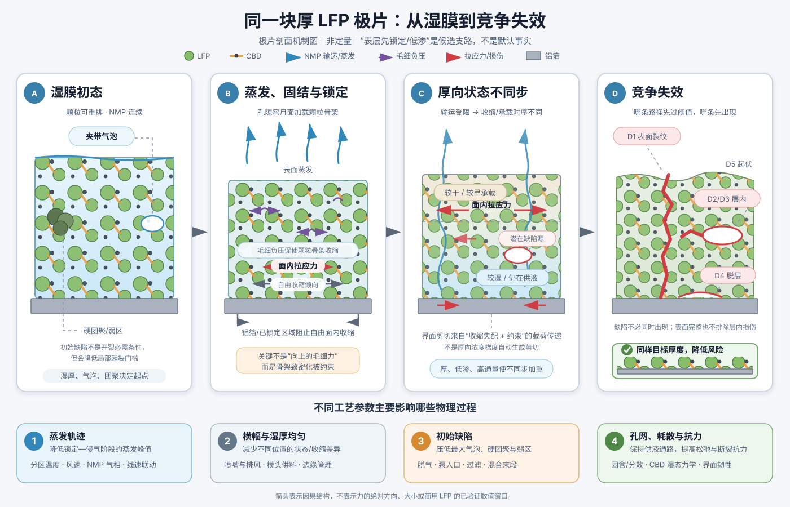

# LFP 厚涂极片干燥开裂：物理机制、计算方法、改善方向与验证方案

> **文档用途：** 对外技术交流和项目立项讨论。  
> **适用体系：** 铝箔单面涂布、LFP–导电剂–PVDF/NMP、连续多区热风干燥。  
> **固定条件：** 默认固定目标干厚度、LFP 活性物面密度和基本电化学设计。  
> **结论性质：** 本文给出可计算、可验证的机制框架，不提供未经目标体系标定的通用炉温、线速、固含量或临界厚度数值。

## 1. 执行摘要

厚极片更容易发生干燥开裂，不应简单解释为“温度太高”或“底部 NMP 最后被强行烘出”。更完整的因果关系是：

$$
\boxed{
\text{NMP 蒸发与孔内输运}
\rightarrow
\text{颗粒骨架产生自由收缩倾向}
\rightarrow
\text{不同高度的锁定、模量和松弛状态不同}
\rightarrow
\text{铝箔和相邻层限制自由收缩}
\rightarrow
\text{固体骨架中积累面内拉应力}
\rightarrow
\text{裂纹、内部空洞、脱层或表面起伏竞争出现}
}
$$

厚度增加会同时带来三类不利影响：

1. NMP 的输运距离和单位面积溶剂库存通常增加，不同高度的状态更容易不同步；
2. 受限收缩产生的应力可能持续更久，局部松弛更难跟上加载；
3. 即使峰值应力没有明显增加，更厚的承载层也能向裂纹释放更多弹性能，因此存在有限的过程临界厚度。

在固定目标厚度下，改善方向可以归纳为：

- 降低锁定后敏感阶段的实际蒸发通量峰值，而不是只降低走带速度；
- 减少横幅方向和涂布方向的湿厚、温度与蒸发差异；
- 减少大气泡、硬团聚、局部厚点和界面污染；
- 在可涂布、可脱气的前提下减少单位面积 NMP，并保持孔网连通；
- 提高湿态颗粒–导电剂–PVDF 网络的松弛能力和断裂抗力；
- 根据实际失效位置调整铝箔界面，而不是只追求最大的最终剥离力；
- 如果单次厚涂仍超过过程临界厚度，考虑分次涂布并分别干燥，或改变承载层结构。

最有效的验证方式也不是一次性把所有参数放入大规模 DOE，而是依次建立临界厚度概率曲线、筛选蒸发与气泡支路、用中断样定位缺陷形成状态，最后才筛选材料参数并标定工艺范围。

## 2. 研究对象和缺陷的完整定义

本文把以下五类现象都纳入“干燥开裂类失效”，但不认为它们具有同一种形成机制。

本文使用以下坐标：$x$ 为走带/涂布方向，$y$ 为横幅方向，$z$ 为厚度方向，$z=0$ 位于铝箔界面，$z=H$ 位于自由表面；$t$ 为从入炉或实验开始计算的时间，$A$ 为被分析区域的面积。CBD 是导电剂–粘结剂域，即由导电剂和 PVDF 共同形成的细尺度网络。

| 完整名称 | 物理定义 | 典型外观与位置 | 建议测量结果 | 容易混淆之处 |
|---|---|---|---|---|
| **表面裂纹或通道裂纹** | 裂口与自由表面相连，可向厚度方向延伸，严重时贯穿至铝箔 | 表面泥裂、纵向/横向裂纹、裂纹网络 | 裂纹发生概率、单位面积总长度、最大宽度、深度和是否触底 | 表面裂纹不一定从表层最先起裂；最终看到表面开口也不能确定最初起裂位置 |
| **层内内聚裂纹** | 涂层内部的颗粒/导电剂–粘结剂网络发生分离，但裂口没有与表面或铝箔界面连通 | 中层横向裂纹、局部层裂、隐蔽内裂 | 三维裂纹体积、面积、长度、距表面/铝箔的位置和连通性 | 二维截面上的黑色区域可能是气泡、拔出孔或制样损伤，不能只凭单张截面判定 |
| **气泡、内部空洞或空化** | 入炉前夹带气泡在干燥中长大、排出或塌陷，或者局部液相/骨架在负压下形成新空腔 | 椭圆孔洞、中层空腔、鼓泡后塌陷区；表面可能没有裂口 | 入炉前气泡尺寸分布、干燥中空洞体积分数、形状、位置和时间演化 | 预存气泡增长与新生空化不是同一过程；所有内部空洞也不等于经典断裂裂纹 |
| **涂层–铝箔界面脱层** | 涂层与铝箔之间发生界面分离，可能由界面本身较弱，也可能由表面裂纹触底后诱发 | 边缘翘起、局部鼓包、裂纹附近脱层、整片剥离 | 脱层面积、界面断裂能、半干态和干态剥离、裂纹与脱层的空间关系 | 提高界面强度可能减少脱层，却把失效转移为层内裂纹 |
| **表面起伏、鼓包或塌陷** | 表面没有明显开口裂纹，但因流平、气泡、厚向收缩差或局部失稳形成永久形貌不均 | 波纹、橘皮、局部凸起、凹陷或塌陷 | 表面算术平均高度 $S_a$、均方根高度 $S_q$、特征波长、局部厚度和内部空洞对应关系 | 表面粗糙、发哑或 PVDF 富集不能单独证明已经形成机械结皮 |

因此，“表面没有裂纹，但中层有空洞”的样品仍属于本项目关心的失效，但必须进一步区分它是层内内聚裂纹、预存气泡演化，还是新生空化。三者的改善方法不同。

*图 1。厚极片从湿膜、蒸发固结、厚向状态不同步到竞争失效的机制示意。蓝色长箭头表示 NMP 输运或蒸发，紫色局部箭头表示孔隙毛细负压的作用，红色表示固体骨架中的拉应力或损伤。图为机制综合，不是任何单一论文原图，也不表示商用 LFP 已标定的数值。*

## 3. 从 NMP 蒸发到面内拉应力的物理过程

### 3.1 毛细作用不是一股向上的拉力

向上运动的是 NMP 液体补给流和蒸气通量。毛细压力是弯月面气液两侧的压力差：

$$
p_c=p_g-p_l\simeq\frac{2\gamma\cos\theta}{r_t}.
$$

弯月面产生的负孔液压力近似从各个方向作用于局部孔壁，使相邻颗粒靠拢并使孔隙缩小。它首先给颗粒骨架一个“自然长度变短”的趋势，而不是直接横向撕开极片。

只有当这种致密化包含面内自由收缩，而且面内收缩被铝箔、已锁定区域或相邻材料阻止时，固体骨架中才形成面内拉应力。该因果结构与受约束颗粒膜的断裂模型一致。[Tirumkudulu & Russel, 2005](https://doi.org/10.1021/la048298k)

### 3.2 为什么“想缩但缩不了”会产生拉应力

定义：

- $\varepsilon_{\mathrm{free}}<0$：取出一小块湿骨架并解除面内约束后，它在当前溶剂状态下自然达到的面内收缩应变；
- $\varepsilon_{\mathrm{actual}}$：该位置粘在铝箔上以后实际实现的面内应变；
- $\varepsilon_e$：实际应变与自由收缩之间保存在骨架中的可恢复弹性应变。

忽略黏塑性重排时：

$$
\varepsilon_e
=
\varepsilon_{\mathrm{actual}}
-
\varepsilon_{\mathrm{free}},
\qquad
\sigma_\parallel=E'\varepsilon_e.
$$

如果自由膜自然缩短 3%，而铝箔使实际面内长度基本不变，则：

$$
\varepsilon_{\mathrm{actual}}\approx0,
\qquad
\varepsilon_{\mathrm{free}}\approx-0.03,
\qquad
\varepsilon_e\approx+0.03.
$$

因此涂层相对于自己的无应力自然长度处于拉伸状态。铝箔不需要主动把涂层向两侧拉开；只要阻止其自由缩短，就足以建立拉应力。

### 3.3 厚向溶剂梯度为什么不自动等于界面剪切

厚向 NMP 或锁定差异首先改变各高度的自由收缩、模量和松弛：

$$
c_{\mathrm{NMP}}(z,t),\;S_l(z,t),\;\lambda(z,t),\;T(z,t)
\longrightarrow
\varepsilon_{\mathrm{free}}(z,t),\;E'(z,t),\;\tau_r(z,t).
$$

如果层间保持粘结，复合体实际面内应变近似满足：

$$
\varepsilon_{\mathrm{actual}}(z,t)
=
\varepsilon_0(t)+z\kappa(t),
$$

其中 $\varepsilon_0$ 是复合体的平均面内应变，$\kappa$ 是曲率。各高度的应力为：

$$
\sigma_\parallel(z,t)
=
E'(z,t)
\left[
\varepsilon_0(t)+z\kappa(t)-\varepsilon_{\mathrm{free}}(z,t)
\right].
$$

所以厚向梯度首先产生的是不同高度的面内应力和弯曲倾向。明显的界面剪切还要求膜内合力沿涂布方向或横幅方向发生变化。单位幅宽的膜内合力为：

$$
N_x(x,t)=\int_0^{H(x)}\sigma_{xx}(x,z,t)\,dz,
$$

界面切向载荷的数量级满足：

$$
\left|\tau_i(x,t)\right|
\simeq
\left|\frac{\partial N_x}{\partial x}\right|.
$$

因此，界面剪切通常在涂层边缘、厚度突变、横向干燥不均、裂纹两侧和脱层前缘较明显；均匀极片中央即使存在厚向应力差，也不要求界面处处具有同样大的剪切。

## 4. 建议采用的计算逻辑

第一版模型的目标不是同时解释所有微观过程，而是把可测输入逐级转换为可验证的中间量和失效风险。

### 4.1 第一步：闭合产品几何和初始 NMP 库存

第 $j$ 个烘箱区的停留时间为：

$$
t_j=\frac{L_j}{v_{\mathrm{web}}},
$$

其中 $L_j$ 是该区有效长度，$v_{\mathrm{web}}$ 是走带速度。

若浆料液相近似全部为 NMP，固定单位面积干固体质量 $m_{\mathrm{dry}}/A$ 时，初始 NMP 面密度近似为：

$$
\frac{m_{\mathrm{NMP},0}}{A}
=
\frac{m_{\mathrm{dry}}}{A}
\frac{1-w_s}{w_s},
$$

其中 $w_s$ 是浆料质量固含量。该式说明在固定干面密度时，提高固含通常会减少单位面积 NMP 和初始湿厚，但不保证一定降低开裂，因为固含还会改变流变、气泡排出、锁定时间、孔喉和渗透率。

### 4.2 第二步：把炉温和线速转换成实际蒸发历史

单位面积 NMP 质量通量定义为：

$$
J_m(t,y)
=
-\frac{d}{dt}
\left(\frac{m_{\mathrm{NMP}}}{A}\right),
$$

单位为 $\mathrm{kg\,m^{-2}\,s^{-1}}$。对应的液体体积通量为：

$$
q_v(t,y)=\frac{J_m(t,y)}{\rho_l},
$$

其中 $\rho_l$ 是液相密度。

气侧边界可用下式表示其结构：

$$
J_m
\approx
\beta_m
\left[
c^*_{\mathrm{NMP}}(T_s,c_l)
-
c_{\mathrm{NMP},g}
\right],
$$

其中 $\beta_m$ 是气侧传质系数，$T_s$ 是膜面温度，$c^*_{\mathrm{NMP}}$ 是膜面平衡蒸气浓度，$c_{\mathrm{NMP},g}$ 是烘箱气相 NMP 浓度。

所以走带速度决定“在每个区停留多久”，但不单独决定瞬时蒸发通量。单独降速可能延长高通量暴露，也可能因为单位时间 NMP 负荷降低而改变气相推动力，必须用实测失重、膜温和排气 NMP 共同判断。

### 4.3 第三步：计算内部液体补给所需的压力差

部分饱和孔网中的液相体积通量可用 Darcy 关系表示：

$$
q_z
=
-\frac{k\,k_r(S_l)}{\mu_l}
\frac{\partial p_l}{\partial z}.
$$

在厚度为 $H$ 的简化尺度下：

$$
\Delta p_{\mathrm{tr}}
\sim
\frac{\mu_l q_v H}{k\,k_r(S_l)}.
$$

其中 $k$ 是饱和湿骨架本征渗透率，$k_r(S_l)$ 是降饱和后的相对渗透率，$\mu_l$ 是孔内液相有效黏度。

可以构造输运诊断量：

$$
\Pi_{\mathrm{tr}}
=
\frac{\Delta p_{\mathrm{tr}}}{p_c}.
$$

$\Pi_{\mathrm{tr}}$ 较大表示维持表面供液所需的压力差已经接近孔喉毛细压力尺度，厚向不同步、侵气和液路断连的可能性增加。但它不是未经标定即可直接使用的开裂阈值。

### 4.4 第四步：从 NMP 状态得到锁定、自由收缩和松弛

模型需要把局部 NMP 含量或液相饱和度转换为三个力学状态：

$$
c_{\mathrm{NMP}}(z,t),\;S_l(z,t)
\longrightarrow
\lambda(z,t),\;
\varepsilon_{\mathrm{free}}(z,t),\;
E'(z,t),\;
\tau_r(z,t).
$$

- $\lambda$ 是从可流动浆料到可持续承载骨架的锁定程度，0 表示基本不能保存应力，1 表示已经形成持续承载网络；
- $\varepsilon_{\mathrm{free}}$ 是解除约束后局部材料自然希望实现的面内收缩；
- $E'$ 是当前溶剂、温度和约束状态下的有效面内模量；
- $\tau_r$ 是颗粒重排、黏弹或塑性变形释放应力的特征时间。

第一版模型建议采用“经验自由收缩路线”：用实测或拟合的 $\varepsilon_{\mathrm{free}}(c_{\mathrm{NMP}})$ 表示全部溶剂相关收缩，不再额外把完整毛细孔压作为第二份收缩载荷。否则同一毛细作用可能被重复计算。

### 4.5 第五步：计算应力随时间和高度的变化

为处理不断变化的模量，建议演化 Maxwell 弹簧中的可恢复应变：

$$
\dot\varepsilon_e
+
\frac{\varepsilon_e}{\tau_r}
=
\dot\varepsilon_{\mathrm{actual}}
-
\dot\varepsilon_{\mathrm{free}},
$$

$$
\sigma_\parallel(z,t)
=
E'(z,t)\varepsilon_e(z,t).
$$

点号表示对时间求导。若近似认为 $E'$ 在一个时间步内不变，也可写成：

$$
\dot\sigma_\parallel
+
\frac{\sigma_\parallel}{\tau_r}
=
E'
\left(
\dot\varepsilon_{\mathrm{actual}}
-
\dot\varepsilon_{\mathrm{free}}
\right).
$$

若 $E'$ 随干燥快速变化，直接应力方程还要包含 $\dot E'/E'$ 项，因此数值实现中优先演化 $\varepsilon_e$。

干燥加载与松弛的竞争可用 Deborah 数表示：

$$
De_{\mathrm{dry}}=\frac{\tau_r}{t_{\mathrm{load}}}.
$$

- $De_{\mathrm{dry}}\ll1$：松弛比加载快，应力较难保存；
- $De_{\mathrm{dry}}\gg1$：加载比松弛快，应力更容易积累；
- $t_{\mathrm{load}}$ 应取锁定后自由收缩或孔压快速变化的敏感时段，不能直接等于总烘箱时间。

同步失重–曲率研究直接表明，颗粒涂层干燥应力会经历上升、峰值和松弛，且聚合物增塑状态会明显改变应力历史；其材料参数不能直接移植到 LFP/PVDF–NMP。[Lewis et al., 1996](https://doi.org/10.1111/j.1151-2916.1996.tb08099.x)

### 4.6 第六步：从应力场计算裂纹风险

单位面积涂层中储存的弹性能可写为：

$$
U_A(t)
=
\int_0^H
\frac{\sigma_\parallel(z,t)^2}{2E'(z,t)}\,dz.
$$

对表面通道裂纹，厚向非均匀时的能量释放率结构为：

$$
G_{\mathrm{ch}}(t,y)
=
C_{\mathrm{int}}
\int_0^H
\frac{\sigma_{\parallel,+}(z,t,y)^2}
{E'(z,t,y)}\,dz,
$$

其中 $\sigma_{\parallel,+}=\max(\sigma_\parallel,0)$ 只保留拉应力，$C_{\mathrm{int}}$ 吸收裂纹几何、泊松比、膜–箔弹性失配和界面滑移影响。

裂纹传播风险为：

$$
R_{\mathrm{ch}}(t)
=
\frac{G_{\mathrm{ch}}(t)}{\Gamma_c(t)}.
$$

$\Gamma_c$ 是当时 NMP 含量和温度下形成单位新裂面所需的有效能量，不是最终全干电极的拉伸强度。$R_{\mathrm{ch}}\ge1$ 只有在 $C_{\mathrm{int}}$ 和 $\Gamma_c$ 已由目标体系标定时才是定量阈值；未标定时只能作为相对风险指标。

均匀薄层近似下：

$$
G_{\mathrm{ch}}
\sim
C\frac{\sigma_\parallel^2H}{E'},
$$

因此状态相关临界厚度为：

$$
H_c(t)
=
\frac{E'(t)\Gamma_c(t)}{C\sigma_\parallel(t)^2},
\qquad
H_{c,\mathrm{process}}
=
\min_t H_c(t).
$$

该式说明厚度增加不要求应力本身一定增加，也能提高裂纹扩展可释放的能量。颗粒涂层实验观察到更厚样品可在相近峰值应力下更容易开裂，支持这一结构，但不能把其数值移植到商用 LFP。[Moorhead & Francis, 2024](https://doi.org/10.1111/jace.19644)

起裂还需要局部强度条件：

$$
R_\sigma(t)
=
\max_{z,y}
\frac{\sigma_{1,+}(z,t,y)}{\sigma_t(z,t,y)}.
$$

$R_\sigma$ 回答局部缺陷附近能否形成初始裂口；$R_{\mathrm{ch}}$ 回答已经存在的裂口能否继续传播。二者不能互相替代。

### 4.7 其他失效需要单独的判据

**层内内聚裂纹：** 可使用局部最大拉应力与湿态层内强度比较，并使用局部 $G/\Gamma_c(z,t)$ 判断是否扩展。但几何系数和弱层位置需要中断 CT/截面标定，不能直接套用表面通道裂纹系数。

**气泡或内部空洞增长：** 最小压力条件可写为：

$$
p_b-p_l
>
\frac{2\gamma}{R}
+
p_{\mathrm{resist}}(R),
$$

其中 $p_b$ 是泡内压力，$p_l$ 是周围孔液压力，$R$ 是气泡半径，$2\gamma/R$ 是界面曲率压力，$p_{\mathrm{resist}}$ 表示周围颗粒骨架的弹性、屈服和黏性阻力。预存气泡、气体析出和新生空化需要分别判断。

**涂层–铝箔界面脱层：** 应比较界面可释放能量 $G_{\mathrm{int}}$ 与界面断裂能 $\Gamma_{\mathrm{int}}$。界面剪切和法向剥离载荷通常在边缘、裂纹附近和脱层前缘集中，最终干态剥离力不能完整代表干燥中半湿界面的断裂抗力。

**表面起伏、鼓包或塌陷：** 目前不建议压缩成单一标量判据。至少要同时考虑入炉前流平、屈服恢复、横向气流、局部气泡、厚向收缩差、铝箔张力和可能的低渗表层。

### 4.8 数值计算的最小流程

对厚度方向离散为 $z_1,\ldots,z_n$，并按时间推进：

1. 输入各烘箱区的停留时间、实测膜温、失重或 NMP 通量；
2. 更新各高度的 NMP 含量或液相饱和度；
3. 计算 $k_r(S_l)$、液体补给压力差和侵气/液路断连状态；
4. 由局部 NMP 状态更新锁定程度、自由收缩、模量和松弛时间；
5. 用位移协调和 Maxwell 方程更新面内应力；
6. 积分得到储存弹性能、通道裂纹风险和临界厚度；
7. 同时检查局部强度、气泡增长和界面脱层条件；
8. 输出随时间、烘箱位置和高度变化的 NMP、锁定、自由收缩、应力与失效风险。

模型必须同时解释中间状态和最终缺陷，而不能只调参数拟合最终“裂/不裂”。

## 5. 方程变量、测试方法与无法直接测试时的确认方式

本节测试缩写含义如下：

- IR：红外热成像；
- GC：气相色谱；
- TGA：热重分析；
- CT：X 射线计算机断层成像；
- DIC：数字图像相关，用于测量表面位移和应变；
- DMA：动态力学分析；
- FTIR：傅里叶变换红外光谱；
- DOE：试验设计。

### 5.1 产品几何和工艺边界

| 符号 | 单位 | 物理含义 | 优先测试方法 | 无法直接测试时如何确认 |
|---|---:|---|---|---|
| $H_0$ | m 或 µm | 入炉前湿膜厚度 | 在线激光/共焦厚度；湿膜截面 | 用单位面积湿质量、浆料密度和涂布宽度反算，并用少量截面校准 |
| $H(t)$ | m 或 µm | 干燥过程中实时厚度 | 在线位移、激光或实验室原位成像 | 用中断样厚度建立 $H$–失重关系；只能得到分段曲线，不能声称连续实测 |
| $H_{\mathrm{dry}}$ | m 或 µm | 最终干电极厚度 | 多点测厚或截面 | 必须同时记录横幅位置；单点平均不能代表最厚热点 |
| $m_{\mathrm{dry}}/A$ | kg m$^{-2}$ | 单位面积总干固体质量 | 冲片称量，扣除铝箔 | 若固定的是 LFP 活性物面密度，还需按配方质量分数换算，不能把总面密度当成 LFP 面密度 |
| $w_s$ | 1 或 wt% | 浆料质量固含量 | 烘干称量/TGA；取多点样 | 若存在 NMP 挥发或批次沉降，应在模头前后取样；只用投料配方不足 |
| $L_j$ | m | 第 $j$ 区有效干燥长度 | 设备几何测量 | 排除过渡段、无有效风区和实际未覆盖区域 |
| $v_{\mathrm{web}}$ | m s$^{-1}$ | 走带速度 | 编码器/设备记录 | 需要核对实际速度波动和启停段，不能只用设定值 |
| $t_j$ | s | 第 $j$ 区停留时间 | 由 $L_j/v_{\mathrm{web}}$ 计算 | 用标记追踪或设备时间戳核对过渡区影响 |
| $T_s(t,y)$ | K 或 °C | 膜面随时间和横幅位置的温度 | 标定发射率后的 IR；实验室薄热电偶 | 用涂布铝箔或等效湿膜校准；未校准 IR 只能比较相对变化 |
| $c_{\mathrm{NMP},g}$ | kg m$^{-3}$ 或体积分数 | 烘箱气相 NMP 浓度 | 分区气体采样、FTIR/GC 或排气质量平衡 | 只能测总排气时，建立分区气体模型并用总量闭合；不能据此声称已得到局部浓度 |
| $c_l$ | kg m$^{-3}$、质量分数或等效组成 | 膜面液相中 NMP/PVDF 等组成状态 | 膜面快速取样后 GC/TGA 或配方–浓缩实验 | 并入膜面平衡浓度 $c^*_{\mathrm{NMP}}$ 的经验关系；不能同时独立反演两者 |
| $c^*_{\mathrm{NMP}}$ | kg m$^{-3}$ | 当前膜温和液相组成下，与膜面平衡的 NMP 蒸气浓度 | 代表性液相的气液平衡/顶空 GC | 使用经实验校准的活度模型；只用纯 NMP 饱和蒸气压会忽略 PVDF 和浓缩效应 |
| $J_m(t,y)$ | kg m$^{-2}$ s$^{-1}$ | 单位面积 NMP 蒸发质量通量 | 在线失重、实验室热重、分区 NMP 质量平衡 | 用不同烘箱位置的中断样残余 NMP 做差分反算；需要至少一个直接失重实验校准 |
| $\rho_l$ | kg m$^{-3}$ | 孔内液相密度，用于把质量通量转换为体积通量 | 不同温度和浓缩状态下的密度计/比重瓶 | 相近组成数据可作初值；应检查其不确定度对 $q_v$ 的影响 |
| $\beta_m$ | m s$^{-1}$ 或等效单位 | 气侧传质系数 | 已知边界下的干燥标定实验 | 与平衡浓度模型一起拟合；若 $T_s$ 和气相 NMP 未测，$\beta_m$ 不可单独辨识 |

### 5.2 NMP 输运、孔网和状态变量

| 符号 | 单位 | 物理含义 | 优先测试方法 | 无法直接测试时如何确认 |
|---|---:|---|---|---|
| $c_{\mathrm{NMP}}(z,t)$ | kg m$^{-3}$、质量分数或等效状态 | 不同高度和时间的局部 NMP 含量 | 中断样分层后 GC/TGA；冷冻截面配合化学分析 | 用厚向取样的少数时刻校准一维传输模型；只有总失重时不能唯一确定厚向分布 |
| $S_l(z,t)$ | 1 | 连通孔隙中液体所占比例 | 原位 CT/核磁、冷冻截面和体积平衡 | 用质量守恒和孔隙率反算平均值；局部值必须标为模型估计 |
| $q_z$、$q_v$ | m s$^{-1}$ | 孔内液体补给或等效体积通量 | 由局部质量通量和液体密度换算 | 只能得到面积平均值时，不应解释为每个孔道的真实速度 |
| $k$ | m$^2$ | 饱和湿骨架本征渗透率 | 湿骨架压差–流量测试 | 从干燥曲线和压力/状态模型反演 $k/\mu_l$；若没有压力信息，通常只能辨识有效导流能力而非独立 $k$ |
| $k_r(S_l)$ | 1 | 降饱和后液路连通能力相对饱和状态的下降 | 控制饱和度的渗流试验 | 用侵气后干燥曲线转折反演参数族，并用不同厚度数据交叉验证 |
| $\mu_l$ | Pa s | 孔内 NMP/PVDF 富集液相的有效黏度 | 分离液相或代表性浓缩液的温变流变 | 与 $k$ 组合为 $k/\mu_l$ 反演；不能直接用纯 NMP 黏度代替浓缩液相 |
| $p_l$ | Pa | 孔液压力 | 专用微型压力传感或孔压实验，量产极片中通常困难 | 由 Darcy 关系和毛细侵气状态反演压力差；只能得到尺度和趋势，不能声称局部绝对压力 |
| $p_g$ | Pa | 孔隙气相压力 | 烘箱压力和局部气路测量 | 薄膜中常先近似为烘箱压力，但鼓泡、低渗表层或快速产气时需检查该假设 |
| $p_c$ | Pa | 气相与液相之间的毛细压力差 | 毛细压力–饱和度曲线、受控侵气实验 | 由孔喉分布、界面张力和润湿角估算，并用首次侵气时刻校准 |
| $\Delta p_{\mathrm{tr}}$ | Pa | 为维持表面液体补给而跨越涂层厚度建立的压力差 | 由实测通量、$k/\mu_l$ 和厚度计算 | 无独立 $k$ 时只报告有效压力差范围，并用不同厚度干燥曲线验证趋势 |
| $\Pi_{\mathrm{tr}}$ | 1 | 输运压力差与毛细压力尺度的比值 | 由 $\Delta p_{\mathrm{tr}}/p_c$ 计算 | 未标定时只作为条件间相对比较，不能把 1 直接当作通用开裂阈值 |
| $\gamma$ | N m$^{-1}$ | NMP 富集液相与气体的界面张力 | 悬滴法/气泡压力法，按温度和配方测量 | 用相近配方数据只作初值；PVDF 和溶解组分会改变结果 |
| $\theta$ | ° | 液相在代表性固体表面的有效润湿角 | LFP、炭黑和铝箔压片上的接触角 | 多组分多孔体系没有唯一接触角，可并入有效 $p_c$ 标定，不宜给过高精度 |
| $r_t$ | m | 控制侵气和液路的有效孔喉尺度 | 湿态成像、毛细流动孔径、压汞的谨慎对照 | 干态孔径只能提供相对排序；将 $r_t$ 与 $p_c$ 合并标定，不能用供应商颗粒 $D_{50}$ 直接代替 |
| $\lambda(z,t)$ | 1 | 颗粒/CBD 网络形成持续承载能力的锁定程度 | 同步失重–应力起点、原位流变或散射 | 由应力开始持续上升、宏观收缩结束和中断结构共同夹定；它是操作性状态变量，不是可直接称量的物质 |

### 5.3 收缩、应力和断裂变量

| 符号 | 单位 | 物理含义 | 优先测试方法 | 无法直接测试时如何确认 |
|---|---:|---|---|---|
| $\varepsilon_{\mathrm{free}}(z,t)$ | 1 | 解除面内约束后局部骨架自然希望实现的收缩应变 | 释放膜、低粘附基底、窄条自由收缩与 NMP 状态同步测量 | 用受约束应力和模量联合反演；必须有至少一组自由/低约束样，否则与约束系数高度相关 |
| $\varepsilon_{\mathrm{actual}}$ | 1 | 涂层–箔复合体实际实现的面内应变 | DIC、标记间距、箔应变和曲率 | 连续卷材中可用实验室同配方箔样校准；需单独记录走带张力和热膨胀 |
| $\varepsilon_0$ | 1 | 涂层–箔复合体截面参考面的平均面内应变 | DIC、箔应变和层合梁反演 | 与曲率 $\kappa$ 联合从上下表面应变反演；刚性箔近似下可先设为接近零并做灵敏度分析 |
| $\kappa$ | m$^{-1}$ | 涂层–箔复合体因厚向收缩失配产生的曲率 | 激光轮廓、相机曲率或悬臂梁法 | 量产卷材受辊和张力限制时，用实验室自由悬臂样标定，不能把产线平直外观解释为零内应力 |
| $E'(z,t)$ | Pa | 当前 NMP、温度和约束状态下的有效面内模量 | 控制 NMP 含量的拉伸、压入、DMA 或动态流变 | 与曲率应力和自由收缩联合拟合；若无湿态数据，最终干模量只能作为上限参考 |
| $\tau_r(z,t)$ | s | 颗粒重排、黏弹和塑性变形释放应力的特征时间 | 控制 NMP 含量的应力松弛/蠕变试验 | 用干燥应力峰值后的松弛段拟合，并用不同加载速率验证；只拟合单一轨迹容易与 $E'$ 补偿 |
| $t_{\mathrm{load}}$ | s | 锁定后自由收缩或孔压快速增加的有效加载时间 | 由实测失重、收缩和锁定时刻定义 | 用敏感阶段的质量损失区间近似，并明确不是总烘箱时间 |
| $\sigma_\parallel(z,t)$ | Pa | 固体骨架中的面内拉应力 | 实验室涂层–薄箔曲率法、悬臂梁法 | 量产线无法直接测时，用同配方实验室干燥应力样建立转移模型，再用裂纹起始位置和卷曲/箔应变交叉检查 |
| $\sigma_t(z,t)$ | Pa | 当前湿态材料的局部抗拉强度 | 控制 NMP 状态的微拉伸、劈裂或压入反演 | 通过起裂应力和缺陷尺寸联合反演相对值；没有缺陷信息时不能唯一辨识 |
| $N_x$ | N m$^{-1}$ | 单位幅宽涂层沿走带方向承受的膜内合力，即应力沿厚度的积分 | 由厚向应力场积分，或由箔–涂层力平衡反演 | 没有厚向应力时只能得到截面平均合力；用于判断沿面内载荷变化而非局部峰值 |
| $\tau_i$ | Pa | 涂层–铝箔界面的切向载荷，负责在边缘和非均匀区传递膜内力 | 界面传感、DIC/剪滞模型或有限元 | 由 $\partial N_x/\partial x$ 的尺度估算；均匀中央区域不能只凭厚向梯度推断大剪切 |
| $U_A$ | J m$^{-2}$ | 单位面积涂层储存的可恢复弹性能 | 由实测/标定的 $\sigma$ 和 $E'$ 积分 | 可作为相对指标；绝对值取决于厚向应力和模量是否可信 |
| $G_{\mathrm{ch}}$ | J m$^{-2}$ | 表面通道裂纹扩展可释放的能量 | 已标定应力场、厚度和几何系数后计算 | 用临界厚度和已知裂纹几何反演相对值；不能只由最终裂纹宽度直接获得 |
| $\Gamma_c(z,t)$ | J m$^{-2}$ | 湿态层内形成单位新裂面所需的有效能量 | 控制 NMP 的预制缺口/内聚断裂试验 | 用临界厚度、实测应力和裂纹扩展时刻反演“表观 $\Gamma_c/C$”；若 $C$ 未知，不能报告唯一绝对值 |
| $C$、$C_{\mathrm{int}}$ | 1 | 裂纹几何、泊松比、基底失配和界面滑移的综合系数 | 有限元或参考体系标定 | 与 $\Gamma_c$ 合并辨识；未标定时只比较相同几何下的相对风险 |
| $\Gamma_{\mathrm{int}}$ | J m$^{-2}$ | 涂层–铝箔界面形成单位新界面裂面的能量 | 半干态/干态界面断裂、剥离或鼓泡试验 | 用脱层起始载荷和面积作相对排序；普通剥离力不能直接等同于界面断裂能 |
| $G_{\mathrm{int}}$ | J m$^{-2}$ | 界面裂纹或脱层前缘可释放的能量 | 已知残余应力、界面裂纹几何后的断裂力学/有限元计算 | 由脱层起始尺寸和载荷反演相对值；需与 $\Gamma_{\mathrm{int}}$ 分开报告 |
| $a_0$、$R$ | m | 初始裂纹、气泡或团聚缺陷的特征尺寸 | 湿膜 CT、超声、透射、光学和统计取样 | 用强化脱气/过滤正交对照确认缺陷支路；没有尺寸数据时只能确认“缺陷相关”，不能标定断裂阈值 |
| $p_b$ | Pa | 气泡内部总压力，包括夹带气体和 NMP 蒸气贡献 | 原位气泡尺寸–温度–气体状态模型，直接测量通常困难 | 用原位气泡增长/收缩曲线反演，并与局部温度和环境压力共同约束 |
| $p_{\mathrm{resist}}$ | Pa | 周围颗粒骨架抵抗气泡或空洞扩张的弹性、屈服和黏性压力 | 受控气泡膨胀、空化或湿态压入/流变试验 | 与气泡增长阈值合并反演；没有骨架力学数据时不能独立分离 |

### 5.4 计算得到的风险指标和临界量

| 符号 | 单位 | 物理含义 | 如何得到 | 无法完整标定时如何使用 |
|---|---:|---|---|---|
| $De_{\mathrm{dry}}$ | 1 | 应力松弛时间与有效加载时间的比值 | 由 $\tau_r/t_{\mathrm{load}}$ 计算 | 作为不同轨迹和配方的相对比较；两项均未测时不能定量解释 |
| $R_\sigma$ | 1 | 局部最大主拉应力与湿态抗拉强度的比值，表示形成初始裂口的风险 | 由局部应力场和 $\sigma_t$ 计算 | $\sigma_t$ 未知时，只能比较相同材料和缺陷条件下的应力峰值 |
| $R_{\mathrm{ch}}$ | 1 | 通道裂纹能量释放率与湿态层内断裂能之比，表示已有裂口继续传播的风险 | 由 $G_{\mathrm{ch}}/\Gamma_c$ 计算 | $C$ 或 $\Gamma_c$ 未标定时只作为结构风险代理，不能把 1 当作真实阈值 |
| $H_c(t)$ | m | 当前状态下通道裂纹传播的临界厚度尺度 | 由 $E'\Gamma_c/(C\sigma_\parallel^2)$ 计算 | 通常先用实测 $H_{10}$、$H_{50}$ 反向校准组合参数，而不是正向给出绝对值 |
| $H_{c,\mathrm{process}}$ | m | 全干燥过程中最小的状态相关临界厚度 | 取全过程 $H_c(t)$ 的最小值 | 必须覆盖锁定至干燥结束的应力和材料状态；只用最终干态参数会漏掉最危险时刻 |

### 5.5 无法直接测量时的证据等级

对外报告每个关键量时，应标注它属于哪一级：

1. **直接测量：** 仪器直接给出该物理量，并完成温度、空间位置和时间校准；
2. **代理测量：** 测到与该量单调相关的结果，例如用应力开始持续上升夹定锁定时刻；
3. **对照确认：** 通过只改变一个支路的实验确认因果方向，例如强化脱气只降低内部空洞；
4. **模型反演：** 由多组独立数据共同拟合，例如用失重、自由收缩和曲率应力反演 $E'$ 与 $\tau_r$；
5. **未确认假设：** 只根据外观或跨体系类比提出，不能作为已测事实。

如果一个变量只能反演，应至少用不同厚度、不同蒸发轨迹或不同加载速率的数据验证同一组参数。只拟合一条最终裂纹曲线，无法排除参数之间的补偿。

## 6. 固定目标厚度下的改善方案

### 6.1 第一优先：调整实际蒸发历史

**可调参数：** 各区温度、风速、喷嘴间距、循环/排风比例、气相 NMP、走带速度和各区长度。

**目标变化：** 降低锁定后至首次侵气/液路断连附近的 $J_m$ 峰值，使自由收缩加载比湿骨架松弛更慢，同时满足最终残余 NMP。

**确认成功的最低证据：**

- 实测 $T_s(t,y)$ 和 $J_m(t,y)$ 的敏感阶段峰值下降；
- 最终残余 NMP、干面密度和出炉温度仍可比；
- 峰值干燥应力或 $G/\Gamma_c$ 风险下降；
- 表面通道裂纹和层内空洞没有发生相互替代。

**主要风险：** 单独降速不保证瞬时通量下降；后区过强也可能在液路断连后放大内部困液或气泡问题。Kumberg 在水系石墨电极中直接观察到厚度与蒸发通量共同改变表面开裂，但其数值不能移植到 LFP/PVDF–NMP。[Kumberg et al., 2019](https://doi.org/10.1002/ente.201900722)

### 6.2 第二优先：减少横幅和局部湿厚差异

**可调参数：** 喷嘴与排风平衡、边缘风场、狭缝模头横幅流量、泵送稳定性、模头间隙和浆料温度一致性。

**目标变化：** 降低横幅最差位置的 $J_m$、$H_0$ 和温度偏差，减少膜内合力沿面内位置的变化及局部界面载荷传递。

**确认成功的最低证据：** 以左边、左中、中心、右中、右边的最差值管理，而不是只比较全幅平均；同时检查裂纹位置是否仍与喷嘴节距、厚边或局部厚点相关。

### 6.3 第三优先：减少气泡、大团聚和界面污染

**可调参数：** 真空脱气、混合末段、静置/回流、泵入口压力、过滤、模头侵气和铝箔清洁。

**目标变化：** 降低最大气泡、大团聚体和弱区的尺寸分布上尾，而不只是降低平均数量。

**确认成功的最低证据：** 脱气后湿膜气泡体积分数、最大泡径或 $D_{95}$ 明显下降；内部空洞和气泡附近起裂同步下降，而峰值应力变化不大。

Dawson 在 NMC622/PVDF–NMP 模型小样中观察到预存气泡与部分后续主裂纹位置相关，也观察到裂纹触底后诱发脱层；这支持把气泡作为候选缺陷源，但不能解释商用 LFP 的所有裂纹。[Dawson et al., 2026](https://doi.org/10.1039/D5EB00201J)

### 6.4 第四优先：联合调整固含、流变和孔网

固定 LFP 活性物面密度时，适度提高固含通常减少湿厚和单位面积 NMP，但效果可能反转。

**有利条件：** 通过分散、颗粒级配和导电网络效率提高固含，同时保持可涂布、可脱气、可流平和孔网连通。

**不利条件：** 依赖过高 PVDF 分子量、更多炭黑或强增稠网络提高固含，可能使浆料更早承载、气泡更难排出、孔喉更小和渗透率更低。

**确认成功的最低证据：** 单位面积 NMP 下降，同时入炉气泡没有增加，锁定没有显著提前，$k/\mu_l$ 没有明显恶化，峰值应力和内部残余 NMP 差异下降。

颗粒粒径也不能单独作为改善方向。有效孔喉由一次颗粒、团聚结构、炭黑–PVDF 细孔网和润湿共同决定；供应商 $D_{50}$ 不能直接替代 $r_t$ 或 $k$。

### 6.5 第五优先：提高湿态松弛和层内断裂抗力

**可调参数：** PVDF 比例与分子量、导电剂类型与用量、混合顺序、PVDF 吸附/迁移和大 CBD 团聚。

**目标变化：** 在锁定后的加载阶段降低 $De_{\mathrm{dry}}$，提高湿态 $\Gamma_c$，并避免上下层形成低抗力弱区。

**确认成功的最低证据：** 控制 NMP 状态下的松弛时间、模量和表观断裂抗力发生预期变化，并使 $H_{50}$ 上移；不能只用最终干态剥离力或最终电极模量证明改善。

增加 PVDF 并不保证降低裂纹。PVDF 同时影响浆料黏度、锁定、孔网、颗粒迁移、界面粘附和最终电阻，必须按中间物理量判断。

### 6.6 第六优先：根据失效位置调整铝箔界面

如果主要问题是涂层–铝箔脱层，应改善表面清洁、粗糙度、底部 PVDF 分布、底涂层和半干态界面韧性。

如果主要问题是表面或层内裂纹，单纯提高界面强度可能保留更多面内约束，把失效从界面转移到涂层内部。验证时必须同时报告脱层、表面裂纹和内部裂纹，不能只报告剥离力提高。

### 6.7 如果仍超过过程临界厚度：改变单次承载层结构

如果在可接受产能下已经降低敏感阶段的蒸发峰值、减少缺陷并提高湿态抗力，目标厚度仍持续开裂，说明单次干燥层可能超过该材料和约束条件下的过程临界厚度。

可考虑两次薄涂并分别干燥、顺应性底层或功能梯度。只有两次涂层分别形成和释放应力，才可能降低单次承载层的有效厚度；两层湿碰湿后共同锁定，不能自动把有效厚度减半。

## 7. 分阶段验证方案

### 7.1 第一阶段：建立临界厚度概率曲线

以目前持续开裂附近的厚度 $H^*$ 为中心设置：

$$
H/H^*=0.75,\;0.90,\;1.00,\;1.10,\;1.25.
$$

每档至少 3 次独立浆料/涂布运行；每次运行测量左边、左中、中心、右中和右边。输出应包括：

- 10% 样品达到指定缺陷判据的厚度 $H_{10}$；
- 50% 样品达到指定缺陷判据的厚度 $H_{50}$；
- 五类失效各自的概率和严重度；
- 裂纹长度、宽度、深度、内部空洞体积分数和脱层面积随厚度的变化。

### 7.2 第二阶段：筛选厚度与蒸发加载

采用：

$$
3\text{ 档厚度}
\times
3\text{ 条蒸发轨迹}
\times
3\text{ 次独立重复}
=27\text{ 个完整干燥样}.
$$

厚度为 $0.9H_{50}$、$H_{50}$ 和 $1.1H_{50}$。三条轨迹按敏感阶段的实测通量定义：当前基准 $J_0$、约 $0.7J_0$ 和约 $1.3J_0$。

三条轨迹应尽量保持最终残余 NMP、干面密度和出炉温度可比，并完整记录总干燥时间与产能差异。

### 7.3 增加强化脱气对照

在 $H=H_{50}$、基准蒸发轨迹下设置标准脱气和强化脱气，各 3 次独立重复。标准组可与 27 个完整干燥样的中心点重合，因此通常只新增 3 个强化脱气样。

脱气水平应由气泡体积分数、最大泡径、$D_{95}$/$D_{99}$ 或单位面积大气泡数量定义，而不是由“真空时间”定义。

### 7.4 用约 10 个中断样定位缺陷发生状态

选择一个低风险条件和一个高风险条件，每个条件在以下 5 个状态中断：

1. 承载骨架形成前，湿膜仍可较充分自由收缩；
2. 跨厚承载骨架刚形成；
3. 首次侵气或孔隙弯月面形成；
4. 连通液路开始断开；
5. 首次出现可见裂纹、内部空洞或永久表面变形附近。

每个中断样至少测量失重、膜温、湿厚、顶/中/底残余 NMP、PVDF/炭黑分布、气泡/空洞/裂纹位置和湿态力学代理量。

### 7.5 最后筛选材料参数并标定工艺范围

只有在蒸发加载和气泡支路初步明确后，才筛选固含、团聚/渗透率、PVDF/CBD 网络和铝箔界面。

可先使用 13–17 点确定性筛选设计或 18–24 点 D-optimal 设计，保留效应最大的 3 个因素。随后采用三因素三水平 Box–Behnken 设计，约 15–17 个条件，分别拟合五类失效的概率和严重度。

候选工艺范围必须同时满足：

- 表面裂纹、内部裂纹、气泡/空洞、界面脱层和表面起伏分别低于产品容差；
- 95% 单侧置信上限仍在容差内；
- 残余 NMP、剥离、电阻和横幅最差位置合格；
- 连续生产节拍可接受。

最后至少进行 3 次独立长卷运行，并覆盖范围中心、范围边缘和高风险外侧。小规模 DOE 不能证明 ppm 级良率。

## 8. 如何根据观测结果判断主导机制

| 观测组合 | 更支持的解释 | 需要排除的替代解释 | 优先改善方向 |
|---|---|---|---|
| 降低敏感阶段通量后，峰值应力和表面裂纹同时下降 | 锁定后蒸发加载主导 | 最终残余 NMP、温度或固含不同 | 调整分区温度/风速/气相 NMP 和停留时间 |
| 强化脱气后内部空洞和气泡附近裂纹明显下降，但应力变化不大 | 预存气泡是重要缺陷源 | 脱气同时改变固含、温度或黏度 | 改善脱气、泵入口、回流和模头侵气 |
| 表面完整但中层裂纹随厚向残余 NMP 差异增加 | 内部输运、锁定差异或弱层主导 | 制样裂纹、颗粒拔出孔 | 改善孔网、降低局部通量峰值，并检查 PVDF/CBD 厚向分布 |
| 提高固含后 NMP 库存下降，但应力和裂纹增加 | 固含使锁定提前、松弛减弱或渗透率下降 | 气泡、湿厚或分散状态同时变化 | 通过分散/级配改善固含，不再单纯增稠 |
| 提高界面抗力后脱层减少，表面/层内裂纹增加 | 失效从界面转移到涂层内部 | 两批涂层本体力学不同 | 同时提高层内耗散，避免过度刚性约束 |
| 厚度提高后峰值应力相近，但裂纹概率明显增加 | 可释放弹性能随厚度增加，接近过程临界厚度 | 缺陷尺寸也随厚度增加 | 提高湿态断裂抗力、减少大缺陷或改变单次承载层厚度 |

一个因素只有同时满足以下三点，才应认定为关键因素：

1. 能稳定移动 $H_{50}$ 或缺陷严重度，而不只是统计上 $p<0.05$；
2. 跨独立浆料批次和横幅位置，效应方向仍然一致；
3. 相应的中间物理量同步变化，例如降低通量同时降低峰值应力。

## 9. 模型什么时候可以用于工艺决策

模型至少应通过四类检验：

1. **质量守恒：** 预测的 NMP 移除量与进出物料平衡一致；
2. **状态检验：** 能预测厚度收缩停止、首次侵气、液路断连和残余 NMP 的相对时序；
3. **力学检验：** 能预测峰值应力的时间、相对大小和厚度趋势，而不是只拟合最终裂纹；
4. **失效检验：** 使用同一组材料参数预测不同厚度和不同蒸发轨迹下的缺陷概率或相对风险。

以下情况只能报告相对趋势，不能报告绝对临界值：

- 湿态 $E'$、$\tau_r$ 和自由收缩全部来自同一条应力曲线反演；
- $C$ 和 $\Gamma_c$ 没有独立信息，只能得到组合参数 $\Gamma_c/C$；
- 只有最终总残余 NMP，没有厚向或中断状态；
- 只有表面照片，没有内部空洞和界面检查；
- 气泡、团聚和涂布厚度的分布上尾没有记录。

第一版模型应优先回答“哪一条机制正在限制当前厚度”，而不是追求一个看似精确但无法验证的临界面密度。

## 10. 证据来源与适用边界

1. **受约束颗粒膜的通道裂纹能量结构：** Tirumkudulu, M. S. & Russel, W. B. (2005)。用于 $G\sim\sigma^2H/E'$ 的方程结构，不直接提供 LFP 参数。[DOI](https://doi.org/10.1021/la048298k)
2. **同步干燥应力、失重和松弛：** Lewis, J. A. et al. (1996)。直接支持应力上升、峰值和松弛随聚合物状态改变；氧化铝–PVB 参数不能移植到 PVDF/NMP。[DOI](https://doi.org/10.1111/j.1151-2916.1996.tb08099.x)
3. **厚度在相近峰值应力下仍能提高开裂风险：** Moorhead, T. & Francis, L. F. (2024)。跨体系颗粒涂层直接证据，不提供商用 LFP 临界厚度。[DOI](https://doi.org/10.1111/jace.19644)
4. **厚度与蒸发通量的共同影响：** Kumberg, J. et al. (2019)。水系石墨电极直接证据，通量和临界厚度数值不能移植到 LFP/PVDF–NMP。[DOI](https://doi.org/10.1002/ente.201900722)
5. **孔排空、液体库存和 PVDF 分布不同步：** Jaiser, S. et al. (2017)。支持收缩终止、侵气、液路断连和完全干燥不是同一事件；不等于证明所有 PVDF/NMP 电极都形成机械结皮。[DOI](https://doi.org/10.1016/j.jpowsour.2017.01.117)
6. **预存气泡、裂纹和脱层的原位观察：** Dawson, A. et al. (2026)。NMC622/PVDF–NMP 模型小样的近邻直接证据，不代表约 20 cm 宽商用 LFP 热风涂布线的统一路径。[DOI](https://doi.org/10.1039/D5EB00201J)
7. **裂尖不可逆变形和简单弹性断裂模型的边界：** Goehring, L. et al. (2013)。说明实际颗粒膜断裂能包含塑性和不可逆耗散，不能用单一表面能替代。[DOI](https://doi.org/10.1103/PhysRevLett.110.024301)

## 11. 最终结论

在固定目标干厚度和 LFP 活性物面密度时，降低开裂不能只表达为“降低温度”“降低线速”或“增加 PVDF”。更准确的目标是：

1. 降低锁定后敏感阶段的实际蒸发加载；
2. 减少厚度方向和横幅方向的状态差异；
3. 让湿骨架有足够时间通过颗粒重排和黏弹行为释放应力；
4. 提高层内和所需界面的有效断裂抗力；
5. 减少最大气泡、硬团聚、局部厚点和界面弱区；
6. 如果上述措施仍不能使目标厚度低于过程临界厚度，则改变单次承载层结构。

实验和模型的共同目标不是给所有裂纹套用同一个解释，而是确定当前产品首先跨过的是表面裂纹、内部裂纹、气泡/空洞、界面脱层还是表面形貌失稳的条件，并据此选择改善方向。
