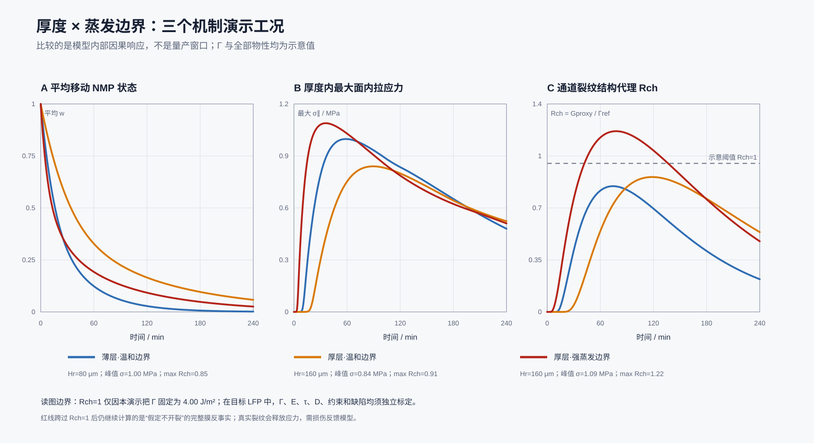
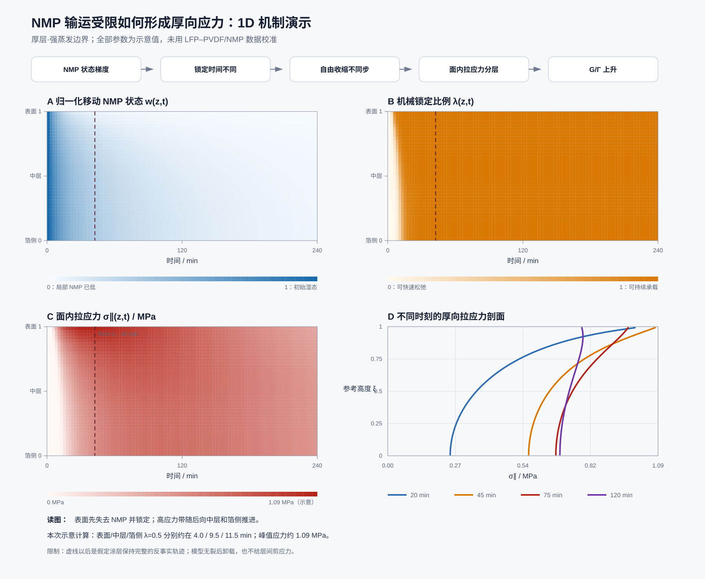

# LFP–PVDF/NMP 厚向干燥应力一维计算：独立输出版

> **报告性质：** 现有一维机制演示模型的独立技术报告。读者不需要先阅读计算代码或其他项目文档。
>
> **版本日期：** 2026-07-30。
>
> **适用读者：** 电极研发、工艺、设备、仿真和测试人员。
>
> **计算版本：** [`models/lfp_drying_mechanism_demo.py`](https://github.com/YangCui1994/coating-drying/blob/main/models/lfp_drying_mechanism_demo.py) 当前保存版本；61 个厚向单元、2 s 时间步、0.5 min 输出间隔、240 min 总计算时间。
>
> **重要边界：** 全部材料参数和断裂参数均为示意值。计算结果用于解释因果关系，不能直接给出商用 LFP 极片的炉温、线速、临界涂布重量或质量放行阈值。

## 1. 技术摘要：一维计算说明了什么

一维计算把 NMP 排出、机械锁定、受限收缩和面内拉应力连接成可计算的时间—厚度演化：

$$
\text{移动 NMP 由表面排出}
\rightarrow
\text{不同高度的移动 NMP 状态不同}
\rightarrow
\text{不同高度的机械锁定时间不同}
\rightarrow
\text{不同高度的自由收缩和应力松弛不同}
\rightarrow
\text{铝箔约束下形成面内拉应力}
\rightarrow
\text{厚度积分后的裂纹扩展能量增加}.
$$

当前三组计算给出五项主要结果：

1. **厚度增加不要求峰值拉应力同步增加，也能提高裂纹扩展风险。** 参考厚度从 80 µm 增至 160 µm、归一化蒸发边界强度保持 $6\times10^{-8}$ m s$^{-1}$ 时，所有时间和高度中的最大面内拉应力从 1.00 MPa 降至 0.84 MPa，但通道裂纹能量结构代理从 3.39 J m$^{-2}$ 增至 3.63 J m$^{-2}$。厚度积分效应使通道裂纹风险代理提高 7.3%。数值来源为 [`scenario_summary.csv`](https://github.com/YangCui1994/coating-drying/blob/main/models/outputs/lfp_drying_mechanism_demo/scenario_summary.csv)。
2. **同一 160 µm 参考厚度下，提高归一化蒸发边界强度会提前锁定并提高应力。** 归一化蒸发边界强度从 $6\times10^{-8}$ m s$^{-1}$ 增至 $2\times10^{-7}$ m s$^{-1}$ 后，表面达到 50% 机械锁定的时间从 18.0 min 提前到 4.0 min，最大面内拉应力提高 29.6%，最大通道裂纹风险代理提高 34.0%。
3. **局部峰值拉应力和厚度积分风险不在同一时刻达到最大值。** 厚层强蒸发场景的最大局部面内拉应力在 36.0 min 达到 1.089 MPa；厚度积分后的通道裂纹风险代理在 78.0 min 达到 1.217。36.0–78.0 min 内，表面拉应力已经下降，但中层和箔侧拉应力仍在增加，因此全厚度可释放能量继续增加。
4. **$R_{ch}^{proxy}=1$ 不是商用 LFP 的真实开裂阈值。** 当前计算人为设定参考断裂能 $\Gamma_{ref}=4.00$ J m$^{-2}$。厚层强蒸发场景在 42.5 min 首次达到 $R_{ch}^{proxy}=1$，只表示模型内部的能量结构代理达到人为参考值。
5. **当前一维模型已经通过离散质量守恒和粗细网格比较，但尚未通过目标材料实验验证。** 粗细网格的最大面内拉应力相对差为 0.041%，最大通道裂纹风险代理相对差为 0.93%，NMP 归一化库存闭合误差约为 $10^{-15}$。数值收敛不等于物理正确。

对工艺讨论最重要的结论是：**固定材料体系时，厚度同时影响 NMP 均化时间和裂纹可释放能量；蒸发边界同时影响锁定时序和应力历史。只比较最终残余 NMP或单点峰值拉应力，都不足以判断开裂风险。**

## 2. 计算范围：当前一维模型计算与不计算的内容

### 2.1 当前一维模型计算的物理量

当前一维模型沿极片厚度方向计算：

- 归一化移动 NMP 参考库存 $w(\xi,t)$；
- 有效内部 NMP 迁移率 $D_{eff}(w)$；
- 机械锁定比例 $\lambda(\xi,t)$；
- 有效面内模量 $E'(\xi,t)$；
- 应力松弛时间 $\tau_r(\xi,t)$；
- 无面内约束时的自由收缩应变 $\varepsilon_{free}(\xi,t)$；
- Maxwell 弹簧保存的可恢复应变 $\varepsilon_e(\xi,t)$；
- 固体骨架中的面内拉应力 $\sigma_{\parallel}(\xi,t)$；
- 厚度积分后的通道裂纹能量结构代理 $G_{ch}^{proxy}(t)$；
- 通道裂纹风险代理 $R_{ch}^{proxy}(t)=G_{ch}^{proxy}(t)/\Gamma_{ref}$。

### 2.2 当前一维模型没有计算的物理过程

当前一维模型没有计算：

- 炉温、风速、气相 NMP 浓度和走带速度共同决定的真实表面质量通量；
- 实时湿膜厚度 $H(t)$ 和厚度收缩映射 $z(\xi,t)$；
- 裂纹成核位置、裂纹形状、裂纹速度和裂后应力释放；
- 层内剪切应力、涂层边缘剪滞和涂层—铝箔界面脱层；
- 预存气泡增长、气体析出、液相空化和中层空洞；
- PVDF/导电剂迁移、颗粒迁移和厚向组分变化；
- 面内湿厚不均、横幅风场不均和局部团聚体；
- 温度依赖的 NMP 活度、PVDF 增塑和材料物性。

因此，当前一维模型只能解释“受约束颗粒骨架中的面内拉应力和通道裂纹能量尺度”，不能把表面裂纹、内部空洞、气泡和界面脱层压缩成同一个风险数值。

## 3. 空间、时间、初始条件和边界条件

### 3.1 厚度坐标

当前一维模型使用固定参考厚度 $H_r$ 和无量纲材料坐标 $\xi$：

$$
0\le\xi\le1,
\qquad
X=H_r\xi.
$$

- $\xi=0$ 表示靠近铝箔的参考材料位置；
- $\xi=1$ 表示靠近自由表面的参考材料位置；
- $X$ 表示固定参考构形中的厚度坐标，单位为 m；
- $H_r$ 表示参考输运长度和能量积分厚度，单位为 m。

当前计算没有建立 $X$ 到实时物理高度 $z$ 的映射。因此，CSV 文件中的 `height_fraction=0.9918` 表示最靠近自由表面的有限体积单元中心，不表示实时湿膜高度已经测得为总厚度的 99.18%。

### 3.2 数值离散

| 数值设置 | 当前值 | 明确含义 | 验证方式 |
|---|---:|---|---|
| 厚向有限体积单元数 $N_z$ | 61 | 把参考厚度平均分成 61 个控制体 | 与 41 单元和 81 单元结果比较 |
| 时间步 $\Delta t$ | 2 s | 输运方程和应力方程每 2 s 更新一次 | 与 4 s 和 1 s 时间步结果比较 |
| 输出间隔 | 30 s | CSV 每 0.5 min 保存一次状态 | 输出采样设置，不改变求解时间步 |
| 总计算时间 | 14,400 s | 每组场景计算 240 min | 人为设定的比较窗口，不代表实际烘箱停留时间 |
| 初始移动 NMP 状态 | $w(\xi,0)=1$ | 全厚度的移动 NMP 参考库存按初始值归一化 | 模型初始条件 |
| 初始可恢复应变 | $\varepsilon_e(\xi,0)=0$ | 初始固体骨架不保存面内弹性应变 | 模型初始条件 |
| 初始面内拉应力 | $\sigma_{\parallel}(\xi,0)=0$ | 模型忽略涂布、流平和入炉前残余应力 | 模型初始条件 |

61 个有限体积单元在参考厚度方向具有相同长度，时间序列中的 `mean_nmp` 使用 61 个单元的算术平均。算术平均等价于干固体质量加权平均需要参考构形中的干固体库存沿厚度均匀。若实际极片存在明显厚向干固体或组分梯度，面积守恒方程需要加入参考干固体密度分布。

### 3.3 NMP 输运边界

铝箔侧采用零 NMP 通量边界：

$$
\left.
\frac{\partial w}{\partial X}
\right|_{X=0}=0.
$$

零 NMP 通量边界表示 NMP 不穿过铝箔离开涂层。

自由表面采用 Robin 型归一化蒸发边界：

$$
-D_{eff}(w_s)
\left.
\frac{\partial w}{\partial X}
\right|_{X=H_r}
=k_e w_s,
\qquad
w_s=w(X=H_r,t).
$$

$k_e w_s$ 的单位为 m s$^{-1}$，表示归一化移动 NMP 库存的边界排出速度。$k_e w_s$ 不是 kg m$^{-2}$ s$^{-1}$ 的真实 NMP 质量通量。若干固体面密度为 $m_A$、初始 NMP 与干固体质量比为 $r_0$，与归一化模型一致的真实 NMP 面质量通量为：

$$
J_m(t)
=
\frac{m_A r_0}{H_r}
k_e w_s(t).
$$

真实 NMP 面质量通量 $J_m$ 需要 $m_A$ 和 $r_0$。当前计算没有输入 $m_A$ 和 $r_0$，因此当前计算不能输出真实 NMP 面质量通量。

## 4. 方程如何把 NMP 状态转换成面内拉应力

### 4.1 归一化移动 NMP 守恒

固定参考厚度坐标中的输运方程为：

$$
\frac{\partial w}{\partial t}
=
\frac{\partial}{\partial X}
\left[
D_{eff}(w)
\frac{\partial w}{\partial X}
\right].
$$

有效内部 NMP 迁移率采用现象学关系：

$$
D_{eff}(w)
=
D_{dry}
+
\left(D_{wet}-D_{dry}\right)w^{n_D}.
$$

归一化移动 NMP 状态接近 1 时，$D_{eff}$ 接近湿态有效内部 NMP 迁移率 $D_{wet}$；归一化移动 NMP 状态接近 0 时，$D_{eff}$ 接近低 NMP 状态有效内部 NMP 迁移率 $D_{dry}$。$D_{eff}$ 包含孔内重分布、连通孔路和未显式分开的毛细供液效应，不能解释为纯 NMP 分子扩散系数。

### 4.2 归一化移动 NMP 状态转换为机械锁定比例

机械锁定比例采用 logistic 函数：

$$
\lambda(w)
=
\frac{1}
{1+\exp[(w-w_L)/\Delta w_L]}.
$$

- $\lambda=0$ 表示局部颗粒/CBD 结构不能长时间保存面内应力；
- $\lambda=1$ 表示局部颗粒/CBD 结构已经形成持续承载网络；
- $w_L$ 表示机械锁定转变的归一化移动 NMP 中心；
- $\Delta w_L$ 表示机械锁定从低值过渡到高值的宽度。

机械锁定比例 $\lambda$ 是模型状态变量，不是结晶度、固含量、孔隙率或 PVDF 浓度。Dawson 的 NMC622/PVDF–NMP 原位 CT 观察支持“主要泥裂发生在固相压实平台之后”的事件顺序，但 Dawson 的原位 CT 没有直接测量 $\lambda$。[Dawson et al., 2026](https://doi.org/10.1039/D5EB00201J)

### 4.3 机械锁定比例转换为模量和应力松弛时间

有效面内模量采用：

$$
E'(w)
=
E_{wet}
+
\left(E_{dry}-E_{wet}\right)
\lambda(w)^{n_E}.
$$

应力松弛时间采用：

$$
\tau_r(w)
=
\tau_{wet}
\left(
\frac{\tau_{dry}}{\tau_{wet}}
\right)^{\lambda(w)}.
$$

较低的机械锁定比例同时给出较低的有效面内模量和较短的应力松弛时间。较高的机械锁定比例同时给出较高的有效面内模量和较长的应力松弛时间。非水系陶瓷流延的同步失重—应力实验直接显示，聚合物增塑和松弛状态会显著改变干燥应力轨迹；陶瓷流延中的 PVB 数值不能移植到 PVDF/NMP。[Lewis et al., 1996](https://doi.org/10.1111/j.1151-2916.1996.tb08099.x)

### 4.4 移动 NMP 减少转换为自由收缩

无面内约束时的自由收缩应变采用：

$$
\varepsilon_{free}(w)
=
-\varepsilon_{max}(1-w)^{n_\varepsilon}.
$$

负号表示自然长度缩短。$\varepsilon_{max}=0.07$ 表示归一化移动 NMP 状态从 1 降至 0 时，模型允许的最大面内自由收缩幅度为 7%。7% 是示意值，不是 LFP–PVDF/NMP 的实测自由收缩。

铝箔约束施加的等效加载应变率为：

$$
\dot\varepsilon_{load}
=
-c_{con}\dot\varepsilon_{free}.
$$

$c_{con}=0$ 表示自由收缩完全释放，不产生受限收缩加载；$c_{con}=1$ 表示面内自由收缩完全受到限制；当前示意计算采用 $c_{con}=0.90$。

### 4.5 Maxwell 黏弹模型计算面内拉应力

Maxwell 弹簧保存的可恢复应变满足：

$$
\dot\varepsilon_e
+
\frac{\varepsilon_e}{\tau_r(w)}
=
\dot\varepsilon_{load}.
$$

面内拉应力为：

$$
\sigma_{\parallel}(X,t)
=
E'(w)\varepsilon_e(X,t).
$$

较快的自由收缩增加 $\varepsilon_e$，较短的应力松弛时间降低 $\varepsilon_e$，较高的有效面内模量把同一 $\varepsilon_e$ 转换成更高的面内拉应力。面内拉应力来自“自由收缩受到铝箔和相邻材料限制”，不是来自一股沿厚度向上的毛细力。

### 4.6 面内拉应力场转换为通道裂纹风险代理

当前模型使用厚度积分：

$$
G_{ch}^{proxy}(t)
=
C_{int}
\int_0^{H_r}
\frac{\sigma_{\parallel,+}(X,t)^2}
{E_{fr}(X,t)}
\,dX,
$$

$$
\sigma_{\parallel,+}
=
\max(\sigma_{\parallel},0),
\qquad
R_{ch}^{proxy}(t)
=
\frac{G_{ch}^{proxy}(t)}{\Gamma_{ref}}.
$$

当前计算令裂纹卸载相关模量 $E_{fr}$ 等于应力模型中的有效面内模量 $E'$。当前计算令实时厚度与参考厚度的伸长比为 1，因此积分长度固定为 $H_r$。$G_{ch}^{proxy}$ 保留受约束颗粒膜中 $\sigma^2H/E$ 的断裂力学结构，但 $G_{ch}^{proxy}$ 不是已经标定的真实通道裂纹能量释放率。[Tirumkudulu & Russel, 2005](https://doi.org/10.1021/la048298k)

颗粒膜裂尖还会发生塑性、颗粒重排和不可逆耗散。真实湿态断裂能不能用 NMP 表面张力替代。[Goehring et al., 2013](https://doi.org/10.1103/PhysRevLett.110.024301)

## 5. 物理量、代码变量、当前数值和可测试性

### 5.1 坐标、NMP 库存和输运物理量

| 物理量 | 符号与代码名称 | 单位 | 当前模型定义或数值 | 能否测试 | 推荐测试或辨识方法 |
|---|---|---:|---|---|---|
| 计算时间 | $t$；`time_s` | s | 0–14,400 s | 可直接记录 | 烘箱位置除以走带速度得到停留时间；实验室记录实际时间 |
| 参考厚度 | $H_r$；`scenario.thickness_m` | m | 80 或 160 µm | 可直接测量，但必须明确参考状态 | 湿膜测厚、干膜截面或单位面积体积；建立湿态、锁定态和干态厚度之间的对应关系 |
| 参考材料高度 | $\xi$；`result.xi` | 1 | 0 为箔侧，1 为表面 | 不能单独测试；属于坐标 | 用截面位置除以选定参考厚度；若膜厚变化明显，建立 $z(\xi,t)$ 映射 |
| 单位干固体质量对应的移动 NMP | $r(X,t)$ | kg NMP kg$^{-1}$ dry solid | 方程的物理库存；代码未保存绝对值 | 平均值可直接测，局部值需要分层测量 | 中断干燥后快速密封，采用 GC、TGA 或经验证的溶剂分析；厚向分层取样难度高 |
| 初始 NMP/干固体质量比 | $r_0$ | kg NMP kg$^{-1}$ dry solid | 归一化比例尺；代码未输入 | 可直接计算 | 由浆料固含量、PVDF 溶液组成和配料质量计算，并用浆料失重/GC闭合 |
| 归一化移动 NMP 参考库存 | $w=r/r_0$；`w`、`result.nmp` | 1 | 初始为 1，长期趋向 0 | 平均值可换算；局部值通常联合反演 | 用局部或平均 $r/r_0$ 换算；不能把 $w$ 直接称为 NMP 浓度、液相饱和度或固含量 |
| 表面归一化移动 NMP 状态 | $w_s=w(H_r,t)$；`w[-1]` | 1 | 最靠近表面的状态 | 难以直接连续测量 | 表面微区光谱、快速中断薄层分析，或与总失重和内部模型联合反演 |
| 有效内部 NMP 迁移率 | $D_{eff}(w)$；`effective_diffusivity` | m$^2$ s$^{-1}$ | $D_{dry}+(D_{wet}-D_{dry})w^{n_D}$ | 只能联合反演 | 同一配方至少使用三种厚度和多种蒸发边界拟合总失重及厚向 NMP；单条干燥曲线不能唯一分开 $D_{eff}$ 和 $k_e$ |
| 湿态有效内部 NMP 迁移率 | $D_{wet}$；`d_wet_m2_s` | m$^2$ s$^{-1}$ | $8\times10^{-11}$，示意值 | 只能联合反演 | 使用早期干燥曲线、不同厚度数据和局部 NMP 分布共同拟合 |
| 低 NMP 状态有效内部 NMP 迁移率 | $D_{dry}$；`d_dry_m2_s` | m$^2$ s$^{-1}$ | $2\times10^{-12}$，示意值 | 只能联合反演 | 使用锁定后干燥尾段、残余 NMP 和厚向 NMP 分布共同拟合 |
| 迁移率状态指数 | $n_D$；`diffusivity_exponent` | 1 | 2.5，示意值 | 只能联合反演 | 多厚度、多边界的完整干燥曲线；检查不同场景能否共享同一个 $n_D$ |
| 归一化蒸发边界强度 | $k_e$；`evaporation_coefficient_m_s` | m s$^{-1}$ | $6\times10^{-8}$ 或 $2\times10^{-7}$ | 只能联合反演 | 同时测膜温、气相 NMP、单位面积失重和表面状态；$k_e$ 不能直接等同于气侧传质系数 |
| 归一化边界排出速度 | $k_e w_s$；`top_flux_m_s` | m s$^{-1}$ | 计算内部状态，未写入 CSV | 不能作为真实质量通量直接测试 | 先测真实 NMP 面质量通量，再用 $H_rJ_m/(m_Ar_0)$ 换算 |
| 真实 NMP 面质量通量 | $J_m$ | kg m$^{-2}$ s$^{-1}$ | 当前代码未计算 | 可直接测量平均值 | 在线/实验室称重求 $-d(m_{NMP}/A)/dt$；量产线可用排风 NMP 质量平衡交叉检查 |

### 5.2 锁定、收缩和应力物理量

| 物理量 | 符号与代码名称 | 单位 | 当前模型定义或数值 | 能否测试 | 推荐测试或辨识方法 |
|---|---|---:|---|---|---|
| 机械锁定比例 | $\lambda$；`lock_fraction`、`result.lock` | 1 | 0 表示不能持续承载，1 表示持续承载 | 不能直接称量；需要操作性定义 | 同步失重—应力测试、自由收缩停止时刻、原位流变或散射共同确定；避免只用一个现象定义锁定 |
| 锁定中心 | $w_L$；`lock_nmp_midpoint` | 1 | 0.62，示意值 | 只能联合反演 | 找到面内应力开始持续上升时的局部/平均 NMP 状态；0.62 不能解释为 62 wt% 固含 |
| 锁定转变宽度 | $\Delta w_L$；`lock_width` | 1 | 0.045，示意值 | 只能联合反演 | 拟合应力起始和模量上升的状态区间，并用不同干燥速率检验一致性 |
| 有效面内模量 | $E'(w)$；`result.modulus_pa` | Pa | 从 0.02 MPa 增至 30 MPa | 可在专门实验中测量 | 制备不同 NMP 平衡状态的代表性湿膜，采用微拉伸、DMA、压入反演或曲率—载荷联合分析；保持温度一致 |
| 湿态模量极限 | $E_{wet}$；`e_wet_pa` | Pa | 0.02 MPa，示意值 | 可在专门实验中测量 | 高 NMP 状态下的小应变动态测试；低模量样品可能需要流变方法而非固体拉伸 |
| 低 NMP 状态模量极限 | $E_{dry}$；`e_dry_pa` | Pa | 30 MPa，示意值 | 可在专门实验中测量 | 控制残余 NMP 和温度的干膜微拉伸/DMA；最终全干模量不能替代锁定阶段模量 |
| 模量状态指数 | $n_E$；`modulus_exponent` | 1 | 1.5，示意值 | 只能拟合 | 用多个 NMP 状态下的模量数据拟合并进行留出状态验证 |
| 应力松弛时间 | $\tau_r(w)$；`relaxation_mid` | s | 从 3 s 增至 10,800 s | 可在专门实验中测量 | 不同 NMP 状态和温度下施加小应变阶跃，拟合应力衰减；单一 Maxwell 时间只代表第一阶近似 |
| 湿态松弛时间 | $\tau_{wet}$；`tau_wet_s` | s | 3 s，示意值 | 可在专门实验中测量 | 高 NMP 状态下的应力松弛或振荡流变 |
| 低 NMP 状态松弛时间 | $\tau_{dry}$；`tau_dry_s` | s | 10,800 s，即 3 h，示意值 | 可在专门实验中测量 | 控制残余 NMP 的长时间应力松弛；测试时间必须覆盖小时尺度 |
| 无约束自由收缩应变 | $\varepsilon_{free}(w)$；`free_strain` | 1 | 从 0 降至最多 −0.07 | 可在专门实验中测量 | 自由膜、低粘附基底或可释放边界上同步测量长度和 NMP 状态；面内与厚向收缩需要分开 |
| 最大自由收缩幅度 | $\varepsilon_{max}$；`free_shrinkage_max` | 1 | 0.07，示意值 | 可在专门实验中测量 | 取锁定前后自由膜自然长度变化；7% 不能直接采用为商用 LFP 参数 |
| 自由收缩状态指数 | $n_\varepsilon$；`free_shrinkage_exponent` | 1 | 1.3，示意值 | 只能拟合 | 用多个 NMP 状态的自由收缩数据拟合并检查单调性 |
| 等效面内约束比例 | $c_{con}$；`in_plane_constraint` | 1 | 0.90，示意值 | 只能联合反演 | 对比自由膜收缩、铝箔承载膜实际应变、界面滑移和曲率应力；$c_{con}$ 同时吸收箔顺应性和滑移 |
| 等效加载应变率 | $\dot\varepsilon_{load}$；`loading_rate` | s$^{-1}$ | $-c_{con}\dot\varepsilon_{free}$ | 模型派生量 | 用实测自由收缩率和已辨识 $c_{con}$ 计算 |
| Maxwell 可恢复应变 | $\varepsilon_e$；`elastic_strain` | 1 | 由加载和松弛共同决定 | 难以直接测量 | 由实际应变、自由收缩和黏弹本构反演；卸载回弹可提供约束 |
| 面内拉应力 | $\sigma_{\parallel}$；`result.stress_pa` | Pa | 计算结果约 0–1.09 MPa | 面积平均值可测；厚向分布难直接测 | 涂层—薄箔曲率法、悬臂梁法或经校准的基底应变法；厚向分布需要模型、分层实验或高级原位方法 |

### 5.3 断裂和风险物理量

| 物理量 | 符号与代码名称 | 单位 | 当前模型定义或数值 | 能否测试 | 推荐测试或辨识方法 |
|---|---|---:|---|---|---|
| 拉应力正值部分 | $\sigma_{\parallel,+}$；`tensile_stress` | Pa | $\max(\sigma_{\parallel},0)$ | 由应力结果得到 | 当前模型不计算压应力对裂纹闭合的完整作用 |
| 裂纹卸载相关模量 | $E_{fr}$ | Pa | 当前令 $E_{fr}=E'$ | 可在专门实验中测量或由本构给出 | 湿态卸载—再加载、裂纹附近局部力学或与断裂试验联合反演 |
| 膜—箔和裂纹几何系数 | $C_{int}$；`channel_geometry_factor` | 1 | 1.50，示意值 | 不能独立直接测量 | 使用已知膜/箔模量、泊松比、厚度和界面滑移的有限元计算；裂纹实验可校核组合值 |
| 通道裂纹能量结构代理 | $G_{ch}^{proxy}$；`channel_g_j_m2` | J m$^{-2}$ | 厚度积分 $C_{int}\int\sigma_+^2/E_{fr}\,dX$ | 不能直接用传感器测量 | 由已验证的应力、模量、厚度和几何系数计算，并与裂纹增长实验比较 |
| 参考湿态断裂能 | $\Gamma_{ref}$；`fracture_energy_j_m2` | J m$^{-2}$ | 4.00，示意值 | 真实 $\Gamma_c$ 可在专门实验中测量 | 控制 NMP 状态和温度的内聚断裂、裂纹扩展或临界厚度反演；需要区分层内断裂与界面脱层 |
| 通道裂纹风险代理 | $R_{ch}^{proxy}$；`channel_risk` | 1 | $G_{ch}^{proxy}/\Gamma_{ref}$ | 仅模型计算 | 用不同厚度和干燥轨迹的裂纹发生概率检验排序；没有真实 $\Gamma_c$ 时不能把 1 当作量产阈值 |
| 局部起裂强度指标 | $R_\sigma=\max(\sigma_{1,+}/\sigma_t)$ | 1 | 当前代码未计算 | 可由局部应力和湿态强度计算 | 测量湿态抗拉强度 $\sigma_t$、缺陷尺寸和局部应力；用于补充通道裂纹传播条件 |
| 实时厚度映射 | $F_z=\partial z/\partial X$ | 1 | 当前固定为 1 | 可通过厚度测量建立 | 原位厚度或中断厚度测量；没有 $F_z$ 时，$G_{ch}^{proxy}$ 使用固定参考厚度积分 |

### 5.4 判断“能否测试”时需要保留的层级

| 测试层级 | 物理量示例 | 结论边界 |
|---|---|---|
| 可直接测量 | 湿厚、干厚、干面密度、总失重、平均残余 NMP、膜温、裂纹时间和位置 | 直接测量仍需要明确时间、温度、位置和样品状态 |
| 可在代表性实验中测量 | 自由收缩、湿态模量、应力松弛、面积平均干燥应力、湿态断裂能 | 实验样品必须保持与量产浆料接近的 NMP 状态、颗粒/CBD 网络和温度 |
| 需要多数据联合反演 | $D_{eff}(w)$、$k_e$、$\lambda(w)$、$c_{con}$、$C_{int}$ | 单条失重曲线或单个最终裂纹结果不能唯一确定多项参数 |
| 仅模型派生 | $G_{ch}^{proxy}$、$R_{ch}^{proxy}$、厚向应力分布 | 模型派生量需要通过独立中间状态和失效排序验证，不能直接当作测量事实 |

## 6. 方程、代码变量和输出字段如何对应

### 6.1 方程到代码的对应关系

| 计算环节 | 明确物理量 | 代码实现 | 保存位置 |
|---|---|---|---|
| 场景输入 | 参考厚度 $H_r$、归一化蒸发边界强度 $k_e$ | `Scenario.thickness_m`、`Scenario.evaporation_coefficient_m_s` | `scenario_summary.csv` 的 `thickness_um`、`evaporation_coefficient_m_s` |
| NMP 状态 | 归一化移动 NMP 参考库存 $w(X,t)$ | `w`、`SimulationResult.nmp` | `scenario_timeseries.csv` 和 `thick_fast_height_profiles.csv` |
| 内部输运 | 有效内部 NMP 迁移率 $D_{eff}(w)$ | `effective_diffusivity()` | 不单独保存；由 $w$ 和参数重新计算 |
| 机械锁定 | 机械锁定比例 $\lambda(w)$ | `lock_fraction()`、`SimulationResult.lock` | `thick_fast_height_profiles.csv` 的 `lock_fraction` |
| 面内模量 | 有效面内模量 $E'(w)$ | `material_state()`、`SimulationResult.modulus_pa` | `thick_fast_height_profiles.csv` 的 `modulus_mpa` |
| 应力松弛 | 应力松弛时间 $\tau_r(w)$ | `material_state()` 中的 `relaxation` | 不单独保存；由 $w$ 和参数重新计算 |
| 自由收缩 | 无约束自由收缩应变 $\varepsilon_{free}(w)$ | `material_state()` 中的 `free_strain` | 不单独保存；由 $w$ 和参数重新计算 |
| 受限收缩加载 | 等效加载应变率 $\dot\varepsilon_{load}$ | `loading_rate` | 不单独保存 |
| 黏弹应力 | 可恢复应变 $\varepsilon_e$、面内拉应力 $\sigma_{\parallel}$ | `elastic_strain`、`SimulationResult.stress_pa` | 两个 CSV 文件中的 `*_stress_mpa`、`stress_mpa` |
| 裂纹能量 | 通道裂纹能量结构代理 $G_{ch}^{proxy}$ | `SimulationResult.channel_g_j_m2` | `scenario_summary.csv` 和 `scenario_timeseries.csv` |
| 裂纹风险 | 通道裂纹风险代理 $R_{ch}^{proxy}$ | `SimulationResult.channel_risk` | `scenario_summary.csv` 和 `scenario_timeseries.csv` |
| 质量守恒 | 初始归一化库存 − 最终归一化库存 − 积分表面排出量 | `mass_balance_relative_error` | `scenario_summary.csv`、`numerical_checks.json` |

### 6.2 `scenario_summary.csv` 字段字典

[`scenario_summary.csv`](https://github.com/YangCui1994/coating-drying/blob/main/models/outputs/lfp_drying_mechanism_demo/scenario_summary.csv) 每一行对应一组完整的 240 min 计算。

| CSV 字段 | 明确物理含义 | 单位 | 计算范围和注意事项 |
|---|---|---:|---|
| `scenario` | 场景机器标识 | — | `thin_slow`、`thick_slow` 或 `thick_fast` |
| `label_zh` | 场景中文名称 | — | 只用于显示 |
| `thickness_um` | 固定参考厚度 $H_r$ | µm | 不是随时间变化的实时湿膜厚度 |
| `evaporation_coefficient_m_s` | 归一化蒸发边界强度 $k_e$ | m s$^{-1}$ | 不是气侧传质系数，也不是真实 NMP 面质量通量 |
| `final_mean_nmp` | 240 min 时全厚度平均归一化移动 NMP 状态 | 1 | 表示剩余初始移动 NMP 参考库存的比例，不表示最终 NMP wt% |
| `top_lock_50_min` | 最靠近自由表面的有限体积单元首次达到 $\lambda\ge0.5$ 的时间 | min | 50% 锁定来自模型定义，不是直接实验阈值 |
| `middle_lock_50_min` | 厚度中部有限体积单元首次达到 $\lambda\ge0.5$ 的时间 | min | 中部单元中心接近 $\xi=0.5$ |
| `bottom_lock_50_min` | 最靠近铝箔的有限体积单元首次达到 $\lambda\ge0.5$ 的时间 | min | 底部单元中心为 $\xi\approx0.0082$ |
| `peak_stress_mpa` | 所有保存时间和全部厚向单元中的最大面内拉应力 | MPa | 不是厚度平均应力；三组场景的最大值均位于表面单元 |
| `peak_stress_time_min` | `peak_stress_mpa` 出现的保存时间 | min | 0.5 min 输出间隔限制时间分辨率 |
| `peak_stress_height_fraction` | `peak_stress_mpa` 所在有限体积单元的参考高度 | 1 | 当前三组场景均为 0.9918，即表面单元中心 |
| `peak_channel_g_j_m2` | 240 min 内最大的 $G_{ch}^{proxy}$ | J m$^{-2}$ | 使用固定参考厚度、$E_{fr}=E'$ 和 $C_{int}=1.5$ |
| `peak_channel_risk` | 240 min 内最大的 $R_{ch}^{proxy}=G_{ch}^{proxy}/4.00$ | 1 | 与 `peak_channel_g_j_m2` 成固定比例 |
| `peak_channel_risk_time_min` | 最大 $R_{ch}^{proxy}$ 出现的时间 | min | 不要求与局部最大面内拉应力时间相同 |
| `risk_one_crossing_min` | $R_{ch}^{proxy}$ 首次达到 1 的时间 | min | 空值表示未达到人为参考线；数值不代表真实开裂时间 |
| `mass_balance_relative_error` | 离散 NMP 归一化库存闭合相对误差 | 1 | 只检验数值守恒，不检验材料本构 |

### 6.3 `scenario_timeseries.csv` 字段字典

[`scenario_timeseries.csv`](https://github.com/YangCui1994/coating-drying/blob/main/models/outputs/lfp_drying_mechanism_demo/scenario_timeseries.csv) 每 0.5 min 保存三组场景的时间轨迹。

| CSV 字段 | 明确物理含义 | 单位 | 位置或统计范围 |
|---|---|---:|---|
| `scenario` | 场景机器标识 | — | 一组时间轨迹的分组字段 |
| `time_min` | 自计算初始时刻起的时间 | min | 0–240 min |
| `mean_nmp` | 全部 61 个厚向单元的 $w$ 算术平均 | 1 | 只有参考干固体库存沿厚度均匀时，算术平均才等于干固体质量加权平均 |
| `bottom_nmp` | 箔侧单元中心的 $w$ | 1 | $\xi\approx0.0082$ |
| `middle_nmp` | 中部单元中心的 $w$ | 1 | $\xi=0.5$ |
| `top_nmp` | 表面单元中心的 $w$ | 1 | $\xi\approx0.9918$ |
| `bottom_stress_mpa` | 箔侧单元中心的 $\sigma_{\parallel}$ | MPa | 固体骨架面内拉应力 |
| `middle_stress_mpa` | 中部单元中心的 $\sigma_{\parallel}$ | MPa | 固体骨架面内拉应力 |
| `top_stress_mpa` | 表面单元中心的 $\sigma_{\parallel}$ | MPa | 固体骨架面内拉应力 |
| `max_stress_mpa` | 当前保存时间内 61 个单元的最大 $\sigma_{\parallel}$ | MPa | 位置可随时间改变；不是时间全过程最大值 |
| `channel_g_j_m2` | 当前保存时间的 $G_{ch}^{proxy}$ | J m$^{-2}$ | 全厚度应力和模量积分 |
| `channel_risk` | 当前保存时间的 $R_{ch}^{proxy}$ | 1 | 使用固定 $\Gamma_{ref}=4.00$ J m$^{-2}$ |

### 6.4 `thick_fast_height_profiles.csv` 字段字典

[`thick_fast_height_profiles.csv`](https://github.com/YangCui1994/coating-drying/blob/main/models/outputs/lfp_drying_mechanism_demo/thick_fast_height_profiles.csv) 只保存“160 µm 厚层·强蒸发边界”场景的完整时间—厚度场。

| CSV 字段 | 明确物理含义 | 单位 | 注意事项 |
|---|---|---:|---|
| `time_min` | 自计算初始时刻起的时间 | min | 每 0.5 min 保存一次 |
| `height_fraction` | 有限体积单元中心的参考材料高度 $\xi$ | 1 | 0 接近箔侧，1 接近表面；不是实时物理高度 |
| `nmp_state` | 对应时间和参考高度的归一化移动 NMP 状态 $w$ | 1 | 不是 NMP wt%、浓度或液相饱和度 |
| `lock_fraction` | 对应时间和参考高度的机械锁定比例 $\lambda$ | 1 | logistic 模型输出 |
| `stress_mpa` | 对应时间和参考高度的面内拉应力 $\sigma_{\parallel}$ | MPa | 不包含层间剪应力或法向剥离应力 |
| `modulus_mpa` | 对应时间和参考高度的有效面内模量 $E'$ | MPa | 由 $w\rightarrow\lambda\rightarrow E'$ 的示意关系得到 |

### 6.5 JSON 和图形文件

| 文件 | 内容 | 用途 | 不能代表的内容 |
|---|---|---|---|
| [`interactive_payload.json`](https://github.com/YangCui1994/coating-drying/blob/main/models/outputs/lfp_drying_mechanism_demo/interactive_payload.json) | 模型参数、三组场景汇总和降采样后的 $w$、$\lambda$、$\sigma_{\parallel}$、$R_{ch}^{proxy}$ 数组 | 交互显示或其他可视化输入 | 新的独立实验数据 |
| [`numerical_checks.json`](https://github.com/YangCui1994/coating-drying/blob/main/models/outputs/lfp_drying_mechanism_demo/numerical_checks.json) | 41/4 s 与 81/1 s 粗细离散结果比较 | 数值收敛和质量守恒检查 | 模型物理正确性或参数真实性 |
| [`11_lfp_thickness_stress_evolution.svg`](images/11_lfp_thickness_stress_evolution.svg) | 厚层强蒸发场景的 $w$、$\lambda$、$\sigma_{\parallel}$ 时空图和四个应力剖面 | 解释高应力区如何从表面向内部发展 | 裂后应力、层间剪应力、气泡或空洞 |
| [`12_lfp_stress_scenario_comparison.svg`](images/12_lfp_stress_scenario_comparison.svg) | 三组场景的平均 $w$、厚度内最大 $\sigma_{\parallel}$ 和 $R_{ch}^{proxy}$ 时间轨迹 | 比较厚度和蒸发边界的模型响应 | 量产工艺窗口 |

## 7. 三组计算使用了哪些输入

### 7.1 三组场景共同使用的材料和本构参数

| 参数 | 当前示意值 | 参数控制的物理过程 | 当前证据状态 |
|---|---:|---|---|
| $D_{wet}$ | $8\times10^{-11}$ m$^2$ s$^{-1}$ | 高移动 NMP 状态的内部均化速度 | 未标定 |
| $D_{dry}$ | $2\times10^{-12}$ m$^2$ s$^{-1}$ | 低移动 NMP 状态的内部均化速度 | 未标定 |
| $n_D$ | 2.5 | 有效内部 NMP 迁移率随 $w$ 下降的曲率 | 未标定 |
| $w_L$ | 0.62 | 机械锁定转变中心 | 未标定 |
| $\Delta w_L$ | 0.045 | 机械锁定转变宽度 | 未标定 |
| $E_{wet}$ | 0.02 MPa | 高移动 NMP 状态的低模量极限 | 未标定 |
| $E_{dry}$ | 30 MPa | 低移动 NMP 状态的高模量极限 | 未标定 |
| $n_E$ | 1.5 | 模量随机械锁定上升的曲率 | 未标定 |
| $\tau_{wet}$ | 3 s | 高移动 NMP 状态的快速应力松弛 | 未标定 |
| $\tau_{dry}$ | 10,800 s | 低移动 NMP 状态的慢应力松弛 | 未标定 |
| $\varepsilon_{max}$ | 0.07 | 最大无约束面内自由收缩幅度 | 未标定 |
| $n_\varepsilon$ | 1.3 | 自由收缩随 $w$ 下降的曲率 | 未标定 |
| $c_{con}$ | 0.90 | 铝箔顺应性和界面滑移合并后的约束比例 | 未标定 |
| $C_{int}$ | 1.50 | 裂纹几何、膜—箔失配和滑移的合并系数 | 未标定 |
| $\Gamma_{ref}$ | 4.00 J m$^{-2}$ | 通道裂纹风险代理的参考分母 | 人为设置 |

三组场景只改变参考厚度 $H_r$ 和归一化蒸发边界强度 $k_e$。三组场景的材料参数完全相同，因此三组场景只用于隔离“厚度”和“蒸发边界”在当前方程组中的影响。

### 7.2 场景变量

| 场景 | 参考厚度 $H_r$ | 归一化蒸发边界强度 $k_e$ | 比较目的 |
|---|---:|---:|---|
| 薄层·温和边界 | 80 µm | $6\times10^{-8}$ m s$^{-1}$ | 作为厚度比较的基准场景 |
| 厚层·温和边界 | 160 µm | $6\times10^{-8}$ m s$^{-1}$ | 与薄层·温和边界比较纯厚度影响 |
| 厚层·强蒸发边界 | 160 µm | $2\times10^{-7}$ m s$^{-1}$ | 与厚层·温和边界比较纯蒸发边界影响 |

归一化蒸发边界强度从 $6\times10^{-8}$ 增至 $2\times10^{-7}$ m s$^{-1}$，数值提高 3.33 倍。3.33 倍只表示 $k_e$ 的场景比例，不表示炉温、风速或真实 NMP 面质量通量提高 3.33 倍。

## 8. 最终计算结果的完整汇总

### 8.1 全场景结果表

| 明确输出物理量 | 薄层·温和边界 | 厚层·温和边界 | 厚层·强蒸发边界 |
|---|---:|---:|---:|
| 参考厚度 $H_r$ | 80 µm | 160 µm | 160 µm |
| 归一化蒸发边界强度 $k_e$ | $6\times10^{-8}$ m s$^{-1}$ | $6\times10^{-8}$ m s$^{-1}$ | $2\times10^{-7}$ m s$^{-1}$ |
| 240 min 全厚度平均归一化移动 NMP 状态 | 0.00154 | 0.05816 | 0.02575 |
| 表面单元达到 $\lambda=0.5$ 的时间 | 10.0 min | 18.0 min | 4.0 min |
| 中部单元达到 $\lambda=0.5$ 的时间 | 11.5 min | 24.0 min | 9.5 min |
| 箔侧单元达到 $\lambda=0.5$ 的时间 | 12.0 min | 26.0 min | 11.5 min |
| 表面—箔侧 50% 锁定时间差 | 2.0 min | 8.0 min | 7.5 min |
| 全时间、全厚度最大面内拉应力 | 0.998 MPa | 0.840 MPa | 1.089 MPa |
| 最大面内拉应力出现时间 | 58.5 min | 89.5 min | 36.0 min |
| 最大面内拉应力参考高度 | 0.9918 | 0.9918 | 0.9918 |
| 最大通道裂纹能量结构代理 $G_{ch}^{proxy}$ | 3.386 J m$^{-2}$ | 3.632 J m$^{-2}$ | 4.867 J m$^{-2}$ |
| 最大通道裂纹风险代理 $R_{ch}^{proxy}$ | 0.847 | 0.908 | 1.217 |
| 最大 $R_{ch}^{proxy}$ 出现时间 | 74.5 min | 118.5 min | 78.0 min |
| 首次达到 $R_{ch}^{proxy}=1$ 的时间 | 未达到 | 未达到 | 42.5 min |
| 归一化 NMP 库存闭合相对误差 | $4.40\times10^{-15}$ | $6.61\times10^{-15}$ | $3.05\times10^{-15}$ |

表 8-1 的全部数值来自 [`scenario_summary.csv`](https://github.com/YangCui1994/coating-drying/blob/main/models/outputs/lfp_drying_mechanism_demo/scenario_summary.csv)。表 8-1 中的“最大面内拉应力”是所有保存时间和全部 61 个厚向单元的全局最大值。表 8-1 中的“最大通道裂纹风险代理”是 0–240 min 内的时间最大值。

### 8.2 三组场景的总体时间轨迹

下图比较全厚度平均归一化移动 NMP 状态、当前时刻的厚度内最大面内拉应力和通道裂纹风险代理。蓝线与橙线隔离参考厚度影响，橙线与红线隔离归一化蒸发边界影响。



*图 8-1。三组未校准示意场景。A 面板中的纵轴是归一化移动 NMP 参考库存，不是残余 NMP wt%；B 面板中的纵轴是每个时刻 61 个厚向单元中的最大面内拉应力；C 面板中的纵轴是使用 $\Gamma_{ref}=4.00$ J m$^{-2}$ 得到的通道裂纹风险代理。红线超过 1 后继续显示的是强迫膜保持完整的反事实计算。*

图 8-1 给出三个直接可见的关系：

1. 薄层·温和边界的平均归一化移动 NMP 状态下降最快，因为内部均化时间随输运长度平方增加；
2. 厚层·温和边界的局部最大面内拉应力低于薄层·温和边界，但厚层·温和边界的通道裂纹风险代理更高；
3. 厚层·强蒸发边界在早期快速建立面内拉应力，并且只有厚层·强蒸发边界越过人为设置的 $R_{ch}^{proxy}=1$ 参考线。

图 8-1 不能用于读取量产裂纹发生时间。图 8-1 中的时间由示意 $D_{eff}$、$k_e$、$E'$、$\tau_r$ 和 $\varepsilon_{free}$ 共同决定。

## 9. 每组计算结果的详细物理解读

### 9.1 薄层·温和边界：局部应力较高，但厚度积分能量最低

薄层·温和边界使用 80 µm 参考厚度和 $6\times10^{-8}$ m s$^{-1}$ 归一化蒸发边界强度。

**NMP 状态和锁定时序：**

- 表面单元在 10.0 min 达到 $\lambda=0.5$；
- 中部单元在 11.5 min 达到 $\lambda=0.5$；
- 箔侧单元在 12.0 min 达到 $\lambda=0.5$；
- 表面—箔侧 50% 锁定时间差只有 2.0 min；
- 240 min 时全厚度平均归一化移动 NMP 状态为 0.00154，相当于模型初始移动 NMP 参考库存的 0.154%。

80 µm 参考厚度缩短了内部均化距离，因此表面、中部和箔侧的机械锁定接近同步。较小的锁定时间差降低了厚向状态差异，但较快的整体失去移动 NMP 仍然可以建立明显的受限收缩拉应力。

**应力和裂纹能量：**

- 全时间、全厚度最大面内拉应力为 0.998 MPa；
- 最大面内拉应力在 58.5 min 出现在表面单元中心 $\xi=0.9918$；
- 最大 $G_{ch}^{proxy}$ 为 3.386 J m$^{-2}$；
- 最大 $R_{ch}^{proxy}$ 为 0.847，在 74.5 min 出现；
- 0–240 min 内没有达到人为设置的 $R_{ch}^{proxy}=1$ 参考线。

局部最大面内拉应力在 58.5 min 出现，通道裂纹风险代理在 74.5 min 出现。16 min 的时间差说明：局部表面应力开始下降后，内部单元仍能继续积累应力，厚度积分能量仍可继续增加。

薄层·温和边界不是“不会开裂”的预测。最大 $R_{ch}^{proxy}=0.847$ 只表示使用示意参数和 $\Gamma_{ref}=4.00$ J m$^{-2}$ 时没有达到模型参考线。更低的真实湿态断裂能、更大的初始缺陷或更强的真实约束都可能改变结果。

### 9.2 厚层·温和边界：峰值应力下降，裂纹能量反而上升

厚层·温和边界使用 160 µm 参考厚度和 $6\times10^{-8}$ m s$^{-1}$ 归一化蒸发边界强度。厚层·温和边界与薄层·温和边界共享全部材料参数和相同 $k_e$，因此两组场景只比较参考厚度影响。

**NMP 状态和锁定时序：**

- 表面单元在 18.0 min 达到 $\lambda=0.5$；
- 中部单元在 24.0 min 达到 $\lambda=0.5$；
- 箔侧单元在 26.0 min 达到 $\lambda=0.5$；
- 表面—箔侧 50% 锁定时间差扩大到 8.0 min；
- 240 min 时全厚度平均归一化移动 NMP 状态为 0.05816，相当于模型初始移动 NMP 参考库存的 5.816%。

参考厚度加倍后，240 min 时的平均归一化移动 NMP 状态是薄层·温和边界的 37.8 倍。37.8 倍只比较归一化剩余比例，不能解释成实际残余 NMP 质量或 wt% 相差 37.8 倍。真实残余 NMP 质量还需要初始 NMP 面密度和实时厚度。

**应力和裂纹能量：**

- 全时间、全厚度最大面内拉应力为 0.840 MPa；
- 最大面内拉应力在 89.5 min 出现在表面单元中心；
- 最大 $G_{ch}^{proxy}$ 为 3.632 J m$^{-2}$；
- 最大 $R_{ch}^{proxy}$ 为 0.908，在 118.5 min 出现；
- 0–240 min 内没有达到人为设置的 $R_{ch}^{proxy}=1$ 参考线。

参考厚度从 80 µm 墠至 160 µm 后，局部最大面内拉应力下降 15.8%，但最大 $G_{ch}^{proxy}$ 增加 7.3%。局部最大面内拉应力下降的原因是温和边界让厚层在更长时间内失去移动 NMP，Maxwell 松弛可以释放更多局部应力。$G_{ch}^{proxy}$ 增加的原因是通道裂纹能量结构代理对全厚度的 $\sigma_{\parallel,+}^2/E'$ 进行积分，参考厚度加倍增加了能够释放弹性能的材料体积。

厚层·温和边界直接说明：**“更厚所以局部应力必然更高”不是必要条件；“更厚所以可供贯穿裂纹释放的总能量可能更高”才是临界开裂厚度讨论的关键。**

### 9.3 厚层·强蒸发边界：表面先锁定，局部应力先达峰值，全厚度风险随后达峰值

厚层·强蒸发边界使用 160 µm 参考厚度和 $2\times10^{-7}$ m s$^{-1}$ 归一化蒸发边界强度。厚层·强蒸发边界与厚层·温和边界共享相同参考厚度和全部材料参数，因此两组场景只比较 $k_e$ 影响。

**NMP 状态和锁定时序：**

- 表面单元在 4.0 min 达到 $\lambda=0.5$；
- 中部单元在 9.5 min 达到 $\lambda=0.5$；
- 箔侧单元在 11.5 min 达到 $\lambda=0.5$；
- 表面—箔侧 50% 锁定时间差为 7.5 min；
- 240 min 时全厚度平均归一化移动 NMP 状态为 0.02575，相当于模型初始移动 NMP 参考库存的 2.575%。

归一化蒸发边界强度提高 3.33 倍后，表面 50% 锁定时间从 18.0 min 提前到 4.0 min，箔侧 50% 锁定时间从 26.0 min 提前到 11.5 min。表面单元比箔侧单元早 7.5 min 进入持续承载状态。7.5 min 的机械状态差使表面单元更早保存受限收缩应变。

**应力和裂纹能量：**

- 全时间、全厚度最大面内拉应力为 1.089 MPa；
- 最大面内拉应力在 36.0 min 出现在表面单元中心；
- $R_{ch}^{proxy}$ 在 42.5 min 首次达到 1；
- 最大 $G_{ch}^{proxy}$ 为 4.867 J m$^{-2}$；
- 最大 $R_{ch}^{proxy}$ 为 1.217，在 78.0 min 出现。

#### 9.3.1 厚层·强蒸发边界的关键时间点

| 时间 | 平均 $w$ | 箔侧/中部/表面 $w$ | 箔侧/中部/表面面内拉应力 | $G_{ch}^{proxy}$ | $R_{ch}^{proxy}$ | 明确物理解读 |
|---:|---:|---|---|---:|---:|---|
| 0 min | 1.000 | 1.000 / 1.000 / 1.000 | 0 / 0 / 0 MPa | 0 | 0 | 全厚度处于初始移动 NMP 状态；初始可恢复应变和面内拉应力为零 |
| 4.0 min | 0.777 | 0.846 / 0.801 / 0.605 | 0.000004 / 0.000011 / 0.045 MPa | 0.0012 J m$^{-2}$ | 0.00031 | 表面 $w$ 接近锁定中心 0.62；表面开始承载，内部仍可快速松弛 |
| 9.5 min | 0.584 | 0.664 / 0.615 / 0.353 | 0.002 / 0.023 / 0.585 MPa | 0.296 J m$^{-2}$ | 0.074 | 中部达到 50% 锁定；表面模量和松弛时间已经显著增加，表面保存较高拉应力 |
| 11.5 min | 0.536 | 0.618 / 0.569 / 0.291 | 0.019 / 0.085 / 0.714 MPa | 0.532 J m$^{-2}$ | 0.133 | 箔侧达到 50% 锁定；全厚度开始形成持续承载网络，但拉应力仍集中在表面附近 |
| 20.0 min | 0.404 | 0.484 / 0.437 / 0.149 | 0.252 / 0.358 / 0.996 MPa | 1.807 J m$^{-2}$ | 0.452 | 箔侧、中部和表面机械锁定比例均超过 0.95；高应力仍位于表面，内部拉应力开始明显上升 |
| 36.0 min | 0.283 | 0.355 / 0.313 / 0.070 | 0.497 / 0.586 / 1.089 MPa | 3.584 J m$^{-2}$ | 0.896 | 表面面内拉应力达到全计算最大值；内部拉应力仍低于表面拉应力 |
| 42.5 min | 0.252 | 0.322 / 0.280 / 0.057 | 0.551 / 0.636 / 1.082 MPa | 4.028 J m$^{-2}$ | 1.007 | 表面拉应力略降，但内部拉应力继续增加；全厚度积分风险首次越过人为参考线 |
| 78.0 min | 0.151 | 0.208 / 0.170 / 0.026 | 0.682 / 0.747 / 0.956 MPa | 4.867 J m$^{-2}$ | 1.217 | 表面拉应力继续下降，箔侧和中部拉应力继续增加；更宽的厚度范围保存拉应力，使积分风险达到最大值 |
| 120 min | 0.092 | 0.133 / 0.103 / 0.014 | 0.694 / 0.731 / 0.782 MPa | 4.347 J m$^{-2}$ | 1.087 | 厚向拉应力更加均匀；自由收缩加载减慢且 Maxwell 松弛占优，积分风险开始下降 |
| 240 min | 0.0257 | 0.0384 / 0.0283 / 0.00358 | 0.511 / 0.497 / 0.418 MPa | 1.902 J m$^{-2}$ | 0.475 | 新增自由收缩加载已经很弱，保存的拉应力持续松弛；箔侧拉应力高于表面拉应力 |

表 9-1 的全部数值来自 [`scenario_timeseries.csv`](https://github.com/YangCui1994/coating-drying/blob/main/models/outputs/lfp_drying_mechanism_demo/scenario_timeseries.csv)。表 9-1 中 42.5 min 以后的数据是假定涂层始终完整的反事实结果。真实涂层若在 42.5 min 前后开裂，裂纹会释放面内拉应力，真实后续应力不会沿表 9-1 的完整膜轨迹发展。

#### 9.3.2 为什么 36 min 的局部应力峰值早于 78 min 的风险峰值

36 min 时表面单元的面内拉应力达到 1.089 MPa，但箔侧和中部面内拉应力只有 0.497 MPa 和 0.586 MPa。78 min 时表面单元的面内拉应力已经降至 0.956 MPa，箔侧和中部面内拉应力却增至 0.682 MPa 和 0.747 MPa。

$G_{ch}^{proxy}$ 不是单个位置的最大应力，而是全参考厚度的 $\sigma_{\parallel,+}^2/E'$ 积分。36–78 min 内，更大比例的厚度进入高锁定、高模量和可保存拉应力的状态，因此积分能量继续增加。局部峰值面内拉应力适合描述“最危险位置的应力幅度”，厚度积分能量适合描述“贯穿型裂纹能够释放的总能量尺度”。两项指标不能互相替代。

### 9.4 厚层·强蒸发场景的时间—厚度图怎样阅读

下图只显示厚层·强蒸发边界场景。A、B、C 三幅热图的横轴均为时间，纵轴均为固定参考材料高度。D 面板显示 20、45、75 和 120 min 的面内拉应力厚向剖面。



*图 9-1。A：归一化移动 NMP 状态从表面附近优先下降；B：机械锁定比例从表面附近优先上升；C：面内拉应力首先在表面附近形成，随后向中部和箔侧扩展；D：20 min 的面内拉应力高度不均最明显，45–120 min 的内部面内拉应力逐渐增加。虚线表示 $R_{ch}^{proxy}$ 首次达到 1 的 42.5 min，仅为示意参考线。*

图 9-1 的 A 面板不能解释成直接测得的 NMP 浓度场。A 面板显示的是归一化移动 NMP 参考库存 $w$。图 9-1 的 B 面板不能解释成直接观察到的硬壳。B 面板显示的是由 $w$ 的 logistic 函数得到的机械锁定比例。图 9-1 的 C 面板显示固体骨架中的面内拉应力，不显示孔液压力、层间剪应力或法向剥离应力。

20 min 时，表面/中部/箔侧有效面内模量分别约为 30.00、29.24 和 27.94 MPa，表面/中部/箔侧面内拉应力分别为 0.996、0.358 和 0.252 MPa。模量差已经较小，但保存的可恢复应变历史仍然不同，因此面内拉应力保持明显厚向差异。厚向应力差不能直接转换成界面剪切；计算界面剪切至少需要涂布方向或横幅方向的第二个空间坐标。

### 9.5 两组受控比较给出的定量关系

| 受控比较 | 保持不变 | 改变量 | 最大面内拉应力变化 | 最大 $G_{ch}^{proxy}$ 变化 | 明确结论 |
|---|---|---|---:|---:|---|
| 厚层·温和 vs 薄层·温和 | $k_e$ 和全部材料参数 | $H_r$ 从 80 增至 160 µm | −15.8% | +7.3% | 厚度增加可以降低局部峰值应力，同时提高贯穿裂纹可释放能量 |
| 厚层·强蒸发 vs 厚层·温和 | $H_r=160$ µm 和全部材料参数 | $k_e$ 提高 3.33 倍 | +29.6% | +34.0% | 更强归一化蒸发边界提前锁定并提高应力和积分能量 |
| 厚层·强蒸发 vs 薄层·温和 | 全部材料参数 | 厚度和 $k_e$ 同时改变 | +9.1% | +43.7% | 厚度积分能量的增幅远大于局部峰值应力增幅 |

表 9-2 的百分比由 [`scenario_summary.csv`](https://github.com/YangCui1994/coating-drying/blob/main/models/outputs/lfp_drying_mechanism_demo/scenario_summary.csv) 计算。表 9-2 只证明当前方程组和示意参数下的响应方向，不能给出商用 LFP 的效应量。

## 10. 哪些测试能够把示意模型变成目标体系模型

### 10.1 第一组测试：闭合几何、NMP 库存和真实蒸发历史

| 需要确定的物理量 | 最低可执行测试 | 更完整测试 | 数据用于约束的模型部分 |
|---|---|---|---|
| 初始湿厚和横幅湿厚 | 在线测厚或多点湿膜测厚 | 横幅连续测厚和边缘轮廓 | $H_r$、初始几何不均 |
| 干厚和干面密度 | 截面厚度、单位面积称重 | 横幅多点截面和孔隙率 | 参考厚度定义、单位面积固体库存 |
| 初始 NMP/干固体质量比 $r_0$ | 配料质量计算 | 浆料 GC/TGA 和质量平衡 | 把归一化 $w$ 转换成绝对 NMP 库存 |
| 单位面积总失重 $m(t)/A$ | 实验室称重或中断称重 | 同步膜温、气相 NMP 和排风质量平衡 | 联合反演 $D_{eff}(w)$ 和 $k_e$ |
| 膜表温度 $T_s(t)$ | 红外测温或贴片热电偶 | 多区、多横幅位置的高速红外 | 把固定 $k_e$ 升级为温度和气相边界驱动 |
| 240 min 或出炉残余 NMP | GC、TGA 或经校准的残余溶剂方法 | 厚向分层残余 NMP | 检验平均 $w$ 和干燥尾段 |

只有总失重数据时，$D_{eff}(w)$ 与 $k_e$ 可能互相补偿。至少三种厚度和两种蒸发边界能够明显提高内部迁移与外部排出的可辨识性。

### 10.2 第二组测试：确定自由收缩、模量和松弛

| 需要确定的物理量 | 推荐测试 | 关键控制条件 | 主要困难 |
|---|---|---|---|
| $\varepsilon_{free}(w,T)$ | 自由膜或低粘附基底上的面内尺寸—失重同步测试 | NMP 状态、温度、颗粒/CBD 网络和初始厚度 | 厚电极自由膜可能破坏；低粘附基底仍可能提供摩擦约束 |
| $E'(w,T)$ | 控制 NMP 平衡状态的微拉伸、DMA 或压入反演 | 低应变、测试时间尺度和温度 | 高 NMP 状态可能表现为浆体，固体模量测试不适用 |
| $\tau_r(w,T)$ | 控制 NMP 状态的应变阶跃—应力松弛 | 测试时间覆盖秒到小时 | 单 Maxwell 时间可能无法描述宽松弛谱 |
| 面积平均 $\sigma_{\parallel}(t)$ | 涂层—薄箔曲率法或悬臂梁法 | 膜温、失重和曲率同步 | 曲率给出厚度平均或等效应力，不能直接给出厚向分布 |
| $c_{con}$ | 自由膜收缩与箔上实际应变/曲率联合反演 | 箔模量、箔厚、界面滑移和边界夹持 | $c_{con}$ 同时吸收多个约束来源，单一实验难以分开 |

同步失重—曲率测试是连接传质模型和应力模型的关键测试。同步失重提供平均移动 NMP 历史，曲率提供面积平均干燥应力历史，两条历史共同限制 $\varepsilon_{free}$、$E'$、$\tau_r$ 和 $c_{con}$ 的组合。

### 10.3 第三组测试：确定厚向状态和锁定时序

| 需要确定的物理量 | 可选测试 | 可以得到的证据 | 不能直接得到的结论 |
|---|---|---|---|
| 厚向 NMP 状态 $w(z,t)$ | 中断干燥、快速密封、冷冻截面、分层 GC/TGA | 少数时间点的厚向 NMP 分布 | 连续时间场仍需要模型插值 |
| 液相饱和度和侵气 | 原位 X 射线 CT、核磁或中断孔结构 | 液路断连、气相出现和大孔演化 | 化学组分和机械承载能力需要其他测试 |
| 机械锁定比例 $\lambda$ | 同步失重—应力起点、原位流变、散射或宏观收缩平台 | 从流动态到持续承载状态的操作性时刻 | 不存在天然唯一的 0–1 锁定比例，需要明确建模定义 |
| 高应力带位置 | 厚向应变/结构代理、分层残余应力或经验证模型 | 检查表面先承载和应力向内推进的顺序 | 普通曲率测试不能分辨 160 µm 内的应力高度分布 |

厚向状态测试不一定需要连续原位测量。4–6 个有物理意义的中断时刻通常比只测最终干膜更有价值：入炉前、表面开始承载、中部开始承载、箔侧开始承载、可见缺陷首次出现前、出炉状态。

### 10.4 第四组测试：确定断裂抗力和真实临界厚度

| 需要确定的物理量 | 推荐测试 | 数据解释 | 注意事项 |
|---|---|---|---|
| 湿态层内抗拉强度 $\sigma_t(w,T)$ | 控制 NMP 状态的微拉伸、劈裂或缺陷尺寸—起裂反演 | 用于局部起裂指标 $R_\sigma$ | 最终干态强度不能替代锁定阶段强度 |
| 湿态层内断裂能 $\Gamma_c(w,T)$ | 控制 NMP 状态的裂纹扩展、内聚断裂或多厚度临界开裂反演 | 用于把 $G_{ch}$ 转换成真实传播判据 | 需要把塑性耗散和裂纹路径包含在有效断裂能中 |
| 界面断裂能 $\Gamma_{int}(w,T)$ | 控制 NMP 状态的剥离、双悬臂梁或内聚区反演 | 用于判断涂层—铝箔脱层 | 最终干态剥离力不是半湿界面断裂能 |
| 过程临界厚度分布 | 多个厚度、重复涂布、裂纹概率统计 | 标定 $C_{int}/\Gamma_c$ 组合和缺陷散布 | 至少报告无裂、偶发裂和必裂的概率，不使用单一临界样品 |
| 裂纹发生时间和位置 | 在线视觉、原位 CT 或短时中断样 | 验证模型预测的危险时间和危险高度排序 | 表面可见时间可能晚于内部损伤形成时间 |

受约束颗粒膜理论提供 $G\sim\sigma^2H/E$ 的方程结构，不提供 LFP–PVDF/NMP 的 $C_{int}$、$\Gamma_c$ 或临界厚度数值。[Tirumkudulu & Russel, 2005](https://doi.org/10.1021/la048298k)

### 10.5 最小可执行测试组合

若实验资源有限，第一轮标定至少需要：

1. 三种参考厚度；
2. 两种实际蒸发轨迹；
3. 每组同步记录单位面积失重、膜温和可见裂纹时间；
4. 代表性条件下同步记录曲率或基底应变；
5. 每组设置入炉前、应力开始持续上升、裂纹前和出炉四类中断样；
6. 中断样测量残余 NMP、厚度、表面/内部缺陷和界面状态；
7. 至少一组自由收缩测试和一组湿态应力松弛测试。

最小可执行测试组合首先辨识 $D_{eff}$/$k_e$、$\varepsilon_{free}$/$E'$/$\tau_r$ 和 $C_{int}/\Gamma_c$ 三个参数组合。最小可执行测试组合不能保证独立辨识每一个参数。

## 11. 数值检查证明了求解稳定，但没有证明物理参数正确

### 11.1 粗细网格结果

厚层·强蒸发边界场景进行了两组额外离散计算：

| 数值检查 | 粗离散 | 细离散 | 粗细离散相对差 |
|---|---:|---:|---:|
| 厚向单元数 | 41 | 81 | — |
| 时间步 | 4 s | 1 s | — |
| 输出间隔 | 60 s | 60 s | — |
| 全时间、全厚度最大面内拉应力 | 1.08930 MPa | 1.08885 MPa | 0.0406% |
| 最大通道裂纹风险代理 | 1.22424 | 1.21292 | 0.933% |
| 归一化 NMP 库存闭合相对误差 | $1.19\times10^{-15}$ | $8.13\times10^{-15}$ | 两项均接近浮点舍入量级 |

表 11-1 的数值来自 [`numerical_checks.json`](https://github.com/YangCui1994/coating-drying/blob/main/models/outputs/lfp_drying_mechanism_demo/numerical_checks.json)。最大面内拉应力对网格和时间步已经基本稳定。最大通道裂纹风险代理包含厚度积分，对厚向离散更敏感，但粗细离散相对差仍小于 1%。

### 11.2 质量守恒检查

每个后向 Euler 时间步使用同一新时间层的表面归一化排出速度更新域内移动 NMP 库存。归一化库存闭合关系为：

$$
\mathcal{E}_{mass}
=
\frac{
\left|
I_0-I_f-
\int_0^{t_f} k_e w_s(t)\,dt
\right|
}{I_0},
$$

归一化库存闭合关系中的物理量定义为：

- $I_0$ 表示初始全厚度归一化移动 NMP 库存；
- $I_f$ 表示 240 min 时全厚度归一化移动 NMP 库存；
- $\int_0^{t_f}k_ew_s(t)\,dt$ 表示累计归一化表面排出量；
- $\mathcal{E}_{mass}$ 表示离散质量守恒相对误差。

三组基准计算的 $\mathcal{E}_{mass}$ 均约为 $10^{-15}$。$10^{-15}$ 数量级只证明数值输运方程没有显著凭空产生或删除归一化移动 NMP 库存。

### 11.3 尚未完成的稳健性检查

当前数值检查没有覆盖：

- $D_{wet}$、$D_{dry}$、$n_D$ 的材料参数敏感性；
- $w_L$ 和 $\Delta w_L$ 的锁定函数结构不确定性；
- 单 Maxwell 松弛时间与宽松弛谱之间的模型形式差异；
- $\varepsilon_{free}(w)$ 经验函数的替代形式；
- $c_{con}$、$C_{int}$ 和 $\Gamma_{ref}$ 的联合不确定性；
- 移动厚度映射 $z(\xi,t)$ 对 $G_{ch}$ 的影响；
- 真实蒸发通量 $J_m(t)$ 替换固定 $k_e$ 后的响应；
- 裂纹出现后的应力释放和损伤反馈。

因此，当前计算已经达到“数值演示可复现”的水平，没有达到“目标浆料预测已经验证”的水平。

## 12. 计算结果能够支持与不能支持的结论

### 12.1 计算结果能够支持的结论

1. 当前方程组能够同时生成移动 NMP 梯度、锁定时间差、自由收缩历史差和面内拉应力厚向分布。
2. 当前方程组能够显示局部最大面内拉应力与厚度积分裂纹能量不必具有相同排序。
3. 当前方程组能够显示局部应力峰值时间早于厚度积分风险峰值时间。
4. 当前方程组能够用于检查质量守恒、量纲、应力符号和事件顺序是否自洽。
5. 当前方程组可以作为接收实测失重、自由收缩、模量、松弛和曲率应力数据的计算骨架。

### 12.2 计算结果不能支持的结论

1. 1.089 MPa 不能解释为商用 LFP 极片的真实最大面内拉应力。
2. 42.5 min 不能解释为商用 LFP 极片的真实起裂时间。
3. $R_{ch}^{proxy}=1$ 不能解释为量产报警阈值。
4. $w_L=0.62$ 不能解释为浆料固含量等于 62 wt% 时锁定。
5. $D_{eff}$ 不能解释为 NMP 分子扩散系数。
6. 参考高度 $\xi$ 不能解释为已经预测出的实时湿膜高度。
7. 厚向面内拉应力差不能解释为已经计算出层间剪应力。
8. 通道裂纹风险代理不能解释气泡增长、内部空化、层内弱面或界面脱层。
9. 固定 $k_e$ 不能直接转换成炉温、风速、喷嘴距离或走带速度。
10. 三组确定性计算不能描述原料批次、气泡尺寸和局部湿厚波动造成的裂纹概率。

### 12.3 证据等级

| 报告内容 | 证据性质 | 可否迁移到目标 LFP 数值 |
|---|---|---|
| 三组场景的全部数字 | 当前代码和保存输出的直接结果 | 不可直接迁移 |
| $G\sim\sigma^2H/E$ 的通道裂纹结构 | 受约束颗粒膜的理论与实验结构 | 方程结构可用，系数和参数不可直接迁移 |
| 应力上升—峰值—松弛受聚合物状态影响 | 非水系陶瓷流延同步失重—应力直接实验 | 事件结构可参考，PVB 数值不可迁移 |
| 固结后出现泥裂、预存气泡可定位主裂纹、裂纹触底可诱发脱层 | NMC622/PVDF–NMP 小样原位 CT 直接观察 | 可作为近邻机制证据，不能给商用 LFP 阈值 |
| 厚层强蒸发场景的表面先锁定 | 当前模型推论 | 必须用目标体系厚向状态或应力数据验证 |
| 160 µm、$k_e=2\times10^{-7}$ m s$^{-1}$ 对应 $R_{ch}^{proxy}>1$ | 人为参数组合的演示结果 | 不可作为量产结论 |

## 13. 从演示模型升级为可用于工艺判断的模型

### 13.1 第一阶段：用实际蒸发历史替换固定边界

第一阶段需要输入或反演：

- 各区实际膜温 $T_s(t,y)$；
- 各区气相 NMP 浓度；
- 单位面积 NMP 质量通量 $J_m(t,y)$；
- 不同厚度下的总失重和残余 NMP；
- 横幅位置和边缘位置的差异。

第一阶段完成后，模型才能把炉温、风速和走带速度转换成真实蒸发历史。固定 $k_e$ 只能作为第一阶段之前的简化边界。

### 13.2 第二阶段：加入实时厚度和实测力学状态

第二阶段需要加入：

$$
z=z(\xi,t),
\qquad
F_z=\frac{\partial z}{\partial X},
$$

并用实测数据建立：

$$
\varepsilon_{free}(w,T),
\qquad
E'(w,T),
\qquad
\tau_r(w,T).
$$

第二阶段完成后，面内拉应力历史才具有目标材料含义。实时厚度映射还能把固定参考厚度积分升级为当前物理厚度积分。

### 13.3 第三阶段：分别标定起裂和扩展

第三阶段需要同时使用：

$$
R_\sigma
=
\max\frac{\sigma_{1,+}}{\sigma_t},
\qquad
R_{ch}
=
\frac{G_{ch}}{\Gamma_c}.
$$

$R_\sigma$ 用于判断局部缺陷附近能否形成初始裂口，$R_{ch}$ 用于判断已经形成的裂口能否扩展。局部湿态抗拉强度 $\sigma_t$ 和湿态断裂能 $\Gamma_c$ 必须随 NMP 状态和温度测量或反演。

### 13.4 第四阶段：只有在一维模型失败时增加二维和独立失效分支

涂层边缘、局部缺陷和非通道裂纹问题需要二维或独立模型：

- 涂层边缘和横幅湿厚热点产生的界面剪切；
- 局部气泡、团聚体和厚度突变附近的应力集中；
- 层内弱面和界面脱层的内聚区；
- 气泡压力、液相压力、表面张力和骨架阻力共同控制的空洞增长；
- 裂纹出现后的应力释放、裂纹相互作用和图案形成。

二维扩展不应在一维输运、自由收缩和平均应力尚未验证前启动。过早加入二维参数会增加不可辨识性。

### 13.5 仍然会改变工艺判断的未决问题

1. 目标 LFP 极片的参考输运长度应该对应初始湿厚、锁定时厚度还是干厚？
2. 目标 LFP 浆料的厚向 NMP 输运可以由单一 $D_{eff}(w,T)$ 描述，还是需要液相饱和度、毛细压力和相对渗透率模型？
3. 目标 LFP 极片是否存在可测得的持续低渗表层，还是只有连续的厚向状态梯度？
4. 目标 LFP 极片的主要失效是表面通道裂纹、层内内聚裂纹、预存气泡增长、新生空化还是界面脱层？
5. 目标 LFP 湿态 CBD 网络的 $E'(w,T)$、$\tau_r(w,T)$ 和 $\Gamma_c(w,T)$ 是否能用同一组状态变量闭合？
6. 量产烘箱中的真实 $J_m(t,y)$ 峰值位于机械锁定之前、机械锁定过程中还是机械锁定之后？
7. 气泡、硬团聚和横幅湿厚热点的尺寸分布是否主导实际临界厚度的离散性？

七个未决问题会决定一维模型需要优先改进传质本构、湿态力学、断裂判据还是缺陷统计。

## 14. 可复现计算和文件清单

### 14.1 运行命令

在项目根目录运行：

```bash
python3 models/lfp_drying_mechanism_demo.py
```

脚本默认计算 240 min，并写入：

```text
models/outputs/lfp_drying_mechanism_demo/
findings/lfp_pvdf_nmp_drying/images/
```

改变总计算时间的示例：

```bash
python3 models/lfp_drying_mechanism_demo.py --end-time-min 180
```

改变总计算时间不会完成参数标定。改变总计算时间只改变计算时间窗口。

### 14.2 计算文件

| 文件 | 文件作用 |
|---|---|
| [`lfp_drying_mechanism_demo.py`](https://github.com/YangCui1994/coating-drying/blob/main/models/lfp_drying_mechanism_demo.py) | 一维输运—锁定—自由收缩—Maxwell 应力—通道裂纹风险计算脚本 |
| [`scenario_summary.csv`](https://github.com/YangCui1994/coating-drying/blob/main/models/outputs/lfp_drying_mechanism_demo/scenario_summary.csv) | 三组场景的最终汇总指标 |
| [`scenario_timeseries.csv`](https://github.com/YangCui1994/coating-drying/blob/main/models/outputs/lfp_drying_mechanism_demo/scenario_timeseries.csv) | 三组场景的 0.5 min 时间轨迹 |
| [`thick_fast_height_profiles.csv`](https://github.com/YangCui1994/coating-drying/blob/main/models/outputs/lfp_drying_mechanism_demo/thick_fast_height_profiles.csv) | 厚层强蒸发场景的完整时间—厚度场 |
| [`interactive_payload.json`](https://github.com/YangCui1994/coating-drying/blob/main/models/outputs/lfp_drying_mechanism_demo/interactive_payload.json) | 降采样后的交互数据和参数记录 |
| [`numerical_checks.json`](https://github.com/YangCui1994/coating-drying/blob/main/models/outputs/lfp_drying_mechanism_demo/numerical_checks.json) | 粗细网格和质量守恒检查 |
| [`11_lfp_thickness_stress_evolution.svg`](images/11_lfp_thickness_stress_evolution.svg) | 厚层强蒸发场景的时空场和应力剖面 |
| [`12_lfp_stress_scenario_comparison.svg`](images/12_lfp_stress_scenario_comparison.svg) | 三组场景的时间轨迹比较 |

### 14.3 核心外部证据

- 受约束颗粒膜的通道裂纹能量结构：Tirumkudulu, M. S. & Russel, W. B. (2005), *Langmuir*. [DOI](https://doi.org/10.1021/la048298k)
- 非水系颗粒涂层的同步失重—应力和聚合物松弛：Lewis, J. A. et al. (1996), *Journal of the American Ceramic Society*. [DOI](https://doi.org/10.1111/j.1151-2916.1996.tb08099.x)
- 颗粒膜裂尖不可逆变形和简单弹性断裂模型边界：Goehring, L. et al. (2013), *Physical Review Letters*. [DOI](https://doi.org/10.1103/PhysRevLett.110.024301)
- NMC622/PVDF–NMP 小样的预存气泡、固结后泥裂和裂纹触底脱层：Dawson, A. et al. (2026), *Energy & Environmental Science*. [DOI](https://doi.org/10.1039/D5EB00201J)

## 15. 最终判断

当前一维计算最有价值的输出不是 1.089 MPa、42.5 min 或 $R_{ch}^{proxy}=1.217$ 三个绝对数字。当前一维计算最有价值的输出是三个可验证的物理关系：

1. **参考厚度增加会同时延长 NMP 均化时间并增加裂纹可释放能量；**
2. **更强的蒸发边界会提前机械锁定，使受限自由收缩更快转化为面内拉应力；**
3. **局部最大面内拉应力与全厚度裂纹能量具有不同的峰值时间和不同的厚度排序。**

把当前一维计算用于目标 LFP 工艺判断之前，必须用目标浆料的失重、膜温、自由收缩、湿态模量、应力松弛、面积平均干燥应力和湿态断裂数据完成标定。表面裂纹、内部空洞、气泡和界面脱层必须保留独立的失效判据。
