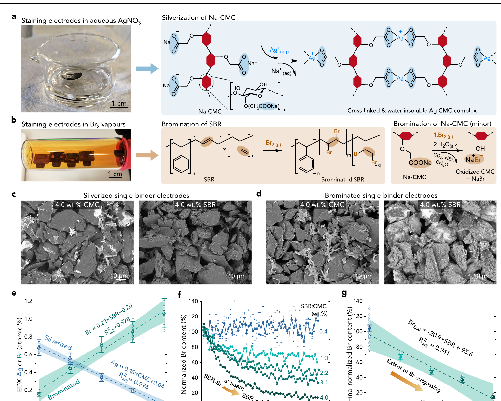
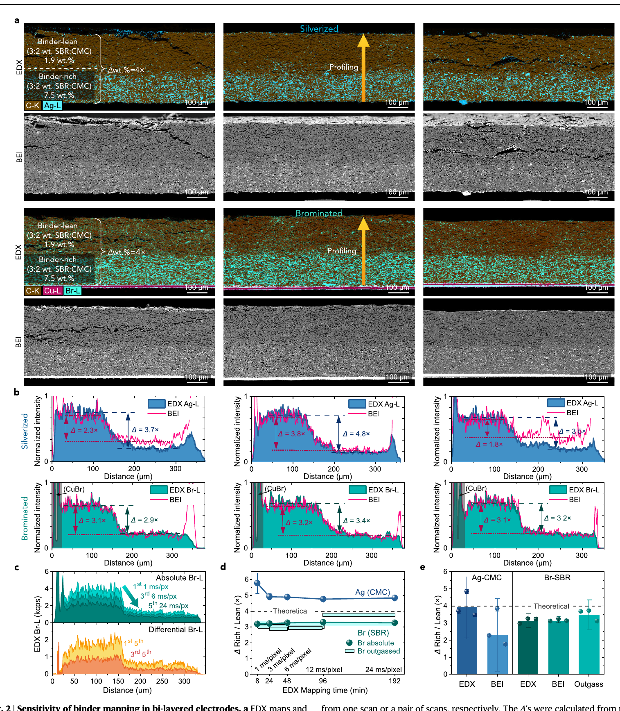
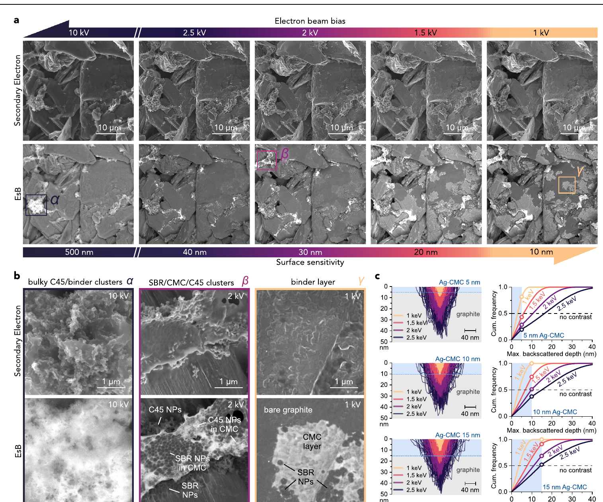
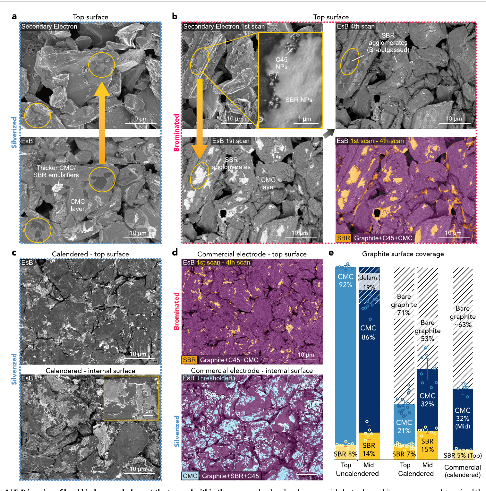
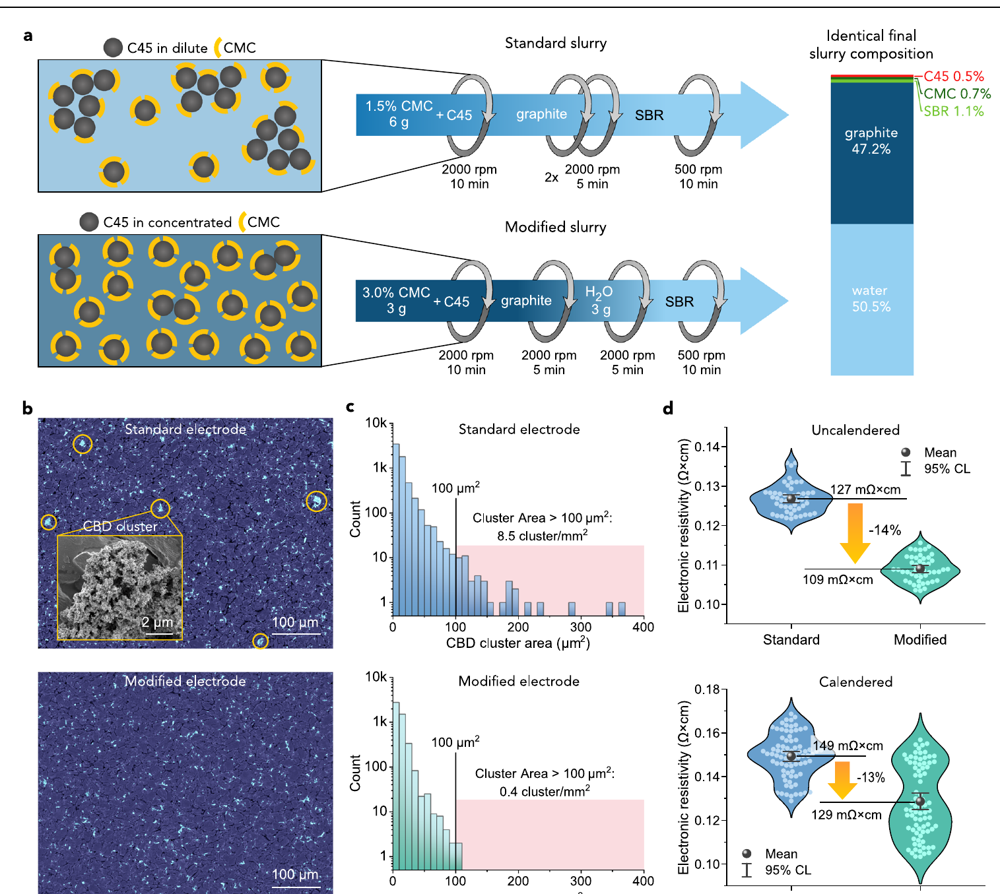
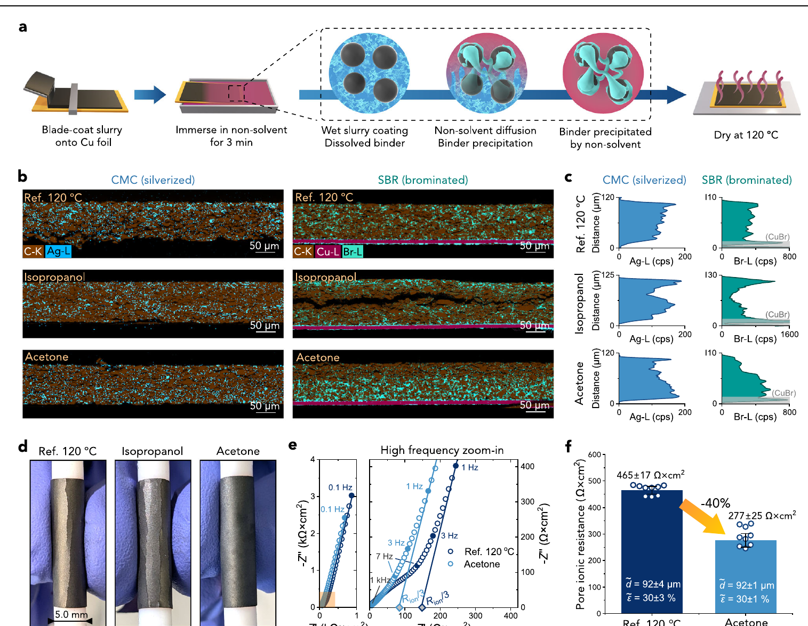
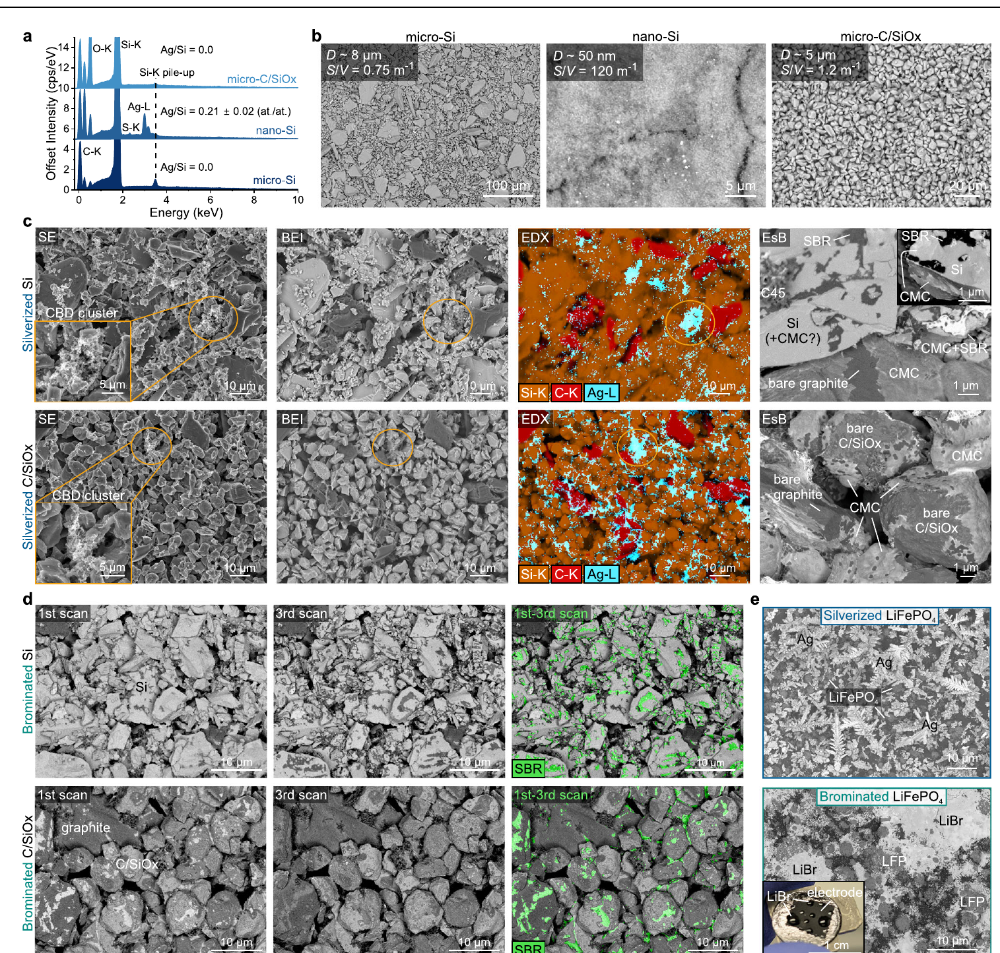

# 锂电负极粘结剂化学染色：专业伴读与逐图证据审计

> 这不是全文中文翻译。英文正式 PDF 是主阅读材料；本文负责术语准备、逐图解释、主张-证据核对和锂电涂布工程判断。

## 阅读范围

- **原论文**：Stanislaw P. Zankowski et al., *Nature Communications* 17, 1438 (2026)。
- **材料范围**：正式开放获取 PDF、出版商 HTML、7 幅主图、正文 Methods、Data availability 和 Code availability。
- **未覆盖**：补充信息中的全部图表没有逐张复核；涉及 Supplementary Figures 的控制实验仅按正文描述纳入判断。
- **证据标签**：`强` = 视觉证据直接支持；`部分支持` = 支持主张的一部分或受关键假设限制；`弱` = 主要为提示性证据；`不能单独证明` = 必须依赖方法、补充实验或后续电芯验证。

## 一页结论

这篇论文最重要的贡献不是“发现粘结剂会迁移”，而是建立了一套能在常规 SEM/EDX/BEI/EsB 条件下区分水系负极中 CMC 和 SBR 的离线表征方法，并用模型双层电极验证其定量灵敏度。它把原本难以观察的三个尺度连接起来：厚度方向的粘结剂梯度、颗粒表面的纳米级覆盖、以及 CBD 团聚和辊压破坏。

**最可信的部分**是 Fig. 1-2：Ag-CMC 和 Br-SBR 的化学标记具有可校准的选择性，且在已知 4 倍浓度差的双层电极中得到接近预期的厚度方向信号。**最有工程价值的部分**是 Fig. 5-6：初始 CMC 浓度会影响 CBD 团聚和电子电阻率；丙酮相转化会改变粘结剂厚度分布并降低表观孔隙离子阻抗。**最有基础研究价值的部分**是 Fig. 3-4：CMC 可能形成约 10-15 nm 的共形薄层，而辊压会使其大面积破裂和脱层。

但工程结论必须收窄：本文验证的是以石墨、CMC/SBR 和 C45 为主的离线破坏性分析，并没有证明该方法适用于在线质量控制，也没有完成全电芯倍率、循环或安全验证。Fig. 6 的相转化结果是有吸引力的工艺线索，不是已经完成放大的量产方案；Fig. 7 进一步证明该染色方案不适合直接用于 LiFePO4、纳米硅、PVDF 或 PTFE 体系。

| 判断维度 | 结论 | 依据 |
|---|---|---|
| 染色方法有效性 | 强 | 组分对照、线性标定、双层模型电极和多种成像方式互证 |
| 纳米 CMC 薄层存在 | 中等偏强 | 多束压 EsB、对照样和重复图像支持；厚度值依赖 Monte Carlo 与可见性阈值 |
| 辊压破坏 CMC 覆盖 | 中等偏强 | 实验室与商业电极图像一致；定量主要基于图像技术重复和阈值分割 |
| 初始 CMC 浓度改善 CBD 分散 | 中等偏强 | 同终配方工艺对照、图像统计和四探针结果一致；未直接测量吸附与流变机制 |
| 丙酮相转化改善离子输运 | 中等 | EDX、弯曲和 EIS 相互呼应；缺少完整电芯与量产放大验证 |
| 可用于在线质量控制 | 不支持 | 染色会改变样品，截面制样耗时且方法不适用于多种正极/粘结剂体系 |

## 建议阅读顺序

面向电极制造工程师，建议按 `Fig. 1 -> Fig. 2 -> Fig. 5 -> Fig. 6 -> Fig. 4 -> Fig. 3 -> Fig. 7` 阅读。先确认测量工具可信，再看混合与干燥应用，随后理解辊压和纳米形貌，最后看适用边界。

## 专业术语 Checklist

### 材料与电极结构

| 英文术语 | 中文辅助 | 专业定义/单位 | 本文中的位置 | 常见误读 | 对涂布工程的意义 |
|---|---|---|---|---|---|
| carboxymethyl cellulose, CMC | 羧甲基纤维素 | 水溶性纤维素衍生物；羧酸盐基团可与 Ag+ 结合 | Fig. 1, 3-7 | CMC 不只是“增稠剂”，也参与颗粒吸附、分散和界面覆盖 | 混合顺序、初始浓度和干燥会改变其空间分布 |
| styrene-butadiene rubber, SBR | 丁苯橡胶乳液 | 以纳米乳胶颗粒形式加入；脂肪族 C=C 可被 Br2 标记 | Fig. 1, 3-7 | SBR 并非均匀溶解的高分子链 | 温和混合可避免破乳，但也可能保留岛状团聚 |
| C-NERGY SUPER C45, C45 | 导电炭黑 | 纳米导电碳添加剂 | Fig. 1, 3, 5, 7 | C45 信号不能等同于有效导电网络 | 与 CMC/SBR 共同形成 CBD，团聚会影响长程电子通路 |
| carbon-binder domain, CBD | 碳-粘结剂域 | 导电剂和粘结剂组成的复合相 | Fig. 3, 5, 7 | CBD 不是单一材料，也不必然均匀 | 尺寸、连通性和分布同时影响电子传输与力学 |
| binder coverage | 粘结剂表面覆盖率 | 图像分割得到的表观颗粒表面面积比例，% | Fig. 4 | 面积覆盖率不等于厚度、质量分数或有效粘附面积 | 辊压前后覆盖变化可能影响 SEI、浸润和局部电流密度 |
| binder migration | 粘结剂迁移 | 干燥过程中粘结剂随溶剂或浓度梯度发生空间再分布 | Fig. 6 | 顶部富集并不自动证明只有蒸发对流一种机制 | 应结合湿膜厚度、Pe、吸附、凝胶和干燥曲线判断 |
| binder-rich / binder-lean layer | 富粘结剂/贫粘结剂层 | 模型双层电极中的已知浓度区域 | Fig. 2 | 这是人为构造的标定样，不是自然迁移形貌 | 用来验证方法灵敏度，而不是代表量产极片真实梯度 |
| current collector | 集流体 | 本文石墨负极通常使用 Cu 箔 | Fig. 2, 6 | Ag+ 会与 Cu 发生置换反应 | 银化前需剥离 Cu，限制了流程便利性和在线应用 |

### 染色与电子显微分析

| 英文术语 | 中文辅助 | 专业定义/单位 | 本文中的位置 | 常见误读 | 对涂布工程的意义 |
|---|---|---|---|---|---|
| silverization | 银化染色 | 0.5 M AgNO3 中处理 3 min，使 Ag+ 与 CMC 羧酸盐结合 | Fig. 1-4, 6-7 | 银信号并非百分之百只来自 CMC | SBR 乳化残留、活泼材料和 Cu 都可能形成干扰 |
| bromination | 溴化染色 | 50 °C 低压 Br2 蒸气处理，使 Br 加成到 SBR C=C | Fig. 1-2, 4-7 | Br 同时会与 CMC 发生表面副反应 | 必须利用脱气行为或标定样区分 SBR 与 CMC |
| energy-dispersive X-ray spectroscopy, EDX | 能量色散 X 射线谱 | 电子束激发特征 X 射线；本文主要跟踪 Ag-L、Br-L | Fig. 1-2, 5-7 | EDX 图的颜色强度不是未经处理的绝对浓度 | 定量较慢但更可靠，适合厚度方向剖面 |
| backscattered electron imaging, BEI | 背散射电子成像 | 对平均原子序数敏感的 SEM 成像 | Fig. 1-2, 5, 7 | 亮区不一定都是粘结剂，充电和污染也会变亮 | 速度快，可用于顶部 CBD 团聚的离线筛查 |
| energy-selective backscattered imaging, EsB | 能量选择背散射成像 | 通过滤网选择高能背散射电子，提高近表面成分对比 | Fig. 3-4, 7 | 对比是相对的，且高度依赖表面清洁和束压 | 可观察颗粒表面的纳米粘结剂层，但方法窗口窄 |
| secondary electron imaging, SE | 二次电子成像 | 主要反映表面形貌 | Fig. 3-4, 7 | SE 形貌对比不能直接当作化学成分图 | 需要与 EDX/BEI/EsB 配对解释 |
| Br outgassing | 束致 Br 脱气 | 电子束照射下 Br-SBR 信号随时间下降 | Fig. 1f-g, 2c-e, 4b, 7d | 不是普通挥发背景，而是作者用于识别 SBR 的动态指纹 | 可通过前后扫描差分区分 SBR 与稳定的 Br-CMC 信号 |
| interaction/probing depth | 电子作用/探测深度 | 随束能降低而减小；本文从数百 nm 降到约 10 nm 量级 | Fig. 3 | 束压降低不只是“放大倍数变化” | 多束压成像可分离体相 CBD 与表面薄层 |
| Ag-L / Br-L signal | Ag-L/Br-L 特征线信号 | EDX 中用于映射 Ag 和 Br 的 X 射线系列 | Fig. 2, 6 | cps 不能跨条件直接比较，需同条件和校正 | 厚度梯度分析需检查 C-K 基线和几何伪影 |
| atomic-number contrast | 原子序数对比 | 高 Z 元素产生更强背散射信号 | Fig. 1, 7 | Si 等较高 Z 元素会削弱 Ag/Br 相对对比 | 不同活性材料需要重新验证成像窗口 |
| plasma cross-sectioning | 等离子体截面制样 | 低几何损伤的截面抛光；100 μm 极片约需 8-12 h | Fig. 2, 6 | 不是快速在线检测步骤 | 是当前厚度方向定量的主要节拍瓶颈 |

### 制造过程与传输表征

| 英文术语 | 中文辅助 | 专业定义/单位 | 本文中的位置 | 常见误读 | 对涂布工程的意义 |
|---|---|---|---|---|---|
| calendering | 辊压 | 通过辊间压实降低孔隙率；本文 80 °C、约 30% 孔隙率 | Fig. 4-6 | 只看最终孔隙率会忽略颗粒表面粘结剂破坏 | 压实温度、应变路径和颗粒形貌都可能改变覆盖状态 |
| phase inversion | 相转化 | 湿膜浸入非溶剂，使聚合物快速失稳和沉淀 | Fig. 6 | 不是简单“溶剂置换清洗” | 可在干燥前锁定粘结剂位置，但引入新溶剂和回收负担 |
| non-solvent | 非溶剂 | 能使目标聚合物从原溶剂体系中沉淀的液体 | Fig. 6 | 非溶剂效果不能只按极性判断 | 渗透速度、黏度和沉淀动力学决定最终梯度 |
| skin layer | 表面皮层 | 表面快速沉淀形成的致密聚合物层 | Fig. 6b-c | 表面完整不等于离子输运更好 | 可能堵塞表层孔道并降低厚电极利用率 |
| electronic resistivity | 电子电阻率 | 四探针测得并按厚度归一，单位 Ω·cm | Fig. 5d | 多次旋转测量不是多批独立样品 | 用于判断 CBD 分散改善是否形成更有效电子网络 |
| pore ionic resistance | 孔隙离子阻抗 | 对称电池 EIS 推导，本文单位 Ω·cm2 | Fig. 6e-f | 不是完整电芯的总内阻或电荷转移阻抗 | 反映电解液在电极孔道中的有效离子输运阻力 |
| symmetric-cell EIS | 对称电池阻抗谱 | 两片相同电极配非嵌入型电解液，分离孔隙输运贡献 | Fig. 6e | 不能直接替代倍率或循环测试 | 适合快速比较孔道结构，但模型和 Cdl 分布会影响结果 |
| electronic contact resistance | 电子接触电阻 | Nyquist 高频区域可能出现的接触相关贡献 | Fig. 6e | 没有明显半圆不等于所有界面问题都不存在 | 可辅助判断相转化是否恶化电子接触 |
| porosity, epsilon | 孔隙率 | 空隙体积分数，% | Fig. 4, 6 | 相同总孔隙率不代表相同孔径分布或曲折度 | 解释输运差异时必须同时关注空间分布和连通性 |
| double-layer capacitance, Cdl | 双电层电容 | 电极/电解液界面的电容贡献 | Methods, Fig. 6 | C45 的高比表面积会改变 EIS 反演权重 | 可能使表观孔隙阻抗低估或高估 |

### 定量与证据判断

| 英文术语 | 中文辅助 | 专业定义/单位 | 本文中的位置 | 常见误读 | 对结果可信度的意义 |
|---|---|---|---|---|---|
| technical replicate | 技术重复 | 对同一样品区域、切片或电池重复测量 | Fig. 1, 4-6 | 不能等同于独立浆料批次或独立涂布批次 | 技术重复可估计测量噪声，但不能覆盖制造波动 |
| independent sample | 独立样品 | 独立制备、处理或染色的样品 | Fig. 2, Fig. 3正文 | 图像数量多不一定代表独立样品多 | 决定结论能否跨批次推广 |
| 95% confidence interval, 95% CI | 95% 置信区间 | 本文同时考虑随机和系统不确定度 | 全文 | CI 窄不代表没有系统偏差 | 需结合样本层级、标定误差和图像处理判断 |
| threshold segmentation | 阈值分割 | 用 Otsu、Phansalkar、Sauvola 等算法划分类别 | Fig. 2, 4-5 | 分割结果不是直接化学测量 | 覆盖率和团簇面积对滤波、阈值及表面污染敏感 |
| surface-to-volume ratio, S/V | 比表面积近似指标 | 粒子表面积/体积，单位 m-1 | Fig. 7b | 粒径相近时仍可能受形貌和钝化层影响 | 高 S/V 活泼材料更容易与染色剂发生副反应 |

## 论文论证主线

```text
染色反应是否有选择性？ (Fig. 1)
        ↓
能否定量分辨已知粘结剂梯度？ (Fig. 2)
        ↓
能否看到颗粒表面的局部粘结剂形貌？ (Fig. 3-4)
        ↓
表征结果能否指导混合与干燥工艺？ (Fig. 5-6)
        ↓
该方法在哪些材料上失效？ (Fig. 7)
```

这个论证顺序是合理的：先做化学选择性和定量标定，再提出微结构发现，随后展示两个工艺应用，最后用失败案例限定适用边界。

## Fig. 1：染色机理与选择性

**源位置**：正式 PDF p.3。  
**核心问题**：Ag 和 Br 是否能分别作为 CMC 与 SBR 的可测标签？



### Panel 逐项读图

| Panel | 展示什么 | 应该看哪里 | 图中直接观察 |
|---|---|---|---|
| a | AgNO3 水溶液银化与 Ag-CMC 反应示意 | Ag+ 替代 Na+ 并与多个羧酸盐配位 | 该设计会引入高 Z 的 Ag，使 CMC 可被 EDX/BEI 追踪 |
| b | Br2 蒸气溴化 SBR，同时存在 CMC 副反应 | SBR 的 C=C 加成与 CMC 形成 NaBr 的次反应 | Br 不是完全专一的 SBR 标签，需要动态脱气或标定区分 |
| c | 银化的单粘结剂电极 BEI | 4% CMC 图中的亮线/亮团与 4% SBR 对照 | Ag-CMC 的原子序数对比明显强于 SBR 对照 |
| d | 溴化的单粘结剂电极 BEI | 4% SBR 的亮斑，同时注意 CMC 也有部分亮度 | Br-SBR 可见，但 CMC 副反应不能忽略 |
| e | Ag/Br 原子百分数随 CMC:SBR 配比变化 | 两条线性拟合和置信带 | Ag 随 CMC 近线性增加，Br 随 SBR 近线性增加 |
| f | 连续电子束照射中的归一化 Br 信号 | SBR 含量越高，Br 衰减越快越深 | Br-SBR 在束下脱气；无 SBR 样的信号相对稳定 |
| g | 末端 Br 信号与 SBR 含量 | 负斜率线性关系 | 脱气幅度可以作为识别 SBR 的第二维信息 |

### 证据与解释

- **直接建立的事实**：Ag-CMC 和 Br-SBR 的信号都随目标粘结剂比例近线性变化；Ag 对 CMC 的选择性约为 CMC/SBR 对照的 16 倍，Br 对 SBR 的选择性约为 SBR/CMC 对照的 7 倍。
- **作者解释**：SBR 中残留乳化剂造成少量 Ag 假阳性；CMC 与 Br2 的副反应形成 NaBr；Br-SBR 的束致脱气可用来把 SBR 与 Br-CMC 区分开。
- **支持强度：强，但不是绝对专一。** 组分对照、线性标定和时间维度信号相互支持。Fig. 1e-g 中相当一部分点是技术重复，不能单独证明不同浆料批次间同样稳定。
- **容易误读**：亮区不能直接标成“纯 CMC”或“纯 SBR”；每个新 SBR 乳液品牌、CMC 取代度和染色条件都应重新做选择性矩阵。
- **工程意义**：该图给出了方法导入的第一道质量门。没有完成自家材料的 0/25/50/75/100% CMC:SBR 标定前，不应直接分析量产极片。

**一句话读图**：先看 Fig. 1e 的交叉选择性，再看 Fig. 1f-g 的 Br 脱气；这两者共同决定能否把 CMC 和 SBR 分开。

## Fig. 2：双层模型电极中的定量灵敏度

**源位置**：正式 PDF p.4。  
**核心问题**：面对厚度方向已知的 4 倍粘结剂差异，EDX/BEI 能否正确恢复梯度？



### Panel 逐项读图

| Panel | 展示什么 | 应该看哪里 | 图中直接观察 |
|---|---|---|---|
| a | 三个银化样和三个溴化样的截面 EDX/BEI | 下层富粘结剂、上层贫粘结剂的颜色与亮度界面 | Ag、Br 和 BEI 均能看出预设双层分布 |
| b | 每个样品的厚度方向信号 | EDX 面积与粉色 BEI 曲线是否同步，以及 Delta 值 | 多数 BEI 轮廓跟随 EDX，但银化样的 BEI 偏差更大 |
| c | 不同驻留时间的 Br 绝对信号及扫描差分 | 绝对 Br 轮廓与脱气差分轮廓是否同形 | 脱气差分仍能恢复富/贫层结构 |
| d | 映射时间与富/贫层比值 | 结果何时接近理论 4 倍 | Br 约 8 min、Ag 约 24 min 已可得到可用剖面；高质量图需要更久 |
| e | EDX、BEI、Br 脱气的汇总 | 加权均值、散点和理论 4 倍虚线 | Ag-CMC 平均约 3.9 倍，Br-SBR 平均约 3.1 倍 |

### 证据与解释

- **直接建立的事实**：模型电极设计的理论富/贫层比例是 4 倍；EDX 得到 Ag-CMC `3.9 +/- 1.8`，Br-SBR `3.1 +/- 0.4`，且三个独立染色样的方向一致。
- **作者解释**：SBR 对石墨吸附较弱并易受干燥迁移影响，因此 Br-SBR 比值低估；银化的液相润湿、低本征 Ag 信号和表面污染使其离散度更大。
- **支持强度：强。** 这是全文最重要的定量方法验证。不过模型电极厚约 300-350 um、梯度人为构造且差异较大；对量产中更薄极片和更小梯度的检测限仍需单独验证。
- **容易误读**：BEI 的一分钟结果适合快速筛查，不等于一分钟完成可靠的绝对定量；图像充电、离子抛光污染和阈值算法都会改变结果。
- **工程意义**：可建立两级流程：BEI 先筛查异常极片，EDX 再对疑似样做厚度方向定量。量产实验应增加已知小梯度样，确定最小可检测差异，而不只复现 4 倍模型。

**一句话读图**：先比较 Fig. 2b 中 EDX 与 BEI 是否同形，再用 Fig. 2e 判断快速方法离理论值有多远。

## Fig. 3：三类局部粘结剂形貌与 CMC 纳米薄层

**源位置**：正式 PDF p.6。  
**核心问题**：降低 EsB 束压、缩小探测深度后，能否把体相 CBD、SBR 团聚体和表面 CMC 薄膜分开？



### Panel 逐项读图

| Panel | 展示什么 | 应该看哪里 | 图中直接观察 |
|---|---|---|---|
| a | 同一区域从 10 kV 降至 1 kV 的 SE/EsB 图 | 上排形貌基本不变，下排成分对比随束压变化 | 10 kV 突出 alpha 团块；约 2 kV 出现 beta；1-1.5 kV 显示 gamma 薄层 |
| b | alpha、beta、gamma 的高倍图 | C45 纳米粒子、SBR 纳米粒子和连续 CMC 层的形态差异 | 三种形貌不是同一团聚体的简单亮度变化 |
| c | 5、10、15 nm Ag-CMC 层的 Monte Carlo 轨迹和深度分布 | 不同束压下背散射事件落在 CMC 层还是石墨中 | 10-15 nm 模型最符合低束压可见、高束压对比消失的条件 |

### 证据与解释

- **直接建立的事实**：同一表面在不同束压下出现三个可重复的对比层级；正文称四个独立制备电极、数百张图中重复观察，并使用无 CMC/无 SBR/无 C45 对照排除部分替代解释。
- **作者解释**：`alpha` 是体积较大的 CMC/C45 CBD 团；`beta` 是富 SBR 的 SBR/CMC/C45 团；`gamma` 是覆盖石墨的共形 CMC 薄层。
- **支持强度**：三类形貌存在为`中等偏强`；CMC 层厚度为 10-15 nm 为`部分支持`。厚度不是对整个电极逐点直接测量，而是由束压可见性、材料密度和 Monte Carlo 可检测阈值反演。
- **容易误读**：Fig. 3 不能证明所有石墨颗粒都均匀覆盖 10-15 nm CMC，也不能证明三类形貌的质量占比。胶带剥离和表面暴露会改变局部覆盖。
- **工程意义**：常规截面 SEM 看不见 CMC 薄层不代表薄层不存在。若要研究辊压、干燥或表面处理对活性表面覆盖的影响，成像束压和表面污染必须作为受控变量。

**一句话读图**：不要只看一张 SEM；看同一区域的对比如何随束压变化，才是 Fig. 3 的证据核心。

## Fig. 4：辊压前后颗粒表面覆盖与商业极片对照

**源位置**：正式 PDF p.7。  
**核心问题**：未辊压电极中的 CMC/SBR 如何覆盖石墨表面，辊压后覆盖是否破裂？



### Panel 逐项读图

| Panel | 展示什么 | 应该看哪里 | 图中直接观察 |
|---|---|---|---|
| a | 未辊压顶部的银化 SE/EsB | EsB 中广泛亮层与局部更亮斑块 | 顶部石墨表面接近连续 CMC 覆盖，同时存在较厚富集区 |
| b | 未辊压顶部的溴化连续扫描 | 第一与第四次扫描的亮区差分 | 部分亮岛随扫描消退，被识别为 SBR 纳米粒子团聚体 |
| c | 辊压后顶部与内部银化 EsB | 大片破裂、剥离和裸露石墨区 | 辊压后原本连续的 CMC 层显著破碎 |
| d | 商业石墨负极顶部与内部 | 彩色分割中的 SBR、CMC 和裸露石墨 | 商业样也出现破碎 CMC 层和 SBR 岛状团聚 |
| e | 覆盖率汇总 | 未辊压、辊压和商业样的 CMC/SBR/裸露比例 | CMC 从未辊压顶部约 92% 降到辊压顶部约 21%、内部约 32%；商业样裸露石墨超过 60% |

### 证据与解释

- **直接建立的事实**：在所测样品上，辊压后 CMC 亮层出现破裂和脱层，图像分割给出大幅下降的表观覆盖率；商业样显示相似形貌。
- **作者解释**：干燥 CMC 的脆性导致辊压破裂；覆盖下降可能改变 SEI、嵌锂和局部锂析出行为。
- **支持强度**：辊压改变覆盖为`中等偏强`；进一步影响循环和锂析出的因果链为`不能单独证明`。Fig. 4 没有配套的同批全电芯电化学验证。
- **统计边界**：覆盖率主要来自多张 EsB 图的技术重复；CMC 与 SBR 在不同极片碎片上分别染色，再组合成覆盖图。图像阈值、胶带剥离、表面污染和选区会影响绝对比例。商业样未显示跨供应商、跨批次重复。
- **工程意义**：辊压工艺不能只用最终厚度和孔隙率表征。建议把顶部/内部 CMC 覆盖、剥离强度和压实应变路径联动，评估温度、线压力和材料颗粒形貌的影响。

**一句话读图**：Fig. 4e 给出数量级变化，Fig. 4c-d 说明变化来自不规则破裂，而不是均匀变薄。

## Fig. 5：初始 CMC 浓度、CBD 团聚与电子电阻率

**源位置**：正式 PDF p.8。  
**核心问题**：在最终干组成相同的条件下，改变 CMC 初始混合浓度能否改善 C45 分散和电子网络？



### Panel 逐项读图

| Panel | 展示什么 | 应该看哪里 | 图中直接观察 |
|---|---|---|---|
| a | 标准与改性浆料流程 | 初始 CMC 为 1.5% 或 3%，随后补水到相同终组成 | 唯一有意改变的是 C45 首次接触的 CMC 浓度及加水时点 |
| b | 两种极片顶部 BEI | 标准样黄色圈出的 CBD 大团与改性样对照 | 改性流程中大型 CBD 团明显减少 |
| c | 10 张图得到的团簇面积分布 | 面积大于 100 um2 的粉色区 | 大团密度由 8.5 降至 0.4 cluster/mm2 |
| d | 辊压前后电子电阻率小提琴图 | 均值、95% CI 和分布宽度 | 未辊压约 127 -> 109 mOhm·cm；辊压后约 149 -> 129 mOhm·cm，下降约 13-14% |

### 证据与解释

- **直接建立的事实**：改性流程显著减少大型 CBD 团，并在未染色样的四探针测试中降低平均电子电阻率。
- **作者解释**：更高初始 CMC 浓度提高 C45 表面的 CMC 饱和吸附和静电稳定，从而改善分散。
- **支持强度**：工艺变化与团聚/电阻率改善之间为`中等偏强`；“CMC 表面饱和吸附是主导机制”为`部分支持`。本文没有直接测吸附量、zeta 电位、流变曲线或混合能量耗散。
- **容易误读**：最终固含和配方相同，不代表混合过程中的局部黏度、剪切应力和团聚破碎动力学相同。14% 电阻率改善在高导电石墨体系中有统计意义，但不等于电芯性能提高 14%。
- **工程意义**：这是最容易落地的小试方向。应把“初始 CMC 浓度/加水时点”作为 DOE 因素，同时测高剪切黏度、触变恢复、CBD 大团尾部、四探针和剥离强度，防止只优化一个指标。

**一句话读图**：先确认 Fig. 5a 的终配方相同，再用 Fig. 5c-d 判断微结构变化是否传递到宏观电子性质。

## Fig. 6：相转化、粘结剂梯度与孔隙离子阻抗

**源位置**：正式 PDF p.9。  
**核心问题**：在 120 °C 快速干燥前进行 3 min 非溶剂浸泡，能否锁定更有利的粘结剂分布？



### Panel 逐项读图

| Panel | 展示什么 | 应该看哪里 | 图中直接观察 |
|---|---|---|---|
| a | 相转化流程示意 | 非溶剂进入湿膜、溶解粘结剂沉淀、随后高温干燥 | 该工艺在干燥前增加一个 3 min 液浴步骤 |
| b | 参比、IPA、丙酮样的 CMC/SBR 截面 EDX | 顶部与集流体侧的颜色分布 | 参比顶部富集；IPA 顶部形成更强皮层；丙酮向集流体侧富集 |
| c | 对应厚度方向线剖面 | 峰值靠近顶部还是底部 | 线剖面支持 Fig. 6b 的梯度方向判断 |
| d | 5 mm 芯棒弯曲照片 | 裂纹是否出现 | 参比和 IPA 样开裂，丙酮样未见明显裂纹 |
| e | 参比与丙酮样对称电池 Nyquist 图 | 低频近线性区斜率和外推截距 | 丙酮样推导的孔隙离子阻抗更低 |
| f | 孔隙离子阻抗汇总 | 相同厚度约 92 um、总孔隙率约 30% 条件下的柱高 | 465 +/- 17 降至 277 +/- 25 Ohm·cm2，表观下降 40% |

### 证据与解释

- **直接建立的事实**：三种处理形成不同的 CMC/SBR 厚度分布；丙酮处理样的弯曲完整性更好，表观孔隙离子阻抗更低。
- **作者解释**：丙酮黏度约为 IPA 的六分之一，渗透和 CMC 沉淀更快，使粘结剂在集流体附近富集，同时保留更有利的表层孔道。
- **支持强度：中等。** EDX、弯曲和 EIS 方向一致，但“阻抗降低完全由优选粘结剂/孔隙分布造成”仍包含推断。相同总孔隙率不能排除孔径分布、曲折度、颗粒重排、残余溶剂或表面化学差异。
- **统计边界**：每种条件是 3 个对称电池、每个电池重复扫描 3 次，图中 `n=9` 不是 9 批独立涂布。作者还指出 C45 双电层电容空间分布会影响反演，实际差异可能不同于表观 40%。
- **缺失验证**：没有完整石墨半电池/全电池的倍率、快充、循环和析锂数据；弯曲是定性照片；没有给出卷对卷浸泡、丙酮回收、防爆、干燥负荷和节拍评估。
- **工程意义**：适合作为“机制验证项目”，不应直接作为量产导入方案。先用小幅宽湿膜验证非溶剂渗透时间、表层皮层、残留溶剂、剥离强度和孔径分布，再进入电芯验证。

**一句话读图**：Fig. 6b-c 证明梯度改变，Fig. 6f 证明表观输运改善，但二者之间的唯一因果关系尚未被完全隔离。

## Fig. 7：适用材料边界与失败案例

**源位置**：正式 PDF p.11。  
**核心问题**：Ag/Br 染色在 Si、C/SiOx 和 LiFePO4 电极中是否仍保持选择性？



### Panel 逐项读图

| Panel | 展示什么 | 应该看哪里 | 图中直接观察 |
|---|---|---|---|
| a | 银化后微米 Si、纳米 Si、C/SiOx 的 EDX 谱 | nano-Si 的 Ag-L 峰和 Ag/Si 比 | 纳米 Si 自身与 Ag+ 强烈反应，失去 CMC 选择性 |
| b | 三种粉体的 BEI、粒径和 S/V | nano-Si 的极高 S/V | 高反应表面积解释了 nano-Si 的干扰风险 |
| c | 微米 Si 与 C/SiOx 电极的 SE/BEI/EDX/EsB | Ag 是否定位在 CBD；EsB 对不同基体的相对对比 | EDX 可识别 CBD；CMC 薄层在 C/SiOx 上较清楚，在 Si 上对比差 |
| d | 溴化样的连续 EsB 与差分图 | 绿色 SBR 脱气区 | Br 脱气仍可用于识别 SBR |
| e | 银化/溴化 LiFePO4 | Ag 枝晶和 LiBr 液滴 | Fe2+ 还原 Ag+，溴化形成吸湿 LiBr，两者都遮蔽粘结剂 |

### 证据与解释

- **直接建立的事实**：微米 Si 和稳定包覆的 C/SiOx 在一定条件下可分析；nano-Si 和 LiFePO4 与染色剂发生强副反应；高 Z 基体也会削弱 BEI/EsB 相对对比。
- **支持强度：强。** 失败现象直接可见，且与材料反应性和 S/V 一致。
- **容易误读**：Fig. 7 不是“硅体系普遍适用”。表面氧化层、碳包覆完整性、粒径和前处理都会改变结果；每种硅材料都需独立标定。
- **工程意义**：当前方法优先用于石墨 CMC/SBR 负极。LFP、NCM、PVDF、PTFE 或纳米 Si 不能直接照搬；正极项目应寻找与基体和粘结剂官能团相容的其他标记或光谱方法。

**一句话读图**：Fig. 7 的价值在于告诉读者“哪里不能用”，而不是把方法扩展到所有电极体系。

## 主张-证据矩阵

| 核心主张 | 主要证据 | 支持强度 | 独立性/重复层级 | 尚未证明 |
|---|---|---|---|---|
| Ag/Br 可分别追踪 CMC/SBR | Fig. 1 组分对照、线性标定、Br 脱气 | 强 | 多个配比；部分为技术重复 | 新供应商、新取代度和老化材料无需重标定 |
| 方法能定量恢复厚度梯度 | Fig. 2 已知 4 倍双层样 | 强 | 3 个独立染色样 | 量产极片中小梯度的检测限与跨批次重复性 |
| 电极内存在 alpha/beta/gamma 三类形貌 | Fig. 3 多束压 EsB 与补充对照 | 中等偏强 | 4 个独立电极、数百张图（按正文） | 三类形貌的体积分数和在全幅极片上的空间统计 |
| CMC 表面层约 10-15 nm | Fig. 3c Monte Carlo 与可见性转换 | 部分支持 | 模拟和局部高分辨对照 | 全电极直接厚度分布；模型参数不确定度传播 |
| 辊压显著降低 CMC 覆盖 | Fig. 4c-e 图像与分割 | 中等偏强 | 主要为图像技术重复；商业样批次信息有限 | 覆盖下降直接导致循环、SEI 或析锂变化 |
| 高初始 CMC 浓度改善 CBD 分散 | Fig. 5a-c 工艺对照和图像统计 | 中等偏强 | 10 张图/条件；电阻率 5 或 8 个样 | CMC 吸附饱和是唯一机制；对不同混合设备可直接迁移 |
| CBD 改善降低电子电阻率 | Fig. 5d 四探针 | 中等偏强 | 每样多方向重复测量 | 电芯阻抗、倍率或循环同步改善 |
| 丙酮相转化改变梯度并降低孔隙阻抗 | Fig. 6b-f EDX、弯曲、EIS | 中等 | 3 个对称电池 x 3 次扫描；非 9 批涂布 | 完整电芯性能、长周期稳定性和 R2R 放大可行性 |
| 方法不适用于 LFP/nano-Si | Fig. 7 直接副反应图像 | 强 | 多种粉体/电极对照 | 所有表面包覆或改性后材料都必然失效 |

## 方法学与可信度审计

### 做得好的地方

1. **验证链完整**：化学机制由 ATR-IR、XPS、EDX 支撑，成像方法又经过单组分和已知梯度样校准。
2. **主动展示失败边界**：Fig. 7 不是装饰性扩展，而是直接揭示 LFP、nano-Si 和高 Z 基体的干扰。
3. **源数据与代码可追溯**：原始 EDX、SEM、BEI、EsB、XPS、ATR-IR、EIS 和四探针数据发布于 Figshare；图像分析与模拟提取代码位于补充信息。
4. **承认系统不确定度**：EDX 对 Ag 和 Br 的综合系统不确定度、EIS 中 Cdl 分布偏差和截面 C-K 梯度校正均有披露。
5. **应用案例不是只看图**：Fig. 5 配四探针，Fig. 6 配弯曲和 EIS，至少尝试把微结构连接到宏观性质。

### 需要保留怀疑的地方

1. **重复层级不一致**：多幅图以测量次数或图像数量作为 `n`，但制造工程更关心独立浆料批、独立涂布批和独立母卷。技术重复不能替代这些层级。
2. **图像分割依赖算法**：覆盖率和团簇尺寸使用多个滤波/阈值流程。虽然方法公开，但绝对值对表面污染、灰度校正和选区敏感。
3. **薄层厚度是模型反演**：10-15 nm 结论受 Ag-CMC 化学计量、密度、滤网截止能和 0.5 可检测阈值影响。
4. **Fig. 5 的机制未直接测量**：工艺效果可信，但“更高 CMC 初始浓度提高 C45 表面饱和吸附”仍是合理机制，不是直接证据。
5. **Fig. 6 因果隔离不足**：相同总孔隙率并不能排除孔径分布、曲折度、颗粒重排和表面化学变化；EIS 的 40% 不是完整电芯性能提升。
6. **工业质量控制仍是离线的**：顶部 BEI 可缩短到约 1 h/样，但完整截面染色、抛光和 EDX 仍是小时级破坏性分析。

## 对锂电涂布项目的直接价值

### 可以直接借鉴

| 项目问题 | 可借鉴方法 | 建议输出指标 |
|---|---|---|
| 水系石墨负极 CBD 大团 | 顶部溴化 + BEI 快筛 | >100 um2 团簇密度、面积分布尾部、空间均匀性 |
| CMC/SBR 厚度方向迁移 | 截面 Ag-CMC / Br-SBR EDX | 顶/中/底信号比、集流体附近最低值、跨宽幅位置差异 |
| 辊压后粘结剂覆盖破坏 | 低束压 EsB | 顶部/内部 CMC 覆盖率、裂纹面积、裸露石墨比例 |
| 混合顺序优化 | 改变 CMC 初始浓度和加水时点 | 流变、CBD 大团、四探针、剥离强度联合 DOE |
| 快速干燥导致表层富集 | 染色剖面 + EIS | 梯度、孔隙离子阻抗、剥离、孔径分布和电芯倍率 |

### 不能直接照搬

- 不能把 Ag/Br 染色用于 LFP/NCM 正极、PVDF/PTFE 粘结剂或 nano-Si 后直接解释为粘结剂分布。
- 不能把 BEI 亮度当作无需标定的绝对质量分数。
- 不能用 Fig. 6 的 40% 孔隙阻抗下降代替快充、循环和析锂验证。
- 不能把 3 min 丙酮液浴视为已满足量产防爆、回收、干燥负荷和产能约束。
- 不能只用平均覆盖率评价极片；局部尾部、顶部/内部差异和跨宽幅分布可能更关键。

### 推荐的工厂验证阶梯

1. **方法标定**：使用自有石墨、CMC、SBR、C45 做单组分和五点 CMC:SBR 配比矩阵，确认 Ag/Br 交叉反应、Br 脱气窗口和 EDX 系统误差。
2. **快速筛查**：选取已知正常/异常极片，做顶部 BEI CBD 团簇统计；目标是验证 1 h/样能否区分现有缺陷等级。
3. **厚度定量**：只对筛查出的代表样做截面 EDX，比较顶/中/底和幅宽位置；同时记录制样时间与重复性。
4. **工艺关联**：把混合顺序、初始 CMC 浓度、首段干燥强度、线速度和辊压参数与粘结剂分布联动。
5. **性能闭环**：至少同时测面密度、孔隙率、剥离、四探针、孔隙阻抗和小电芯倍率/循环，避免从图像直接跳到电芯结论。

### 优先级判断

- **近期高价值**：用该方法验证 CBD 大团和 CMC/SBR 厚度梯度，作为根因分析工具。
- **中期研究**：建立辊压条件与 CMC 覆盖破坏的关联地图。
- **长期探索**：评估相转化或其他干燥前“锁定粘结剂”策略，但必须纳入溶剂安全、回收与 R2R 节拍。
- **暂不建议**：把该方法包装成在线质量控制，或直接扩展到 LFP/PVDF 正极。

## 最值得回看英文原文的位置

| 目的 | 原文位置 | 阅读提示 |
|---|---|---|
| 确认染色选择性 | Results, PDF p.2-3, Fig. 1 | 重点看副反应和 SBR 乳化残留，而不只是线性拟合 |
| 确认方法精度与速度 | PDF p.3-5, Fig. 2 | 区分“可用剖面时间”和“高质量元素图时间” |
| 理解纳米薄层推断 | PDF p.5-6, Fig. 3 | 把观察、对照和 Monte Carlo 假设分开读 |
| 评估辊压影响 | PDF p.6-7, Fig. 4 | 注意不同染色碎片、技术重复和图像分割方法 |
| 设计混合 DOE | PDF p.8-9, Fig. 5 | 终配方相同不代表过程流变相同 |
| 评估相转化 | PDF p.9-10, Fig. 6 | 不要把孔隙阻抗直接翻译成电芯性能 |
| 查看材料边界 | PDF p.10-11, Fig. 7 | 失败案例是方法导入前必须完成的兼容性检查 |

## 资料与可追溯性

- 原论文 DOI：https://doi.org/10.1038/s41467-026-69002-1
- 原始数据归档：https://doi.org/10.6084/m9.figshare.28212953
- 本地正式 PDF：`source.pdf`
- 图像来源：正式 PDF 对应页面高分辨率渲染后裁切；未改变图内数据或标注。
- 结构化映射：见 `source_map.json`。

## 样板评估点

后续决定是否固化为 skill 时，重点检查：术语数量是否过多、逐图深度是否足够、证据审计是否影响阅读流畅性、工程建议是否需要进一步绑定具体产线参数，以及 PDF 中复杂表格和高分辨率图像的可读性。
